# Archazia's Island Unofficial Set Notes

Presented by LorcanaJudges.com

Author:

(Updated 3/17/25 to reflect CRD changes on 2/28/25 & more)

Disclaimer: These set notes are assembled as a volunteer effort based on common questions from the community and clarifying information from the Disney Lorcana TCG rules team. They do not reflect any possible upcoming rule changes, and are not official in any sense of the word. They are meant as a general, community-driven play aid only.

These Unofficial Set Notes use trademarks and/or copyrights associated with Disney Lorca, TCG, used under Ravensburger's Community Code Policy (here). We are expressly prohibited from charging you to use or access this content. These Set Notes are not published, endorsed, or specifically approved by Disney or Ravensburger. For more information about Disney Lorca, visit DisneyLorca.com.

As always, a huge thank you to the Rules Advisors on the Lorcana Rulebook Hub Discord for helping to collate questions and proofread the Set Notes!

Table of Contents

General Rules Updates/Clarifications

New Keywords

General Rules Questions

#

Specific Character Questions

#

Specific Item Questions

#

Specific Action/Song Questions

#

References

## General Rules Updates/Clarifications

Q: How do “if you do” effect clauses know if they should resolve? (Ref. 1.1.)

A: Effects that start with "if you do" look to see if the effect in the previous clause was completed exactly as described. If that first effect was not done or was replaced by something else, the "if you do" check fails and the following effect cannot be done. The current rules do not cover this conditional, so expect it to be added in a future update.

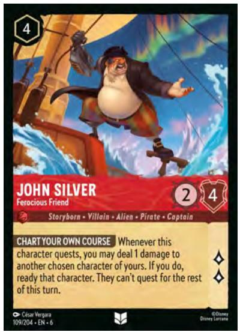

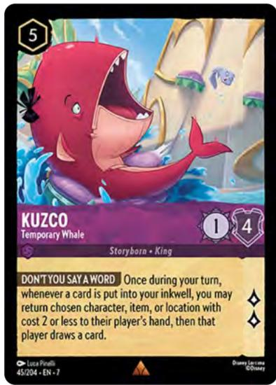

Q: How do "once during your turn" abilities work with "may" effects? Do I lose the chance to resolve an effect if I don't do it the first time? (Ref. 1.2.)

A: "Once during your turn" abilities will continue to trigger and go in the bag until all the effects are resolved. For mandatory abilities this will always be the first time the ability triggers, but for "may" abilities you will continue to get the opportunity to resolve the effect until you actually choose to do so. The current rules do not cover this conditional, so expect it to be added in a future update.

Q: How do Belle/Scrooge's "play for free" abilities really work? (Ref. 1.3.)

A: Belle and Scrooge both have activated abilities that can be used on your turn while they are still in your hand. The rules do not currently allow for activated abilities that can be used from hand, so expect this to be added in a future update.

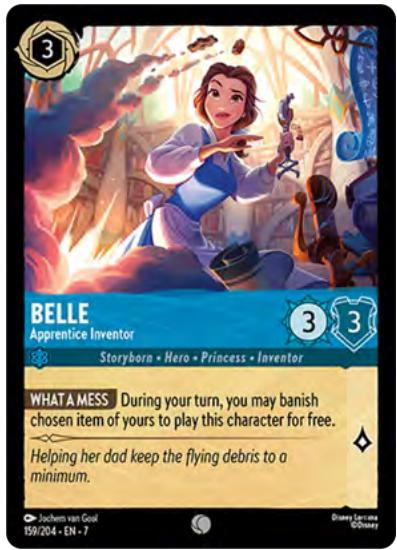

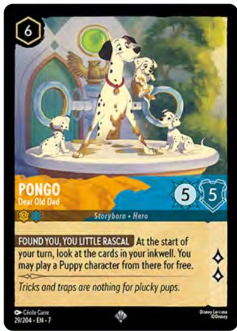

Q: Can I arrange my inkwell to help me remember which cards I have inked, and where they are? (Ref. 1.4.)

A: Yes. You are allowed to arrange your inkwell in any manner you choose, as long as the status (ready or exerted) of all the cards is clear to all players.

Q: What is “a stack” in Lorcana? How can cards be “under” or “on top of” other cards? (Ref. 1.5.)

A: The 2/28/25 update to the Comprehensive Rules Document (CRD) added new definitions for these terms, although some were previously defined in the glossary. Currently, the only mechanic that uses "stacks" of cards is the Shift mechanic, so these terms only apply to characters played by Shifting.

Q: Are characters with strength values reduced below zero counted as having zero strength? (Ref. 1.6.)

A: Yes. The 2/28/25 update to the Comprehensive Rules Document (CRD) corrected an oversight in the previous CRD. Until this revision, characters with negative strength only counted as having zero strength for the purposes of determining damage. That has now been correctly expanded to all circumstances with the exception of applying new modifiers. Negative strength values are now always counted as zero unless you're changing the strength again. Yokai now works as intended with his stolen Microbots.

## New Keywords

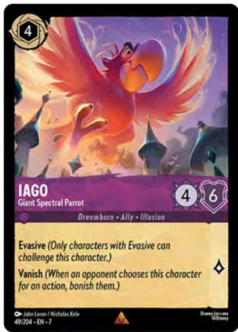

### Q: What is "Vanish"? (Ref. 2.1.)

A: "Vanish" is a new keyword on characters that acts to balance particularly strong character stats. When a character with "Vanish" is chosen by an opponent's action card effect, that character is banished. It is a triggered ability and uses the bag like any other triggered ability.

Q: What if a character with "Vanish" leaves play before the trigger is resolved? (Ref. 2.2.)

A: If the character with "Vanish" leaves play after being chosen by an action card effect, such as Let

It Go or Mother Knows Best, then "Vanish" will resolve to no effect.

Q: Do “Universal Shift” and “Puppy Shift” trigger abilities that occur when something is played using “Shift”? (Ref. 2.3.)

A: Yes! “Universal Shift” and “Puppy Shift” are just special kinds of Shift, so they still trigger any ability that refers to “Shift” in its text.

Q: If I shift Baymax - Giant Robot onto a character with a triggered ability, like Bucky - Squirrel Squeak Tutor, can that triggered ability go into the bag before it is covered up? (Ref. 2.4.)

A: Yes! Baymax would be considered played as soon as his cost is paid, and just before he is put into the Play Zone on top of Bucky. Bucky's ability, Squeak, would trigger right then and go into the bag to be resolved after playing Baymax is completed.

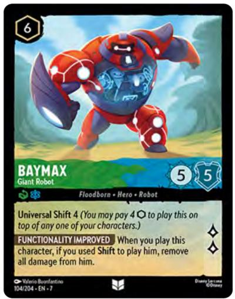

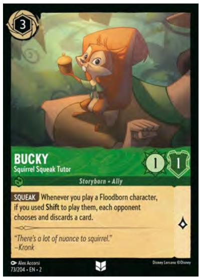

## General Rules Questions

Q: Does paying for a song with ink mean it's not being played as a song? (Ref. 3.1.)

A: No. No matter how you pay to play a song card, it is still a song. The characters in this set that refer to playing an "action that isn't a song" only mean actions that do not also have song in their classifications.

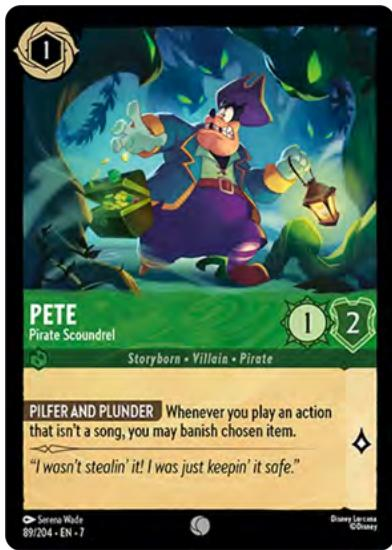

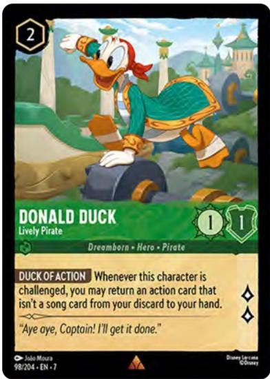

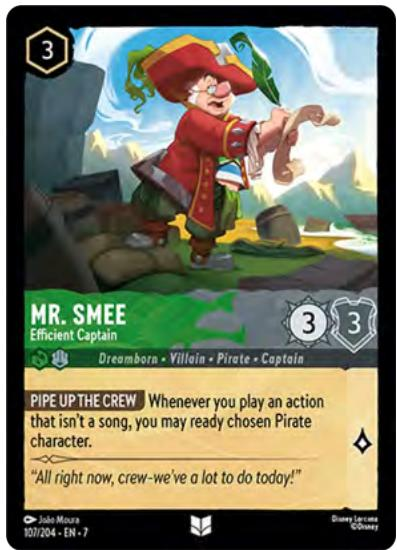

## Specific Character Questions

### Baymax - Giant Robot

Q: If I use Universal Shift to play Baymax on top of a character that has 5 damage, will Baymax be banished? (Ref. 4.1.)

A: Yes. There is a Game State Check (GSC) that will occur after playing Baymax and before the Bag is checked to resolve his triggered ability, Functionality Improved. This means he will be banished by that GSC before you can remove any damage counters from him.

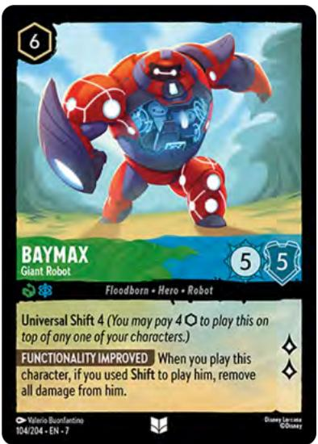

### Belle - Apprentice Inventor

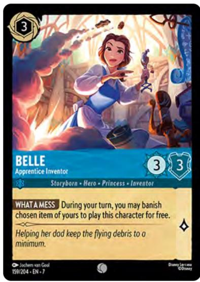

Q: Does the Item banished for What a Mess need to have a banish ability? (Ref. 4.2.a.)

A: No. The ability on the item does not matter for What a Mess. In fact, if the banished Item did have an activated ability, that ability could not be used since the item was not banished for the purpose of paying the cost of that ability. It was only banished to pay for What a Mess.

A2: Note that items with abilities that trigger when they are banished, such as Unconventional Tool, would still have their triggered abilities go in the bag if banished to pay for What a Mess.

Q: When I banish an Item to play Belle for free, can I play all the Belles that are in my hand? (Ref. 4.2.b.)

A: No. Because What a Mess is an activated ability, you must pay the cost for each copy of the ability you wish to activate by taking the "Use Activated Abilities" turn action for each one individually.

Q: Can I use Belle's ability What a Mess to banish on item while she is already in play? (Ref. 4.2.c.)

A: No. While using Belle's ability while she is in play is not specifically prohibited by the rules, it is not intended. We have a special ruling to clarify that What a Mess may only be activated while Belle is in your hand.

### Bolt - Superdog

Q: Can I play Lilo - Escape Artist during my Set Step to gain an additional lore when Bolt readies at the start of my turn? (Ref. 4.3.)

A: Yes! While Bolt's ability, Mark of Power, is triggered during the Ready Step, it is not resolved until the Set Step. This is the same timing as Lilo's triggered ability, so they can be resolved in the order that allows you to have Lilo in play before counting your undamaged characters for Mark of Power.

### Donald Duck - Flustered Sorcerer

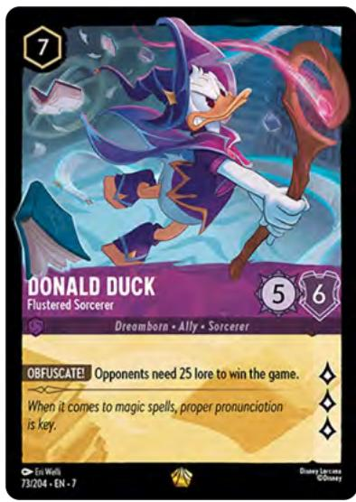

Q: Does my opponent need exactly 25 lore to win? (Ref. 4.4.a.)

A: No, Obfuscate! is intended to change the opponent's win condition to 25 lore or more while Donald Duck remains in play.

Q: What happens if Donald is banished when my opponent has between 20 and 25 lore? (Ref. 4.4.b.)

A: Your opponent would win during the next game state check. If multiple opponents meet the criteria, whichever is first in turn order starting from the active player would be the winner.

Q: Do multiple Donalds stack their effect? (Ref. 4.4.c.)

A: No. Thank goodness.

### Elsa - Ice Maker

Q: Can I choose an already exerted character for this Elsa's ability? (Ref. 4.5.)

A: Yes, you can. However, doing so means the character did not become exerted with this ability, and the second effect of making them unable to ready at the start of their next turn will not resolve even if you have a character named Anna in play. The words "if you do" on the second effect require the first effect to be resolved exactly as the effect describes in order for the second effect to resolve at all.

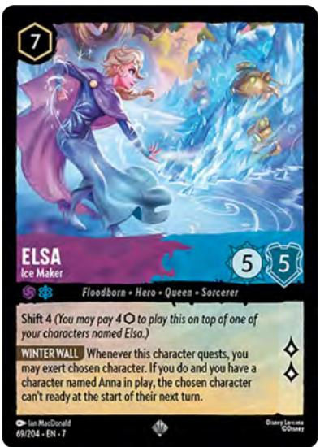

### Fa Zhou - War Hero

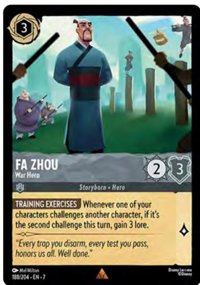

Q: Does Fa Zhou have to be in play during both challenges in order for Training Exercises to trigger? (Ref. 4.6.a.)

A: No. Training Exercises will trigger when the second challenge of your turn is declared, even if he was not in play to see the first one.

Q: Will Fa Zhou's ability trigger if he is played after the second challenge has already occurred that turn? (Ref. 4.6.b.)

A: No. Fa Zhou must be in play when the second challenge occurs. If he misses that one, he misses

his opportunity, even if other challenges happen while he is in play.

Q: Do the challenges both need to be from/against the same character or location? (Ref. 4.6.c.)

A: No. Fa Zhou does not care who challenged or what was challenged. Only that the second challenge has been declared.

### Gantu - Experienced Enforcer

Q: Does Gantu affect cards that I play? (Ref. 4.7.a.)

A: Yes. Both of Gantu's abilities apply their effects to all players.

Q: If an action or item is played “for free”, is the 2 ink from Don’t Get Any Ideas included? (Ref. 4.7.b.)

A: Playing a card "for free" means that you don't pay any ink costs at all. Even ones added by other abilities or effects. Gantu does not affect how much you pay for something played "for free".

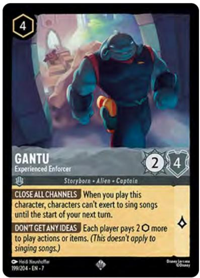

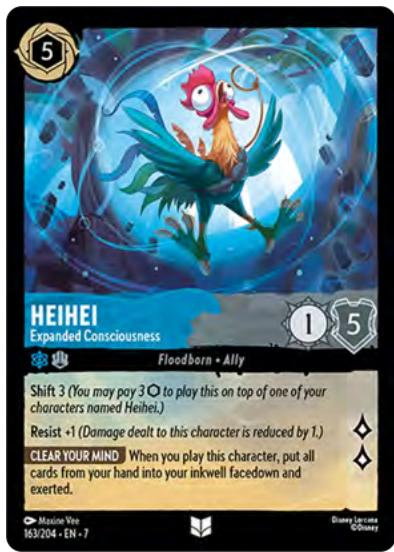

Heihei - Expanded Consciousness Q: Is this the greatest Lorcona card of all time? (Ref. 4.8.)

A: Yes.

### Kronk - Laid Back

Q: Can I still pay for abilities that require me to discard cards as part of the cost while Kronk is in play? (Ref. 4.9.a.)

A: Yes! I'm Lovin' This only applies to the effect portion of an ability. If the ability has a cost that includes discarding, you must still discard, such as for Madam Mim - Truly Marvelous or to resolve Twin Fire's second effect. Cards such as Sudden Chill would have their effect prevented if it was attempting to make you discard.

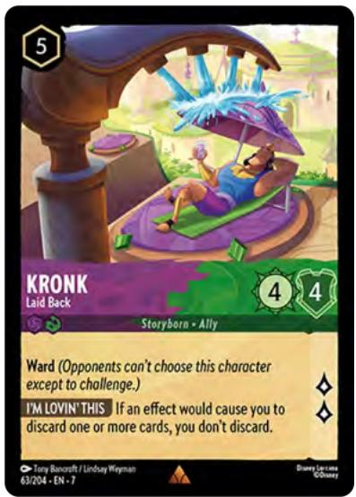

Q: What about if I play Megara - Captivating Cynic while Kronk is in play? (Ref. 4.9.b.)

A: Megara is banished. Kronk prevents you from being able to discard a card in order to keep her in play.

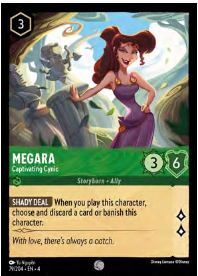

### Lady Tremaine - Bitterly Jealous

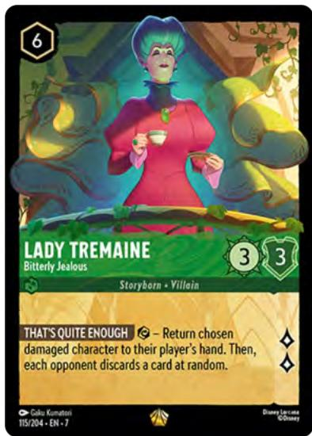

Q: Can I activate That's Quite Enough if there are no damaged characters in play? What happens if I do? (Ref. 4.10.)

A: You can activate the ability when there are no damaged characters in play, as the only cost is to exert Lady Tremaine. If you do so, no characters will return to any player's hand, but each of your opponents will still have to discard a random card.

A2: Remember, though - if there is a valid choice, you must choose it. Even if it is your own character! That part of the ability is not optional.

### Maid Marian - Badminton Ace

Q: If one of my Ally characters is dealt damage, but has Resist that reduces it to 0 damage dealt, does Good Shot still trigger? (Ref. 4.11.)

A: No. If Resist reduces an instance of damage to zero, then no damage is considered to have been dealt. Good Shot will not trigger if no damage is dealt.

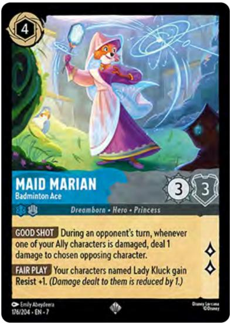

A2: Note that this also includes moving damage and putting damage counters - neither of those effects "deal" damage, and do not trigger Good Shot.

### Mickey Mouse - Inspirational Warrior

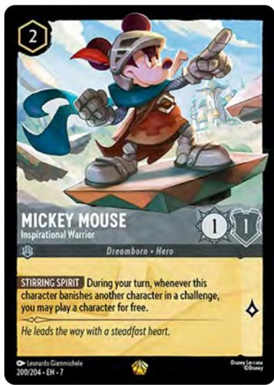

Q: Does Mickey need to survive the challenge in order to play a character for free? (Ref. 4.12.)

A: No. Even if Mickey is banished in the challenge, if he banishes the opposing character then Stirring Spirit will trigger and get to resolve. Mickey does not need to remain in play.

### Mother Gothel - Vain Sorceress

Q: Can Now You've Upset Me move a damage counter that was dealt in the challenge that triggered the ability? (Ref. 4.13.a.)

A: No. Mother Gothel's ability resolves after the challenge has been declared, but before the Challenge Damage Step has dealt any damage to characters.

Q: What happens if the moved damage counter causes one of the characters in the challenge to be banished? (Ref. 4.13.b.)

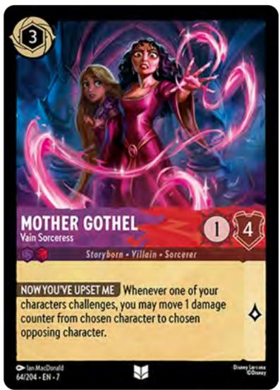

A: Remaining abilities are resolved from the bag, and then the challenge ends. It is an open question whether Gothel "gets credit" for banishing the character - stay tuned for updates!

### Pepa Madrigal - Sensitive Sister

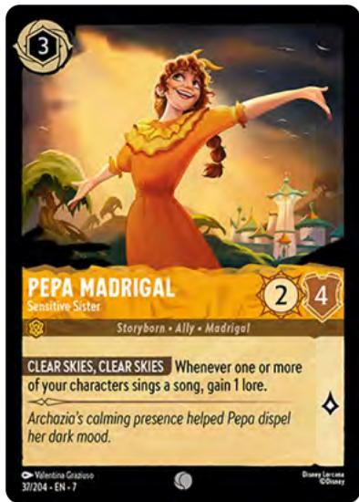

Q: If I sing a song with Sing Together, do I get a lore for each character that song? (Ref. 4.14.)

A: No. Because Clear Skies, Clear Skies specifies "one or more" characters, singing a song with Sing Together would only ever grant one lore.

### Pepper - Quick-Thinking Puppy  
Q: Can Pepper's ability put herself in the inkwell when she is banished? (Ref. 4.15.)

A: Yes! Pepper is a puppy character, and her ability would trigger when she is banished. If you wish, you can put her into the inkwell.

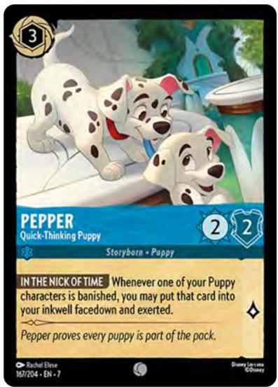

### Pete - Space Pirate

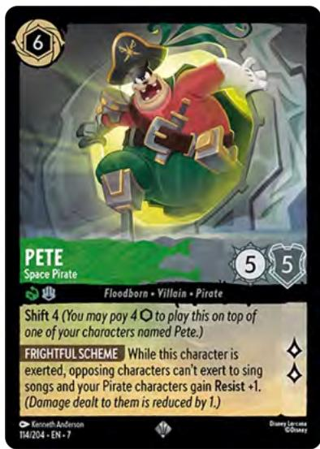

Q: Does Pete get Resist +1 from Frightful Scheme when he challenges? (Ref. 4.16.)

A: Yes! Pete is exerted before the challenge occurs, so he would immediately gain Resist +1 at that point and have it for the entirety of the challenge (and beyond).

### Pongo - Dear Old Dad

Q: What happens if some of my ink is exerted when I resolve Pongo's ability? (Ref. 4.17.)

A: If you look at your inkwell and find that a Puppy was one of the cards you exerted, you can play that character for free and keep the same amount of ready ink - congratulations!

A2: If you are playing with ink tokens, you must select which cards from your real ink pile are the exerted ones before looking at your inkwell.

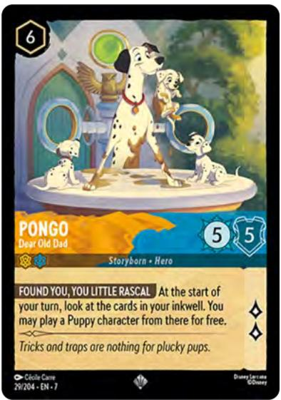

### Queen of Hearts - Unpredictable Bully

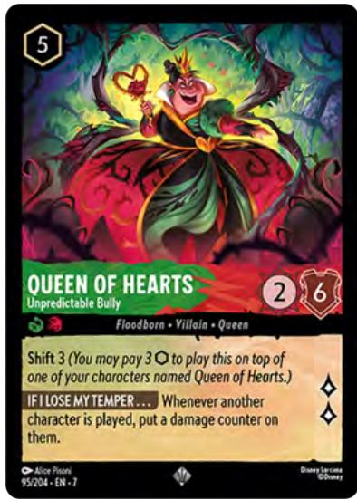

Q: If I shift a character onto Queen of Hearts, will it get a damage counter put on it? (Ref. 4.18.a.)

A: Yes. Playing a character onto Queen of Hearts with Shift counts as "playing another character". It doesn't matter that she will herself be covered up by that character when the ability resolves.

Q: Does Resist or Ward prevent If I Lose My Temper... from putting a damage counter on a character? (Ref. 4.18.b.)

A: No. Resist does not reduce placed damage counters, as they are not "dealt", and If I Lose My

Temper... does not "choose" a character so does not interact with Ward.

### Ratigan - Nefarious Criminal

Q: If I sing Try Everything with Ratigan and ready him, does A Marvelous Performance give me any lore? (Ref. 4.19.)

A: Yes! A Marvelous Performance triggers and goes in the bag whenever an action is played while Ratigan is exerted. Since you have to exert him to pay the cost of the song before it is played, this condition is met. Resolving the effect of Try Everything does ready Ratigan after that, but the ability does not care if he remains exerted until it resolves. You get the lore!

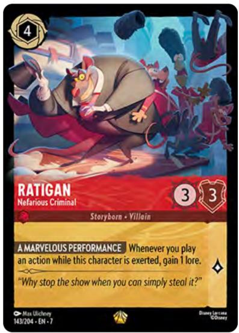

### Scrooge McDuck - Resourceful Miser

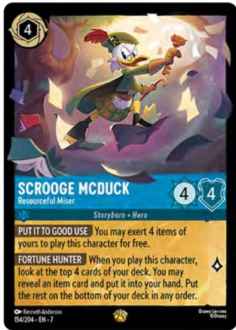

Q: Do the items exerted for Put It To Good Use need to have an exert ability? (Ref. 4.20.a.)

A: No. The abilities on the items do not matter for Put It To Good Use. In fact, if any of the items exerted did have an exert ability, it would not be used since they were not exerted for the purpose of paying the cost of that ability - only Scrooge's.  
Q: Can I "exert" items that are already exerted to pay the cost of Put It To Good Use? (Ref. 4.20.a.)

A: No. If you are not able to do what a cost requires you to do, then you cannot pay that cost. And you em that is already exerted.

Q: Can I use Scrooge's ability Put It To Good Use to exert items while he is already in play? (Ref. 4.20.b.)

A: No. While using Scrooge's ability while he is in play is not specifically prohibited by the rules, it is not intended. We have a special ruling to clarify that Put It To Good Use may only be activated while Scrooge is in your hand.

### Snow White - Fairest in the Land

Q: What happens if I give Snow White Bodyguard?

(Ref. 4.21.)

A: Bodyguard only affects opposing characters that are able to challenge the character with the keyword - no characters can challenge Snow White, so Bodyguard would not have any effect.

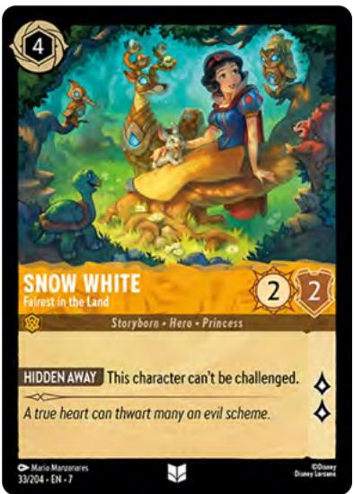

### Te Kā - Elemental Terror

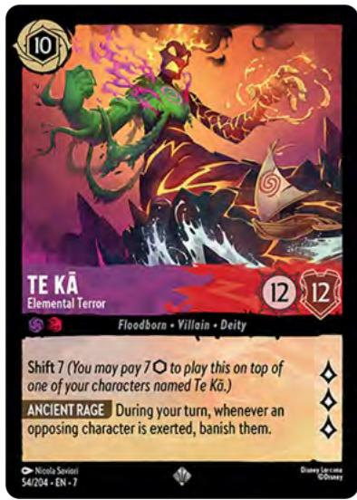

### Q: Does Ancient Rage

banish characters that are already exerted when she is played (or when my turn begins)? (Ref. 4.22.)

A: No. "Is exerted" in the text of Ancient Rage refers to the event of going from the Ready position to the Exerted position. You also cannot "re-exert" an already exerted character.

A2: Notably, this also excludes characters that enter play exerted (if they happen to be played on your turn). Cards like Sleepy - Nodding Off do not go from Ready to Exerted, they simply enter play already sideways.

### The Queen - Jealous Beauty

Q: Can I move fewer than three cards from my opponent's discard if that's all they have? (Ref. 4.23.)

A: No. In order to resolve No Ordinary Apple fully, you must move exactly three cards to the bottom of the deck. If you cannot move three cards, you cannot move any (and, of course, you won't gain any lore).

You can still exert The Queen to use the ability if desired, but it will resolve to no effect.

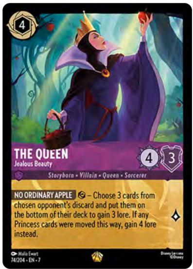

## Specific Item Questions

### Devil's Eye Diamond

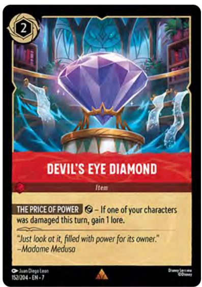

Q: Does Devil's Eye Diamond need to have been in play when one of my characters was damaged? (Ref. 5.1.a.)

A: No. The Price of Power will resolve successfully if one of your characters was dealt damage at any time during this turn, even before Diamond was played.

Q: Does the character that was damaged need to still be in play when Devil's Eye Diamond's ability is activated? (Ref. 5.1.b.)

A: No. The Price of Power will resolve successfully after that was damaged has been banished.

Q: Does moving damage counters to or putting damage counters on one of my characters make The Price of Power able to resolve and give me lore? What about characters that enter play with damage counters? (Ref. 5.1.c.)

A: No. Only damage having been "dealt" will allow The Price of Power to resolve successfully. Moving damage counters and putting damage counters do not count as "dealing" damage. Characters that enter play with damage counters also do not count as having been dealt damage.

### Maurice's Machine

Q: Can I banish Maurice's Machine at any time? (Ref. 5.2.)

A: No. Maurice's Machine must be banished by another ability, like Hiram Flaversham - Toymaker's Artificer.

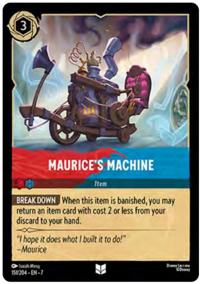

### The Glass Slipper

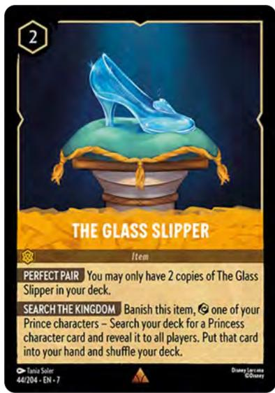

Q: How many copies of The Glass Slipper can I play in Draft/Sealed? (Ref. 5.3.a.)

A: No more than two.

Q: Can I banish The Glass Slipper to use Search the Kingdom if I don't have a Prince character to exert? Or if my Prince character is drying? (Ref. 5.3.b.)

A: No. Banishing the slipper and exerting a Prince character is the cost to activate Search the Kingdom. You cannot only pay part of a cost - you must pay costs in their entirety.

Remember that drying characters cannot exert to pay costs that use the exert symbol.

### Unconventional Tool

Q: Can I banish Unconventional Tool at any time?

(Ref. 5.4.)

A: No. Unconventional Tool must be banished by another ability, like Hiram Flaversham - Toymaker's Artificer.

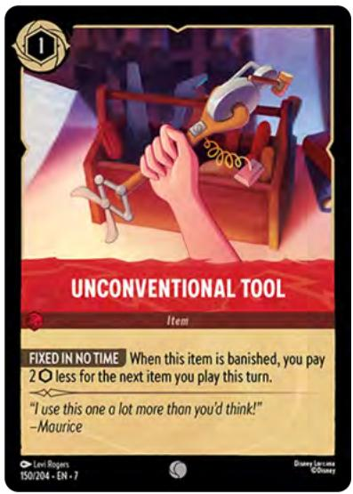

## Specific Action/Song Questions

### All Is Found

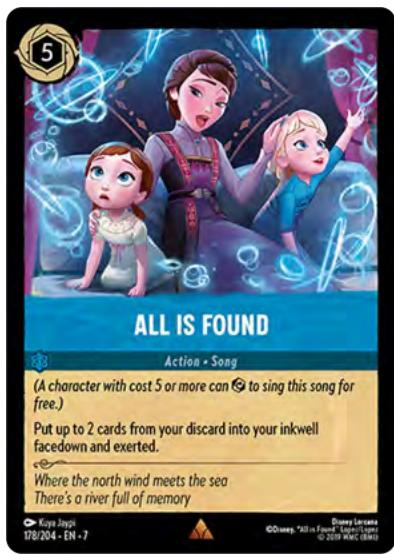

Q: Can I place the copy of All Is Found that I just played into the inkwell when I resolve its effect? (Ref. 6.1.)

A: No. While a played action card is resolving, it is not in any zone, and does not enter the discard pile until its effect is completely resolved. When you are choosing cards from the discard to put into the inkwell, All Is Found is not there to be chosen.

### Ink Geyser

Q: How do I determine which cards stay in the inkwell? Do the inkwell cards have to be shuffled? (Ref. 6.2.)

A: Which cards stay in the inkwell must be determined randomly, but shuffling is not necessarily required. Dice can be used to determine which cards to move to the hand without shuffling their order, for example, but any method that is acceptable to both players can be used. If players cannot agree on a method to determine the random cards, a judge can be called in tournament settings

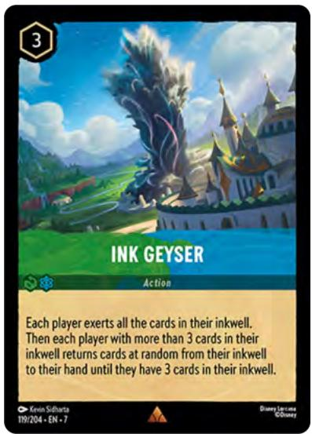

### Restoring Atlantis

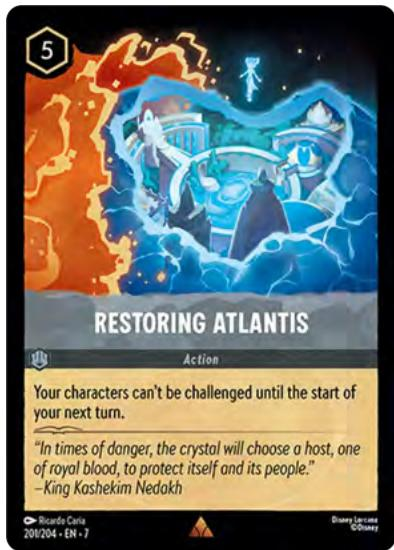

Q: Are characters that are played after Restoring Atlantis able to be challenged? (Ref. 6.3.)

A: No. Restoring Atlantis essentially applies an effect to the player, which protects all characters they have in play. The characters do not need to have been in play when Restoring Atlantis resolved.

### So Much To Give

Q: If I give a drying character Bodyguard with So Much To Give, can I exert them? (Ref. 6.4.)

A: No. The character gaining Bodyguard must already be in play to be chosen for the effect of So Much To Give - it is too late to use the "enter play exerted" effect that Bodyguard usually has.

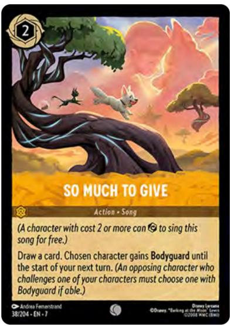

### The Return of Hercules

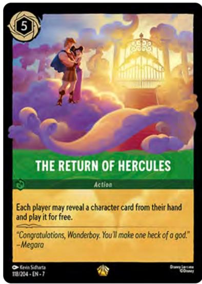

Q: How do my opponent and I resolve this card in the correct order? (Ref. 6.5.)

A: Starting with the active player, each player chooses and reveals a character card that they wish to play (if any - it is optional). Yes, that means your opponent will see what you're choosing to play before they make their choice.

Then all revealed characters will be played in turn order, before finally resolving any triggered abilities as is usually done - in turn order, with each player choosing the order of resolution of their own abilities.

Q: What if we both play Maleficent - Dragon? (Ref. 6.5.)

A: Both Dragons would enter play and trigger when they do so, adding their abilities to the bag. Then each player would get to resolve the banish effect even if the active player chose to banish the opposing Maleficent, since her ability doesn't care if she remains in play and will still resolve.

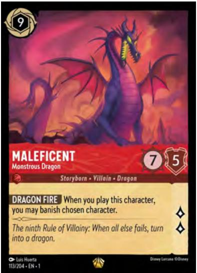