# Azurite Sea Unofficial Set Notes

Presented by LorcanaJudges.com

Author:

Disclaimer: These set notes are assembled as a volunteer effort based on common questions from the community and clarifying information from the rules team. They do not reflect any possible upcoming rule changes, and are not official in any sense of the word. They are meant as a general play aid only.

## General Rules

Q: Can I use an activated ability more than once during my turn?

A: Yes, provided you can pay the cost associated with that ability. Remember, an exert cost can only be paid by a dry, ready character!

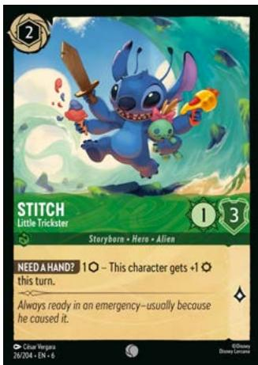

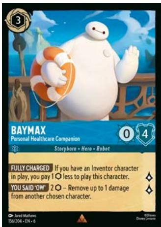

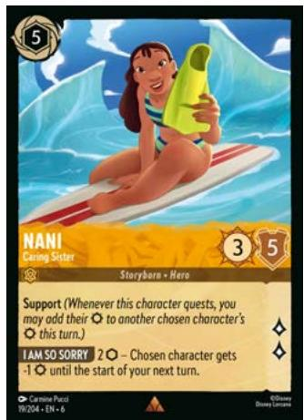

Q: Can characters banished at the same time as each other have their abilities trigger from other banishments?

A: Yes, characters that are banished will first check to see if their abilities trigger from themselves or other characters leaving play.

Example: Hades - Lord of the Dead's ability will trigger for each other of your characters in play if a Be Prepared is played by your opponent.

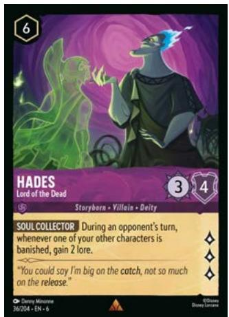

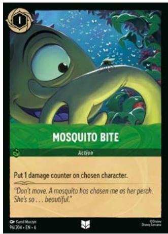

Q: Does putting damage counters on a character/location count as dealing damage?

A: No, putting damage counters onto something in play is mechanically distinct from dealing damage. Putting damage counters on a character is not affected by Resist, and does not trigger abilities that rely on dealing damage.

Example: Using Mosquito Bite to put a damage counter on an opposing character will not trigger Beast - Relentless.

Q: Can an exert (symbol) cost on an item, location, or action be paid by exerting a drying character?

A: No. When the exert symbol is used in a cost, the character you choose to exert must be dry. Even though the ability is not on that character.

Example: Scrimp's cost of exerting one of your characters can only be paid by exerting a dry character.

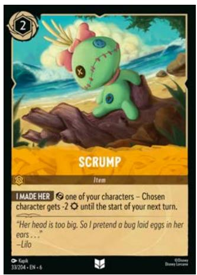

## Specific Characters

Captain Amelia - Commander of the Legacy Q: Does Everything Shipshape apply when Captain Amelia is challenged, or when your other characters are challenged?

A: Everything Shipshape is a static ability that applies to your other characters. When another character of yours is challenged, that character gains Resist +1 for the duration of that challenge. They lose that Resist when the challenge is over.

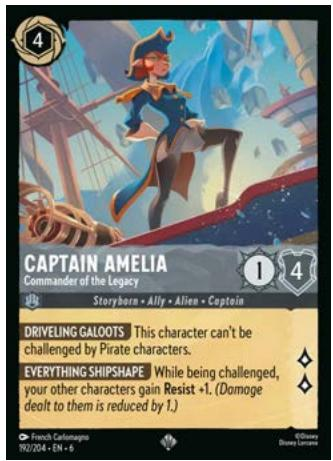

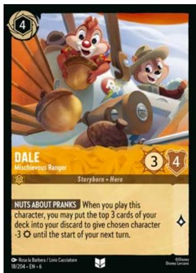

### Dale - Mischievous Ranger

Q: Can I use Nuts About Pranks with fewer than 3 cards left in my deck? What happens if I do that?

No. Nuts About Pranks is a triggered ability that uses the word "to" to join a cost with its effect. You cannot partially pay this cost (by, for example, putting the only two cards remaining in your deck into the discard). If you cannot put three cards into the discard, you cannot put any, and since you have not paid the cost you do not get to reduce a chosen character's Strength.

### Genie - Wonderful Trickster

Q: Does Genie's first ability, Your Reward Awaits trigger when he is played?

A: No. Your Reward Awaits cannot trigger when Genie is played, because at that point Genie is not in play to be able to see the trigger condition being met.

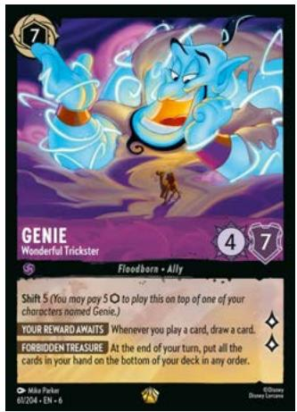

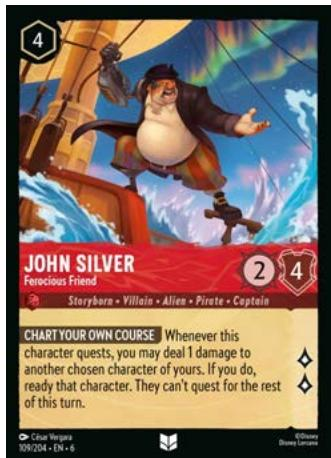

### John Silver - Ferocious Friend

Q: If I choose to damage a character with Resist +1 using Chart Your Own Course so that no damage is dealt, can I still ready that character?

A: No. The "if you do" in John Silver's second effect is only satisfied if one damage was actually dealt to the chosen character.

IMPORTANT NOTE:

John Silver's interaction with Resist is a departure from a similar circumstance with the action Teeth and Ambitions. In that case, Resist reducing the damage does not prevent the second effect from taking place. That is because the first effect in T&A is a cost, which John Silver does not have.

### Lilo - Escape Artist

Q: Do I have to have another copy of Lilo - Escape Artist in play to be able to use No Place I'd Rather Be?

A: No. Lilo - Escape Artist has a special triggered ability that works from the discard pile. If you have a copy of her in your discard, she can be played during the Set Step of the Beginning Phase.

Q: When I play Lilo - Escape Artist from the discard pile, do I have to pay her ink cost?

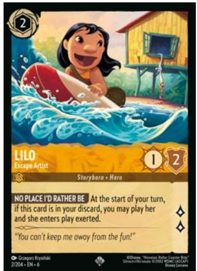

A: Yes. Her ability does not allow her to be played "for free", so her normal ink cost applies.

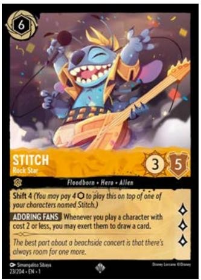

Q: Can I exert Lilo with Stitch - Rock Star in order to use his ability to draw a card when I play her from the discard?

A: No. Lilo enters play from the discard already exerted. She cannot be exerted again in order to pay the cost of Stitch's ability.

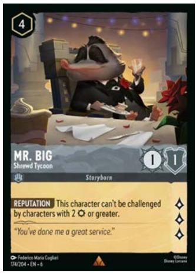

### Mr. Big - Shrewd Tycoon

Q: Can Mr. Big be challenged by a 0 {S} character with Challenger +3?

A: Yes. Challenging restrictions like Reputation are checked before the challenge actually begins, and Challenger only begins affecting a character's strength after that point. The two do not interact.

### Peter Pan - Neverland Prankster

Q: If I challenge my opponent's Peter Pan with Goofy - Super Goof, will I gain lore from Super Peanut Powers?

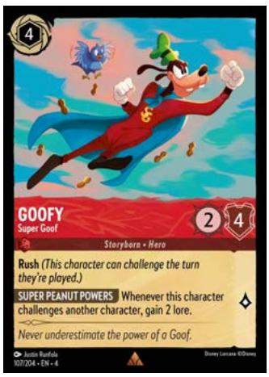

A: Yes. Goofy is considered to "have challenged" as soon as the challenge begins (4.3.6.9. in CRD 8/9/24), so Peter Pan's Can't Take a Joke is no longer in effect when Super Peanut Powers resolves.

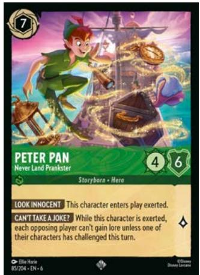

### Pleakley - Scientific Expert

Q: If I play Pleakley with no other characters in play, do I have to put him into the inkwell?

A: Yes. Reporting for Duty is a mandatory ability. If there is no other valid choice when you resolve it, you must choose Pleakley himself and place him facedown in the inkwell.

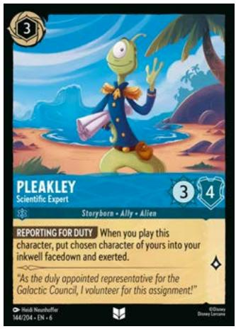

### Scar - Heartless Hunter

Q: If I play Scar - Heartless Hunter when there are no other characters in play, do I have to damage him with Teeth and Ambitions?

A: Yes. Teeth and Ambitions is a mandatory ability, and Scar is a valid choice for the first part of his ability even if there are no other characters to damage with the second part.

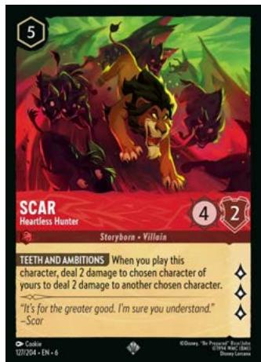

### Simba - Pride Protector

Q: Does Understand the Balance ready all of my other characters, or can I pick and choose which to ready?

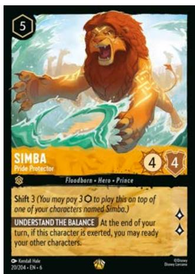

A: If you choose to use the effect, you must ready all of your other characters. You do not get to pick and choose which characters ready.

Q: If I use another effect to ready Simba, can I still ready other characters with Understand the Balance?

A: No. If Simba is not exerted when you resolve Understand the Balance, it will resolve to no effect. This is because the secondary condition "if this character is exerted" must be true when you trigger the ability and when you resolve the ability.

### Sisu - Uniting Dragon

Q: How many times can I repeat Sisu's ability?

A: You must repeat Sisu's ability as long as you continue to reveal Dragons from the top of your deck. It is a mandatory ability, so you will continue to reveal cards until you reveal something that is not a Dragon.

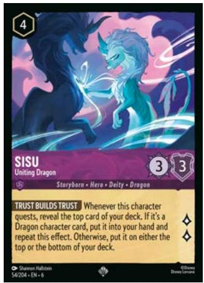

### Tiana - Restaurant Owner

Q: Does Tiana's ability stock when there are multiple copies in play?

A: Yes, the opponent would have to choose whether or not to pay 3  \(\{\mathsf{l}\}\)  for the triggered ability from each copy of Tiana. If they chose not to do so, the -3  \(\{\mathsf{S}\}\)  would stack on the challenging character.

Q: Does Tiana's -3  \(\{S\}\)  stay on the challenging character?

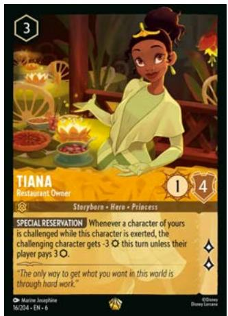

A: Yes, the strength reduction on a challenging character lasts for the whole turn, until the active player's End of Turn Phase.

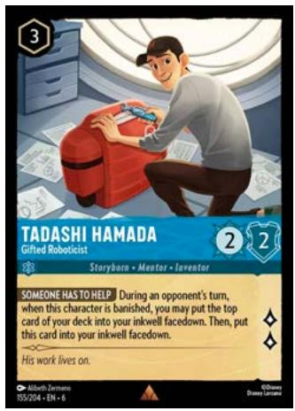

### Tadashi Hamada - Gifted Robotictist

Q: When banished on an opponent's turn, does Tadashi always go to the inkwell?

A: Yes. While putting a card from the top of the deck into the inkwell uses "may" and is an optional effect, the second clause of Tadashi's ability is mandatory. He is always placed in the inkwell by his ability if his trigger condition is met, even if you don't put a card from the deck in also.

### Wreck-It Ralph - Ham Hands

Q: Can I banish an opponent's item or location with / Wreck Things?

A: Yes. The ability text does not specify "your" item or location, so any item or location in play can be chosen.

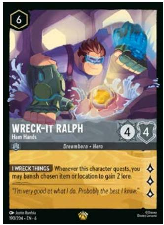

## Specific Actions/Songs

### Sail the Azurite Sea

Q: Does the card placed into the inkwell with Sail the Azurite Sea's effect have to be an inkable card?

A: Yes. Like Belle - Strange But Special in The First Chapter, Sail the Azurite Sea allows you to take an additional turn action to place an inkable card into the inkwell. You must follow the normal procedure for doing so, including revealing the card to your opponent.

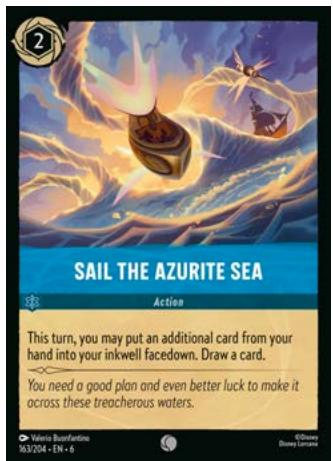

Q: Can I draw a card before choosing what to ink?

A: Yes. In fact, you have to! Because Sail the Azurite Sea allows you to use an additional turn action to place a card into the inkwell, you must complete resolving Sail the Azurite Sea before you can choose to take that turn action at any time later in your turn.

### Twin Fire

Q: Can I deal both instances of two damage to the same character?

A: No. Twin Fire's effect uses the word "another", which has a specifically defined meaning in Lorca's rules - it refers to a card that was not already selected by the effect.

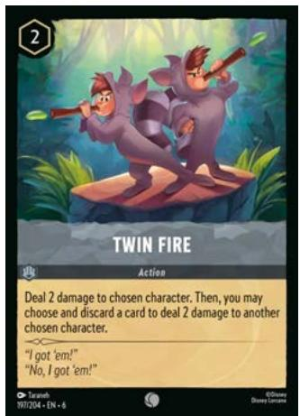

## Specific Items

### Maleficent's Staff

Q: Does Back, Fools! trigger when a character is returned to their player's hand after being banished?

A: No. Back, Fools! only triggers when a character is returned directly from in play to the hand. A character returned to the hand after being banished does so from the discard pile,

not the play zone.

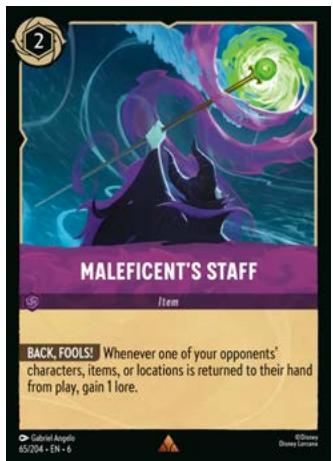

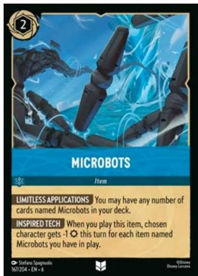

### Microbots

Q: Does Microbots count the copy that you played to trigger Inspired Tech?

A: Yes. When Inspired Tech resolves, the copy of Microbots that triggered the ability is in play, and should be counted.

### Transport Pod

Q: Can I use Transport Pod to move a character to The Queen's Castle in order to draw an extra card with Using the Mirror?

A: Yes. Using the Mirror triggers at the start of the turn, as does Transport Pod. By resolving Transport Pod's ability first, you can have that character present at The Queen's Castle before resolving Using the Mirror.

Q: Can I use Transport Pod to move a Pirate to an empty Skull Rock in order to gain 1 lore?

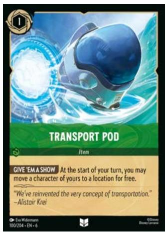

A: No. Safe Haven has a secondary condition ("if you have a Pirate character here") that must be true at the start of the turn in order to trigger. By the time Transport Pod can resolve and move a Pirate there, it is too late.

## Specific Locations

### Owl Island - Secluded Entrance

Q: If I play Owl Island after playing an action, does Teamwork make the next action I play use less ink?

A: No. Teamwork is a static ability, so it does not need to be in play to "know" you played your first action of the turn. If you play Owl Island after an action, you have missed out on taking advantage of the Teamwork ability.

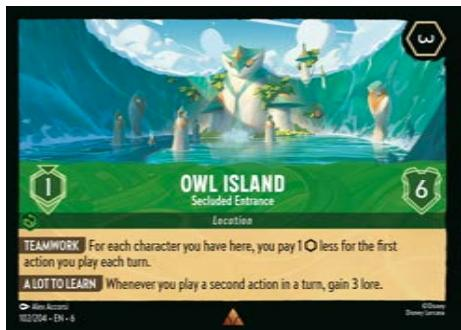

Q: If I sing a song while Owl Island is in play, do I still get to use Teamwork on another action?

A: No. Singing a song is still playing an action. Doing so will "use up" the discount from Teamwork even though you get no benefit from it.

### Sugar Rush Speedway - Finish Line (& Starting Line)

Q: If the damage I deal to a character using Starting Line's On Your Marks! ability would banish that character, do they still move to the Finish Line? Do I still get to use Bring It Home, Kid?!

A: Yes. Even if a character has damage equal to its willpower, it will not be banished until the next Game State Check. In this case, that GSC will not occur until On Your Marks! is completely resolved so the character is able to move to the Finish Line and trigger Bring It Home, Kid!. Additionally, Bring It Home, Kid! does not require the character to still be at the location when it resolves, so the banishment does not prevent it from resolving.

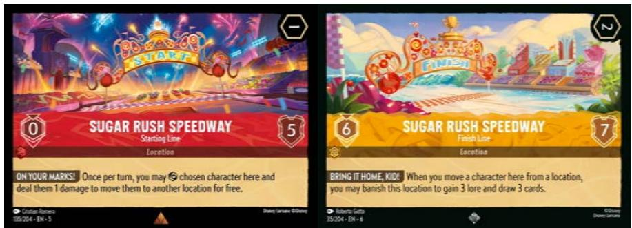

Treasure Mountain - Azurite Sea Island Q: Do I have to deal damage to one of my own characters or locations if my opponent has nothing I can choose?

A: Yes. Secret Weapon is a mandatory ability. If there is no opposing choice to deal damage to, you must deal damage to something you have in play.

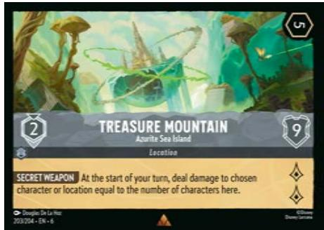