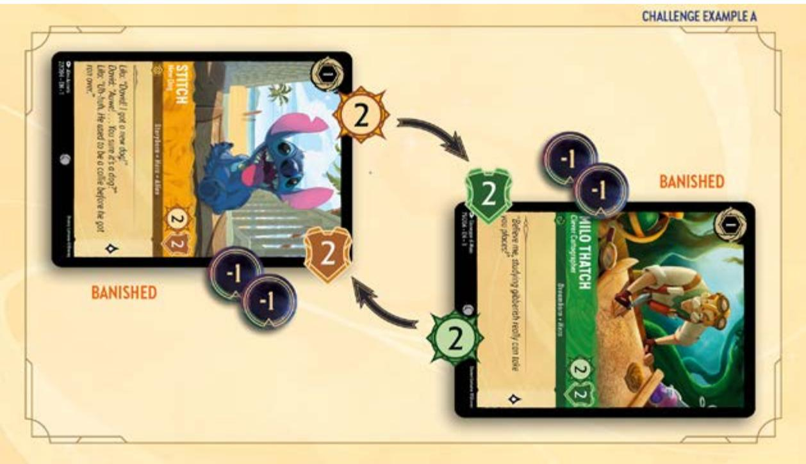
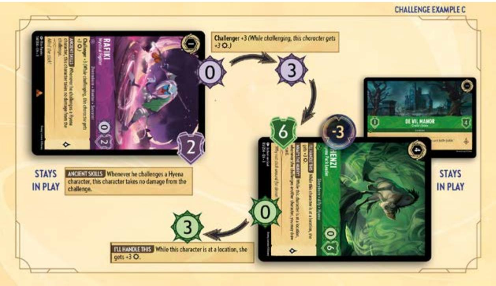
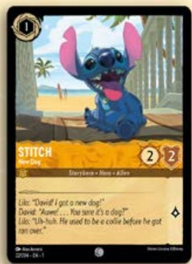
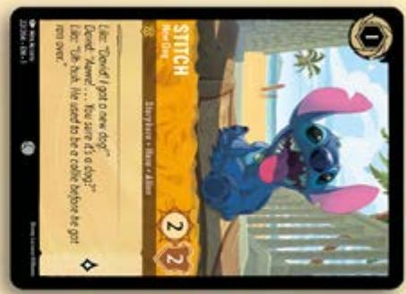
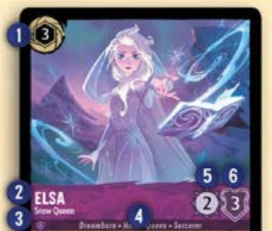
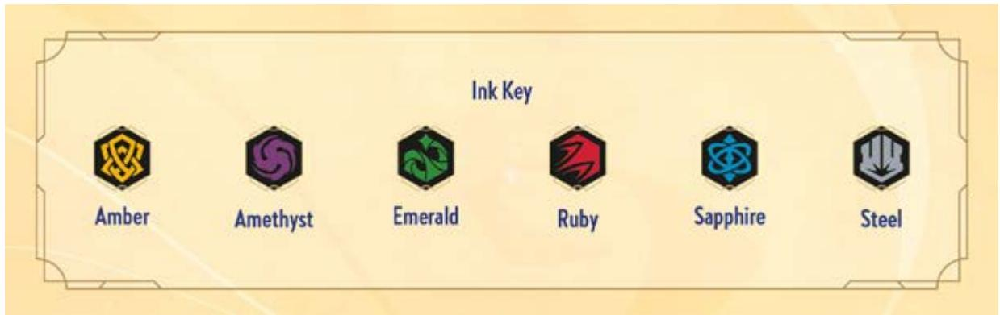
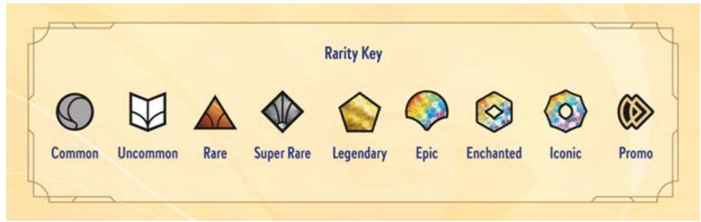
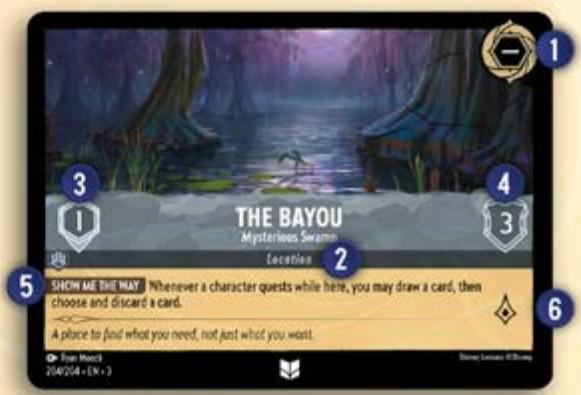

# COMPREHENSIVE RULES

Effective August 22, 2025

A NOTE FOR NEWER PLAYERS

Welcome! There are several ways to access the rules for the Disney Lorcana trading card game. The information outlined in this document is meant for high-level Disney Lorcana rules questions and not as a way to learn the game.

If you're new to the Disney Lorcana TCG, we recommend you start with our introductory videos here or download the official Disney Lorcana Trading Card Game Companion app on Apple or Google Play.

INTRODUCTION

This document covers the technical details of official Disney Lorcana gameplay. The rules described here are organized in a numbered format to make referencing and updating them easy and clear.

The Comprehensive Rules are a living document. Go to the Disney Lorcana Resources page for the most current version.

UPDATES

We've used colored text to make it easier to spot updates made to this document since its last publication. Text that is new or changed is in Sapphire. Text that has been moved is in Amber. For a list of revisions, see the Update Summary at the end of this document.

CONTENTS

## 1. CONCEPTS

1.1. General Languages, Official Text, Updates, Tournament Rules  
1.2. Golden Rules Choices  
1.3. Active Player  
1.4. Opponent  
1.5. Playing Cards  
1.6. Types of Abilities  
1.7. The Bag  
1.8. Players' Cards  
1.9. Game State Check Game State Conditions, Required Actions, Order of Completion  
1.10. Multiplayer Games

## 2. BEFORE THE GAME

2.1. Deck Rules

## 3. GAMEPLAY

3.1. Starting a Game
Starting Player, Randomize, Track Lore, Draw, Alter Hands  
3.2. Ending a Game Lore, Empty Deck, Last Player

## 4. TURN STRUCTURE

4.1. Phases  
4.2. Beginning Phase Ready, Set, Draw  
4.3. Main Phase

Turn Actions, Inkwell, Play a Card, Play for Free, Quest, Challenge, Move a Character, Use Activated Abilities

4.4. End of Turn Phase

## 5. CARDS

5.1. Conditions Ready, Exerted, Damaged, Undamaged, Under, On Top, In a Stack

### 6. CARD TYPES

6.1. Characters Requirements to Be a Character  
6.2. Parts of a Card Ink Key, Rarity Key, Characters with Two Names  
6.3. Actions General, Songs  
6.4. Items  
6.5. Locations Parts of a Card

### 7. ABILITIES

7.1. General Clauses, Multiple Effects in a Clause, "May," "Put into Hand," "Other/Another," Playing Cards while Resolving Abilities, Loops, "Up to," "That," Revealing Cards  
7.2. Action Cards  
7.3. Keywords General, Reminder Text  
7.4. Triggered Abilities
- Abilities with Two Trigger Conditions, Floating Triggered Abilities, Delayed Triggered Abilities  
7.5. Activated Abilities Paying Costs, Steps to Use  
7.6. Static Abilities Duration, Timing, Outside of Play  
7.7. Replacement Effects Skip  
7.8. Ability Modifiers

### 8. ZONES

8.1. General  
Public, Private, Fail to Find  
8.2. Deck  
Private Zone, Adding Cards to Top or Bottom  
8.3. Hand  
8.4. Play  
In Play, Public Zone, Leaving Play  
8.5. Inkwell  
8.6. Discard  
8.7. Bag

### 9. DAMAGE

9.1. Representation of Damage  
9.2. "Put"  
9.3. Moving Damage Counters  
9.4. Leaving Play

### 10. KEYWORDS

10.1. General  
Stacking, Technical Definitions, Reminder Text  
10.2. Bodyguard  
10.3. Challenger  
Stacking  
10.4. Evasive  
10.5. Reckless  
10.6. Resist  
Stacking, O Damage  
10.7. Rush  
10.8. Shift  
Alternate Cost, State, Damaged, Leaving Play, Variants  
10.9. Singer

10.10. Sing Together

Alternate Cost, Resolving Triggered Abilities

10.11. Support  
10.12. Vanish  
10.13. Ward

GLOSSARY

UPDATE SUMMARY

PREVIOUS UPDATE SUMMARY

## 1. CONCEPTS

### 1.1. General

1.1.1. Disney Lorcana cards are published in multiple languages. For the purposes of gameplay, the English cards, rules, rulings, and clarifications are the official versions.  
1.1.2. Card text and rules may be updated or corrected. The most current updated or corrected information is the official version for gameplay.  
1.1.3. The Disney Lorcana TCG is a game played with two or more people. Each player needs a deck of Disney Lorcana cards that they'll use in the game. See 2.1 "Deck Rules" for deck requirements.  
1.1.4. Each player needs a way to track their lore totals and mark damage on characters and locations. This can be any method players find convenient that is clear to all players in the game.  
1.1.5. Disney Lorcana tournaments may have additional rules that can affect the ones in this document. Please refer to the Disney Lorcana TCG Tournament Rules found here for further reference.  
1.1.6. Some cards include reminder text set in italics. Reminder text isn't rules text. It's only a memory aid and may vary without changing the meaning of keyword rules.

### 1.2. Golden Rules

1.2.1. If the text of a card contradicts a game rule, the card effect supersedes that rule.

Example: The game doesn't allow a character to challenge a ready character, but a player has a character with an ability that reads, "This character can challenge ready characters." The ability overrides the game rule and allows that character to challenge a ready character.

1.2.2. If a rule or effect prevents something from happening, that rule or effect supersedes other rules and effects that allow it to happen.

Example: An effect says that players can't play actions. Another effect instructs a player they may play an action for free. That player still can't play an action.

1.2.3. Do as much as you can - If an effect tells a player to do something, the player does as much as possible even if some part of that effect can't be done, except in specific cases (see 7.1.2).

Example: Strike a Good Match has an effect that reads, "Draw 2 cards, then choose and discard a card." If an effect prevents the player of this action from drawing any cards, they still have to choose and discard a card.

1.2.4. Choices that are made as a part of an effect are made as the effect is resolving and not as part of playing the card or using the ability with the effect.

Example: The active player has a Let the Storm Rage On in their hand and no characters in play. The opponent has a Cogsworth - Grandfather Clock (which has Ward) in play and has no other characters in play. Let the Storm Rage On has an effect that reads, "Deal 2 damage to chosen character. Draw a card." When the active player plays Let the Storm Rage On, the opponent isn't sure they can play it, since there are no characters in play for them to choose. The choice of character happens as the effect is resolving, though, not when the card is played. Because the active player can't choose Cogsworth as the effect is resolving, they do as much as they can and draw a card without dealing 2 damage.

### 1.3.Active Player

1.3.1. When a player starts their turn, they become the active player. When a player ends their turn, they're no longer the active player.

### 1.4. Opponent

1.4.1. Anyone a player is playing against is their opponent.  
1.4.2. Some game formats allow a player to designate one or more players as teammates. Such teammates are identified before the game starts. As teammates aren't playing against each other, they aren't opponents to one another.

### 1.5. Playing Cards

1.5.1. Players can play a card whenever they're the active player and there are no effects to resolve. To play a card, the player reveals it from their hand and pays the cost (see 4.3.4).

### 1.6. Types of Abilities

1.6.1. There are several kinds of abilities in the Disney Lorcana TCG.

1.6.1.1. Keywords are words or shortened phrases that represent a larger ability or abilities. See section 10 for the full list of current keywords.  
1.6.1.2. Triggered abilities continuously look for a specific condition and have an effect when that condition is met. Triggered abilities follow the rules in section 7.4.  
1.6.1.3. Activated abilities have a cost and an effect that occurs if that cost is paid. Activated abilities follow the rules in section 7.5.  
1.6.1.4. Static abilities are effects that are continuously active, either for a fixed length of time or for as long as the card generating the effect is in play. Static abilities follow the rules in section 7.6.  
1.6.1.5. Replacement effects are generated by some abilities. These replace one effect with another. Replacement effects follow the rules in section 7.7.

1.6.2. Whenever an effect would affect multiple players at the same time, the active player resolves that effect first, then in turn order each other player resolves that effect.

Example: Donald Duck – Perfect Gentleman has the ability Allow Me that reads, “At the start of your turn, each player may draw a card.” While the triggered ability is resolving, the active player resolves their part of the effect first and draws a card. Then in turn order each other player resolves their part of the effect and draws a card. Once all players have finished resolving their respective parts of the effect, it has fully resolved and the game continues.

### 1.7. The Bag

1.7.1. The bag is the zone where triggered abilities wait to resolve. It's not a physical zone but a way to picture the process of resolving triggered abilities. Think of each triggered ability as a marble and the bag as a place to put them until they're resolved. Every marble is separate from every other marble, and a player can look through the bag of marbles to select the one they wish to resolve next.  
1.7.2. It's possible for both the active player and their opponent(s) to add triggered abilities to the bag at the same time. Resolving these abilities follows the rules in section 8.7, "Bag."

### 1.8. Players' Cards

1.8.1. Cards a player brings to the table in their deck are their cards, and that player makes any decisions necessary for the card and its effects unless otherwise specified by an effect.  
1.8.2. His/Her/Its/Their - When a card refers to "his," "her," "its," or "their" player, it's referring to the person who played the card. When a card refers to "his," "her," "its," or "their" turn, it's referring to its player's turn.  
1.8.3. You/Your/Yours - Card effects address the player who played that card. When a card refers to "you," "your," or "yours," it's referring to the player of the card, even if the ability containing the reference was granted by an opposing effect.

### 1.9. Game State Check

1.9.1. There is a set of conditions the game checks for with certain required actions happening when one or more of those conditions is met. This is called a game state check and is made up of two parts: the game state condition and the required action. A game state condition is a specific circumstance the game state can achieve. A required action is what happens in the game when a game state condition is met. The following are the conditions that the game state check looks for and the required action each creates.

1.9.1.1. If a player has 20 or more lore, that player wins the game.  
1.9.1.2. If a player attempted to draw from a deck with no cards since the last game state check, that player loses the game.  
1.9.1.3. If a character or location has damage equal to or greater than its Willpower, that character or location is banished. A character or location banished as a result of damage dealt by a character in a challenge since the last game state check or as a result of damage dealt, put, or moved by a character's ability since the last game state check is considered banished by that character.

1.9.2. A game state check is made at the end of every step, after any action or ability is finished resolving, and after each effect in the bag is finished resolving. During a game state check, first check and complete all win and loss conditions and required actions. Then if there are no win or loss conditions met, check and complete all other conditions and required actions. Once all required actions are complete, the game state check repeats until there are no further required actions to complete. Triggered abilities that occurred during this process are then added to the bag to resolve.

1.9.2.1. Any required actions generated from a game state check happen in turn order. If a player would win and lose the game at the same time as a result of the same game state check, that player wins the game.

1.9.3. Once a required action is completed, the game state check occurs again.  
1.9.4. Abilities that trigger as a result of a game state check are added to the bag as soon as the check and any required actions are fully completed.  
1.9.5. If multiple required actions would happen at once, a single combined required action takes place, and all of the required actions happen simultaneously.

### 1.10. Multiplayer Games

1.10.1. Multiplayer games are played with three or more players. Team games are a subset of multiplayer play that are not covered in this document.  
1.10.2. Multiplayer games follow the same rules as two-player games, with the following exceptions.

1.10.2.1. At the end of each player's turn, play proceeds to the player on their left rather than going back and forth across the table.  
1.10.2.2. If an ability requires more than one player to do something at the same time, the active player does it first. Then proceed to the left, one player at a time, until all players are done.  
1.10.2.3. After a player loses the game from attempting to draw from a deck with no cards (see 1.9.1.2), they must leave the game immediately. All of that player's cards and effects are removed from the game, including any static effects that would have ended during their current or future turns as well as any triggered abilities that player added to the bag that haven't resolved.

1.10.3. Some multiplayer game formats use simultaneous turns.

1.10.3.1. During a simultaneous turn, all players on the same team progress through the phases and steps of the game at the same time. During the Main Phase, the players can take any turn action they could take normally in any player order they wish. Players must complete one turn action in its entirety before moving to the next turn action.  
1.10.3.2. If triggered abilities or effects are added to the bag by multiple players during a simultaneous turn, these triggered abilities or effects are added to the bag by the team as a whole, and the order in which they are resolved is chosen by the team. Otherwise, resolving follows the same rules found in section 8.7, "Bag."

Example: Three players are members of the same team taking a simultaneous turn. During the Ready step of the Beginning Phase, all three players ready their cards at the same time. During the Set step, all three players gain lore from locations they have in play with a  \(\diamond\)  characteristic and then add any effects or abilities that triggered during the Ready step to the bag at the same time. In the Draw step, all three players draw a card from their decks at the same time.

After the game moves into the Main Phase, the players take a simultaneous turn together. The first player wants to put a card into their inkwell. The second wants to quest, and the third has decided to have one of their characters challenge an opposing character. The players can decide the order of these turn actions, but each turn action must be completed in its entirety before the next player can act.

During the End of Turn Phase, the players declare the end of their turn. All triggers are added to the bag at the same time and all "this turn" effects end at the same time.

## 2. BEFORE THE GAME

### 2.1. Deck Rules

2.1.1. Each player's Disney Lorcana deck must meet the following requirements. Alternate play formats may have different requirements.

2.1.1. The deck must contain at least 60 cards. There's no upper limit to the number of cards in a deck.  
2.1.1.2. The deck can't contain more than two ink types.  
2.1.1.3. The deck can't contain more than 4 cards with the same full name (see 6.2.4).  
2.1.1.4. The deck can't contain any banned cards.

## 3. GAMEPLAY

### 3.1. Starting a Game

3.1.1. Starting a game involves several steps that all players follow. Once these steps are completed, the game is considered to be started.  
3.1.2. First, use a method for randomly determining who chooses who is the starting player and takes the first turn of the game. This can include rolling dice, flipping a coin, or other methods. If this game is next in a best-of series (such as a best-of-three), the losing player of the previous game chooses the starting player.  
3.1.3. Second, each player randomizes (shuffles) their deck. Players may use any form of randomization they find convenient and comfortable, but the method chosen must sufficiently randomize the deck. Each player must offer an opposing player a chance to cut their deck after it's shuffled. Once these steps are complete, the deck is ready to play and is placed in the play area.  
3.1.4. Third, each player begins the game with 0 lore. Players may use any method for tracking their lore, such as pen and paper, lore trackers, or the official Disney Lorcana Trading Card Game Companion app.  
3.1.5. Fourth, each player draws 7 cards.  
3.1.6. Fifth, players may alter their hands, beginning with the starting player. Each player can alter their hand only once in each game, following the steps listed here.

3.1.6.1. Step 1 - The player selects any number of cards from their hand and places them on the bottom of their deck without revealing them.  
3.1.6.2. Step 2 - The player draws until they have 7 cards in their hand.  
3.1.6.3. Step 3 - In turn order, each other player completes steps 1 and 2 if they choose to alter their hand.  
3.1.6.4. Step 4 - Each player who altered their hand by 1 or more cards shuffles their deck.  
3.1.6.5. Step 5 - Each player who altered their hand offers an opposing player a chance to cut their deck. Note that some play events may allow additional randomizing methods or require specific ones.

3.1.7. Once all players have altered or chosen not to alter their hand, the game officially starts with the starting player's Beginning Phase (see 4.2).  
3.1.8. Certain formats and tournament policies may add to, remove from, or otherwise adjust these rules.

### 3.2. Ending a Game

3.2.1. A game can end one of these ways:

3.2.1.1. When a player reaches 20 lore, they win the game.  
3.2.1.2. If a player attempted to draw from a deck with no cards since the last game state check, that player loses the game. All cards in play and any abilities or effects waiting to resolve that belong to a player who loses the game are immediately removed. If this occurs in a multiplayer game, the game continues. If it was the losing player's turn, the game progresses to the next player's turn after any other effects have been resolved.  
3.2.1.3. If a player is the last person left in a game, they win the game.

## 4. TURN STRUCTURE

### 4.1. Phases

4.1.1. A turn has three phases, which occur in this order: Beginning Phase, Main Phase, and End of Turn Phase.  
4.1.2. The Beginning Phase is where a player resets their cards as appropriate for their new turn. This is where all effects that end at the start of the player's turn end and where effects that occur or begin at the start of their turn happen. The Beginning Phase has three steps: Ready, Set, and Draw. (See 4.2, "Beginning Phase.")  
4.1.3. The Main Phase is where a player can act on their turn, choosing to perform any of the Main Phase turn actions. (See 4.3, "Main Phase.")  
4.1.4. The End of Turn Phase is where all effects that end at the current turn end. If effects would be added to the bag as a result of effects ending, those effects are resolved and the game proceeds to the next player's Beginning Phase. (See 4.4, "End of Turn Phase.")

### 4.2. Beginning Phase

4.2.1. Ready

4.2.1.1. The active player readies all their cards in play and in their inkwell.  
4.2.1.2. Effects that apply "During your turn" start applying.  
4.2.1.3. Effects that end "at the start of your turn" or "at the start of your next turn" end.  
4.2.1.4. Effects that trigger "at the start of your turn" and "at the beginning of your turn" trigger but do not yet resolve (see 4.2.2.3).

4.2.2. Set

4.2.2.1. Characters that are in play are no longer "drying" and will be able to quest, challenge, or to pay costs for activated abilities or song cards.  
4.2.2.2. The active player gains lore from locations they have in play with a  \(\diamond\)  characteristic. This isn't a triggered ability and doesn't use the bag.  
4.2.2.3. Effects that would occur "At the start of your turn" or "At the beginning of your turn" and abilities that triggered during the Ready step are added to the bag. Then, all triggers are resolved.

4.2.3. Draw

4.2.3.1. Drawing is when a player takes the top card of their deck and puts that card into their hand. A player can draw only from their deck. Putting a card into a hand from any zone besides the deck isn't considered drawing.  
4.2.3.2. First, the active player draws a card from their deck. If this turn is the first turn of the game, the active player skips this step.  
4.2.3.3. Once all effects have been resolved and there are no more waiting to be added, the game moves into the Main Phase.

### 4.3. Main Phase

4.3.1. Turn actions are the actions that the game allows a player to take during their turn. No effect or other card is needed in order to take these turn actions.

4.3.2. The active player may take turn actions in any order during the Main Phase of their turn. Unless otherwise noted, they may take each action any number of times, provided they have the necessary resources to pay any associated costs and complete the turn actions.  
4.3.3. Put a card into the inkwell. This turn action is limited to once per turn.

4.3.3.1. The player declares they're putting a card into their inkwell, then chooses and reveals a card from their hand with the inkwell symbol. All players verify that the inkwell symbol is present.  
4.3.3.2. The player places the revealed card in their inkwell facedown and ready.  
4.3.3.3. Effects that would occur as a result of a card being put into the inkwell are added to the bag (see 8.7, "Bag").

4.3.4. Play a card.

4.3.4.1. The active player can take a turn action to play a card from their hand by announcing the card and paying its cost. This process follows a series of steps. If any part of the playing a card process can't be performed, it's illegal to play the card and the game goes back to the point right before the card was announced.  
4.3.4.2. These steps apply to all cards that can be played. Cards can normally be played only from a player's hand. Only the active player can play cards; no player may play a card on an opponent's turn.  
4.3.4.3. First, the active player announces the card they intend to play and reveals it from their hand.  
4.3.4.4. Second, the player announces how they intend to play the card, whether for its ink cost or an alternate cost. If multiple alternate costs could apply to the card, the player may choose one and ignore the others for the purposes of playing the card.  
4.3.4.5. Third, the player determines the total cost needed to play the card. The total cost is the ink cost or alternate cost plus any cost modifiers. This can include additional costs, cost increases, or cost reductions. Apply any additional costs first, then cost increases, then cost reductions. The resulting cost is the total cost.  
4.3.4.6. Fourth, the player pays the total cost. If the total cost includes any ink, the player must exert a number of ready ink cards equal to the ink cost. If any other costs are included, the player pays those costs as instructed by the card text. Costs can be paid in any order but must be paid in full.  
4.3.4.7. Once the total card cost is paid, the card is now "played." If the card is a character, item, or location, the card enters the Play zone. If it's a character being played using its Shift ability, it must be put on top of the card indicated in the second step of this process. If the card is an action, the effect immediately resolves and the card goes to the player's discard pile.  
4.3.4.8. If an effect would trigger as a result of any of the steps for playing a card, that effect waits to resolve until the card and its effect are fully played and resolved. Note that while an action card is resolving, it's not considered to be in the discard yet.  
4.3.4.9. Effects that change how a player pays the cost of a card (e.g., Singer) don't change the ink cost of the card.  
4.3.4.10. If a card can be played "for free," ignore all ink costs when paying for it. Other steps required to play the card and non-ink costs still apply.

4.3.5. Quest

4.3.5.1. Sending a character on a quest is a turn action. Only characters can quest.  
4.3.5.2. A character chosen to quest is the questing character. The player who declares a questing character is the questing player.

4.3.5.3. To quest, the active player takes the following steps in order.  
4.3.5.4. First, the player declares that they're going to have one of their characters quest.  
4.3.5.5. Second, the player identifies the questing character and checks for any restrictions that prevent them from questing (e.g., they aren't dry yet, they have Reckless, etc.).  
4.3.5.6. If an effect prevents the identified character from questing, that quest is illegal.  
4.3.5.7. Third, the player exerts the questing character.  
4.3.5.8. If no effect prevents the character from questing, the quest is complete and the questing player gains lore equal to the  \(\diamond\)  of the questing character.  
4.3.5.9. Effects that would occur as a result of the quest are added to the bag (see 8.7, "Bag").  
4.3.5.10. Once all effects have been resolved, the quest is over.

#### 4.3.6. Challenge

4.3.6.1. Sending a character into a challenge is a turn action. Only characters can challenge.  
4.3.6.2. A character sent into a challenge is known as a challenging character, and the opposing character or location is being challenged. Both are considered to be in the challenge. Characters can challenge locations. For the differences in that process, see 4.3.6.19.  
4.3.6.3. Only the challenging character and the character being challenged are in the challenge. If an ability or effect refers to a character "in a challenge," it's referring to one of the two characters in the current challenge.  
4.3.6.4. A player who declares a challenging character is the challenging player. The player whose character is being challenged is the challenged player.  
4.3.6.5. To challenge, the active player follows the steps listed here, in order.  
4.3.6.6. First, the player declares one of their characters is challenging a character. The declared character must have been in play since the beginning of the turn (that is, they must be dry), ready, and otherwise able to challenge.  
4.3.6.7. Second, the player chooses an exerted opposing character to be challenged.  
4.3.6.8. Third, the players check for challenging restrictions. If any effect prevents the challenge, the challenge is illegal.  
4.3.6.9. Fourth, the challenging player exerts the challenging character.  
4.3.6.10. Fifth, the challenge occurs.  
4.3.6.11. Sixth, "while challenging" effects apply.  
4.3.6.12. Seventh, effects that would trigger are added to the bag. This includes effects from abilities that occur "when this character is banished in a challenge" or "when this character is challenged and banished."  
4.3.6.13. Eighth, once all effects in the bag have resolved, each character deals damage equal to their Strength to the other character. This is known as the "Challenge Damage step." This isn't an ability or effect and isn't added to the bag.  
4.3.6.14. To determine the damage each character in the challenge deals, first calculate the total Strength  \(\mathbf{Q}\)  of each, taking into account any current modifier effects. If a character's  \(\mathbf{Q}\)  is negative, it counts as 0  \(\mathbf{Q}\)  for the purpose of determining damage.  
4.3.6.15. Apply effects that adjust the amount of damage dealt (e.g., Resist).  
4.3.6.16. The resulting number is the final amount of damage that character deals. When damage is dealt to a character, place a number of damage counters equal to that damage on that character. (See 9.1, "Representation of Damage.")

4.3.6.17. Any effects that would trigger as a result of a character being banished in or during a challenge that apply trigger and resolve.  
4.3.6.18. Once all effects have been resolved and there are no more waiting to be added, effects that apply "while challenging" or "while being challenged" end, and the challenge is over.  
4.3.6.19. Players can choose to have a character challenge a location. This follows all of the normal rules and steps of challenging with the following exceptions.  
4.3.6.20. When a challenger is declared, the player chooses an opposing location to challenge instead of a character.  
4.3.6.21. Locations are never ready or exerted. They can be challenged at any time in the Main Phase.  
4.3.6.22. Locations don't have a Strength  \(\mathbb{O}\)  characteristic and don't deal damage to the challenging character.  
4.3.6.23. If a character in a challenge is removed from the challenge for any reason, that challenge ends. First, resolve any remaining triggered abilities in the bag. Then, all "while challenging" effects end and the game proceeds to the Main Phase (see 4.3).

Example A: The active player has a ready Stitch - New Dog in play, and an opponent has an exerted Milo Thatch - Clever Cartographer in play. The active player announces Stitch is challenging and chooses Milo Thatch as the character being challenged. There are no restrictions or requirements to satisfy. No effects trigger as a result of these declarations. The active player exerts Stitch.

Both Stitch and Milo Thatch deal damage equal to their Strength to the other. The active player and the opponent each place damage counters on their character.

A game state check is performed. There are no effects that trigger from the check. The challenge is over.

Example B: The active player declares Marshmallow - Persistent Guardian is challenging an opposing Cheshire Cat - Not All There. Cheshire Cat's ability Lose Something? reads, "When this character is challenged and banished, banish the challenging character." Marshmallow's ability Durable reads, "When this character is banished in a challenge, you may return this card to your hand."

Marshmallow has 5, so he deals 5 damage to Cheshire Cat, who has 3. When the game state check is made, Cheshire Cat is banished. This triggers Cheshire Cat's ability, and the opponent adds it to the bag.

The opponent resolves the ability's effect, banishing Marshmallow. Because the players haven't reached the step of the challenge in which the bag is resolved, they're still in the challenge, and Marshmallow's ability is added to the bag by the active player. The active player can then resolve it, returning Marshmallow to their hand. There are no more effects to add, and the bag is empty. The challenge is over.

Example C: The active player declares Rafiki – Mystical Fighter is challenging an opposing Shenzi – Hyena Pack Leader, who has 0 and is at De Vil Manor – Cruella's Estate. De Vil Manor has no abilities, but Shenzi's ability I'll Handle This gives her +3 while she's at a location.

Rafiki's ability Ancient Skills reads, "Whenever he challenges a Hyena character, this character takes no damage from the challenge." After restrictions and requirements are checked, the active player adds this ability to the bag. The active player then resolves that effect. When the challenge proceeds to the Challenge Damage step, Rafiki won't be dealt any damage.

#### 4.3.7. Move a character to a location.

4.3.7.1. A player can move only their characters. A player can move characters only to their locations. A player can't move opposing characters, and they can't move their characters to opposing locations.  
4.3.7.2. Moving a character to a location is a turn action. To move a character to a location, the active player follows the steps listed here in order.  
4.3.7.3. First, the player chooses one of their characters and one of their locations and declares that the character will move to that location.  
4.3.7.4. Second, the player pays the chosen location's move cost. Once the cost is paid, the character moves to the location.  
4.3.7.5. Third, any effects that would happen as a result of the character moving are added to the bag for resolution.  
4.3.7.6. Once all effects have been resolved, the move is complete.

#### 4.3.8. Use activated abilities on cards in play.

4.3.8.1. The use of activated abilities is a turn action provided by cards in play. To use the abilities of characters, follow the steps listed in section 7.5, "Activated Abilities."  
4.3.8.2.  \(\mathbb{O}\)  abilities of characters can be used only if the character is dry.

4.3.8.3. Activated abilities of items can be used during the turn the item is played.  
4.3.8.4. If an activated ability can be used "for free," ignore all ink costs when paying for it. Other steps required to use the ability and non-ink costs still apply.

### 4.4. End of Turn Phase

4.4.1. To end a turn, there must be no abilities currently waiting to resolve. The active player declares the end of their turn. This creates the start of the End of Turn Phase (see 4.1.4).

4.4.1.1. Effects that would occur "At the end of the turn" and "At the end of your turn" and abilities are added to the bag.  
4.4.1.2. Resolve all triggers in the bag.  
4.4.1.3. Effects that would end at the end of your turn end. This includes effects with a stated duration of "this turn" (e.g., Support). If this causes any new triggers, return to step 4.4.1.2.  
4.4.1.4. The turn ends for the active player, and the next player begins their turn.

## 5. CARDS

### 5.1. Conditions

  
READY

  
EXERTED

5.1.1. Ready - Cards enter play ready. A player can't use any of an exerted card's abilities that include as part of the cost.  
5.1.2. Exerted - When a card is exerted, it's turned sideways. A player can use an exerted card's abilities that don't require  \(\odot\)  as part of the cost.  
5.1.3. Damaged - A card that has at least 1 damage is considered damaged.  
5.1.4. Undamaged - A card that has no damage is considered undamaged.

5.1.5. Under - A card that has one or more cards on top of it is considered to be under the top card in a stack (see 5.1.7). A player can't choose any card that's under the top card (see 5.1.6) in a stack.  
5.1.6. On Top - A card that has one or more cards under it is considered to be on top of all cards under it. A card that's on top of one or more cards doesn't gain the text of any card under it. The card that's on top of all other cards in a stack is called the top card.  
5.1.7. In a Stack - When a card is placed on top of one or more other cards in play, it and all cards under it are considered to be in a stack. These cards are considered to be in a stack only while in play. If the top card in a stack leaves play, all cards in the stack move to the same zone as the top card, and these cards are no longer considered to be in a stack.

## 6. CARD TYPES

### 6.1. Characters

6.1.1. Characters are a type of card that can be in play. A character card that's in the Play zone is a character; in all other zones it's a character card.  
6.1.2. Characters don't list "Character" on their classification line. A card needs to have both characteristics outlined in 6.1.2.1 and 6.1.2.2 to be a character. If not, the card isn't a character.

6.1.2.1. A character has a value and a value.  
6.1.2.2. A character has at least one of the following listed on the classification line: Alien, Ally, Broom, Captain, Deity, Detective, Dragon, Dreamborn, Entangled, Fairy, Floodborn, Hero, Hyena, Illusion, Inventor, King, Knight, Madrigal, Mentor, Musketeer, Pirate, Prince, Princess, Puppy, Queen, Racer, Robot, Seven Dwarfs, Sorcerer, Storyborn, Tigger, Titan, Villain.

6.1.3. Only characters can quest or challenge.  
6.1.4. A character must have been in play at the beginning of the Set step of their player's turn in order to quest, challenge, or as part of a cost (see 4.2.2, "Set").

### 6.2. Parts of a Card

Cost & Inkwell  
2 Name  
3 Version  
4 Classification  
5 Strength  
6 Willpower  
7 Abilities and Effects  
8 Lore Value

6.2.1. Most parts of a card appear on all card types. Specific differences are noted in the entry for the relevant card type.  
6.2.2. Art - The art isn't used for gameplay.  
6.2.3. Ink Type - The ink type of the card, identified by the ink type symbol. The colored bar behind the card's name reflects the associated color. A card's ink type is important for building a deck and may be referenced in card rules.

6.2.3.1. Some cards have more than one ink type. Cards with two ink types have two ink type symbols.

6.2.4. Name - The name of the card appears in larger print. An effect that looks for a card or character with a specified name looks only at this line and ignores the version. The whole character or location name must be the same as the specified name to be a match. A character's or location's name and version together constitute its full name. (See #2 in the diagram under 6.2, "Parts of a Card.")

Example A: Tinker Bell – Peter Pan's Ally has an ability called Loyal and Devoted that reads, “Your characters named Peter Pan gain Challenger +1. (They get +1 while challenging.)” If you have Peter Pan – Fearless Fighter and Peter Pan – Never Land Hero in play with this Tinker Bell, she gives both versions of Peter Pan Challenger +1.

Example B: The Sorcerer's Hat is an item with an activated ability that lets you name a card, then reveal the top card of your deck and put that card into your hand if it's the card you named. If you use The Sorcerer's Hat to look for a card named Lucky and then reveal Lucky Dime, that's not a match and you don't get to put it into your hand.

6.2.4.1. Some characters have two names. These characters have an ampersand (&) between the two names listed on the name line. If an effect looks for a card or character with a specified name, the specified name only needs to match one of the two on the character.  
6.2.4.2. A character with multiple names is still a single character.

Example: Flotsam & Jetsam is a character that has two names. The card is both a character named "Flotsam" and a character named "Jetsam" in all zones where the card would normally have one name. The names are separated by an ampersand (&) to denote that this character has two names.

6.2.5. Version - A card's version differentiates cards with the same name. A character's or location's name and version together constitute its full name. (See #3 in the diagram under 6.2, "Parts of a Card.")  
6.2.6. Classifications - Categories that identify some characteristics of the card and may be referenced in card rules. (See #4 in the diagram under 6.2, "Parts of a Card.")

Example: Hades - King of Olympus has an ability that references cards with the Villain classification. It reads, "This character gets  \(+1 \downarrow\)  for each other Villain character you have in play."

6.2.7. Card Cost - The amount of ink needed to play the card. (See #1 in the diagram under 6.2, "Parts of a Card.")  
6.2.8. Inkwell Symbol - If this swirl icon,  \(\mathbb{O}\) , is present around the card's cost, the card can be put into its player's inkwell. Cards in the inkwell are referred to as ink. Each card counts as 1 (See #1 in the diagram under 6.2, "Parts of a Card.")  
6.2.9. Strength - Primarily, how much damage this character deals in a challenge, though card effects can also reference this value. Strength only appears on characters. If a character would deal damage equal to its Strength and it has 0 or less Strength, it deals no damage.  
6.2.10. Willpower - Damage on a character is persistent, which means it accumulates over the course of the game. If a character has damage equal to or higher than their Willpower, they are banished as a required action. Card effects can also reference this value. (See #6 in the diagram under 6.2, "Parts of a Card.")  
6.2.11. Lore Value - How much lore the player gains when the character quests. The appearance of the Lore value symbol  \(\diamond\)  may vary on some cards (e.g., some enchanted or promo cards), but these variations don't affect gameplay. (See #8 in the diagram under 6.2, "Parts of a Card.")  
6.2.12. Abilities - Any abilities the card has appear here. Some abilities have a cost to use them. Abilities can be keywords (see section 10) or have a story name, which is used for referencing the ability but otherwise isn't used for gameplay. (See #7 in the diagram under 6.2, "Parts of a Card" for where abilities appear on a card. See section 7 for more on abilities.)  
6.2.13. Flavor Text - Flavor text isn't used for gameplay.  
6.2.14. Ancillary Information - Ancillary information isn't used for gameplay.

6.2.14.1. Artist Name - Artist who illustrated the card.  
6.2.14.2. Collector Number - Indicates where this card appears in the set. The number of unique standard cards in the set appears after the slash.  
6.2.14.3. Set Number - What number set this card is from.

Example: The First Chapter, Rise of the Floodborn, Into the Inklands, and Ursula's Return are indicated with 1, 2, 3, and 4 here, respectively.

6.2.14.4. Language - The language the card is in.  
6.2.14.5. Legal Text - Copyright information.  
6.2.14.6. *Rarity Symbol - Indicates how common the card is among the cards in the set it was printed in.*

### 6.3. Actions

6.3.1. Actions are a type of card that can be played but can't be in play. An action is an action while being played; otherwise, it's an action card.

6.3.1.1. An action is defined as having "Action" on the card's classification line.  
6.3.1.2. Actions are played from a player's hand, but they're not considered in play. An effect from an action doesn't enter the bag. (See 8.7, "Bag.")

6.3.2. Effects - Actions have effects rather than abilities.  
6.3.3. Songs

6.3.3.1. Songs are actions that have a special rule in addition to the normal rules for actions (see 6.3.3.3).  
6.3.3.2. A song is defined as having "Action" and "Song" on the card's classification line.  
6.3.3.3. All songs allow the player to pay an alternate cost instead of their ink cost to play them. Being a song means "Instead of paying the ink cost of this card, you can one of your characters in play with ink cost N or greater to play this card for free." This is called singing the song.  
6.3.3.4. Some songs also have the keyword Sing Together, which functions similarly to the special rule. (See 10.10, "Sing Together.")  
6.3.3.5. The standard reminder text for a song is " (A character with cost N or more can to sing this song for free.)"

6.3.4. Any effect that's triggered because of an action being played is placed in the bag and will resolve after the effects of the action are fully resolved.

### 6.4. Items

6.4.1. Items are a type of card that can be in play. An item is an item only while in the Play zone; in all other zones it's an item card.  
6.4.2. An item is defined as having "Item" on the card's classification line.  
6.4.3. If an item has an ability, that ability can be used during the turn the item is played.

### 6.5. Locations

Cost & Inkwell  
2 Classifications  
3 Move Cost  
4 Willpower  
5 Abilities and Effects  
6 Lore Value

6.5.1. Locations are a type of card that can be in play. A location is a location while in the Play zone; in all other zones it's a location card.  
6.5.2. Classification - A location is defined as having "Location" on the card's classification line. Locations are the only card type that is printed in landscape (i.e., with the longer sides on the top and bottom). (See #2 on the diagram under 6.5.)  
6.5.3. Cost - A location's cost is in a different place on the card than the cost of other card types, but it works the same way. (See #1 on the diagram under 6.5.)  
6.5.4. Move Cost - A location has a move cost. This is the amount of ink needed to move a character to this location. (See #3 on the diagram under 6.5.)  
6.5.5. Willpower - Damage on a location is persistent, which means it accumulates over the course of the game. If a location has damage equal to or higher than its Willpower  \(\text{串}\) , it's banished as a required action. Note that locations don't have a Strength  \(\text{串}\)  characteristic and don't deal damage. (See #4 on the diagram under 6.5.)  
6.5.6. Lore Value - A location may have a Lore value  \(\diamond\) , which is how much lore its player gains at the start of their turn during the Set step. (See #6 on the diagram under 6.5.)  
6.5.7. Abilities - If a location has an ability, that ability can be used during the turn the location is played. (See #5 on the diagram under 6.5.)