# LORCANA

TRADING CARD GAME

# FABLED

## Disney Lorcana TCG Set Release Notes: Fabled

Hello, Illumineers, far and wide! Welcome to our first set release notes, where we'll explain the latest updates to the game and answer questions about the new cards. These release notes go over any rules changes, new mechanics, and features of the game introduced with Fabled and offer context for why the adjustments are necessary.

For more detailed game information beyond these release notes, visit

DisneyLorcana.com/Resources to check out the Comprehensive Rules, tournament rules, and more.

## Game Updates

We're excited to announce that we're introducing two bigger updates to the Disney Lorcana TCG. Here's how those will work and what that means for you, the player.

### Set Rotation

In August 2023, we launched the Disney Lorcana TCG with 204 cards in The First Chapter set. Two years later, we're ready to announce a new milestone, to ensure the stability of the game for many years to come. Fabled brings a new concept to the Disney Lorcana TCG: set rotation!

Currently, you can use all eight existing sets in the Core Constructed format. When Fabled releases on September 5, 2025, the first four sets will rotate out of that tournament format. This

means that cards from the following sets will no longer be legal in Core Constructed events: The First Chapter, Rise of the Floodborn, Into the Inklands, and Ursula's Return.

It's worth repeating that this applies only to Core Constructed tournament play. You can continue to enjoy all the cards however you like at home with your friends and family!

Let's say you like Limited format events, where you get sealed booster packs and build new decks on the spot. Would you be able to have a Limited event where players opened one booster pack each from every Disney Lorcana TCG set so far? Absolutely! (Actually, that sounds like a lot of fun.)

Likewise, you can still use cards from any sets in Infinity Constructed. Just remember that Infinity Constructed will have its own banned card list.

Future set rotations will happen once a year. The next one will be in the summer of 2026, when Shimmering Skies, Azurite Sea, Archazia's Island, and Reign of Jafar will rotate out of Core Constructed. Generally, you'll be able to play cards from between five and eight sets in Core Constructed at any given time.

You can learn more about set rotation at Twitch.tv/DisneyLorcana.com.

### Reprinted Favorites

We've reprinted cards in the past, but with the release of Fabled, you'll see many of your (and our) favorite cards returning to the spotlight! This means that even with set rotation, some powerful staple cards will remain in the Core Constructed tournament format for at least another year, giving you more chances to play the cards you love.

A card is considered a reprint if it has all the same characteristics as a previous card. For example, take a look at these two printings of *Stitch* – Rock Star:

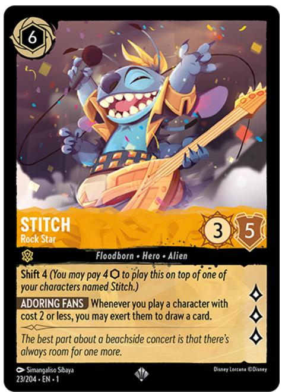

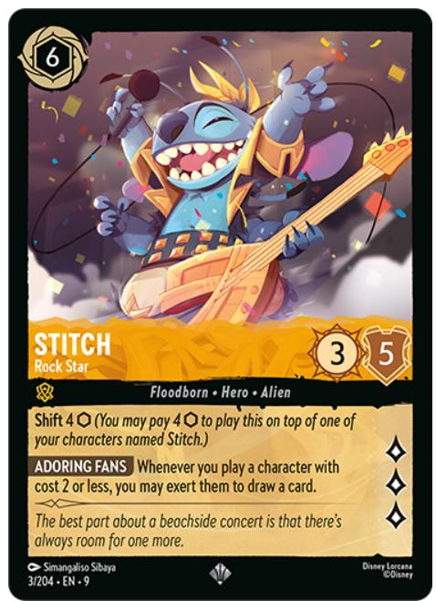

Stitch - Rock Star

Amber character

Floodborn · Hero · Alien

6 cost, inkable

3/5/3

Shift 4 {I} (You may pay 4 {I} to play this on top of one of your characters named Stitch.)

\Adoring Fans\ Whenever you play a character with cost 2 or less, you may exert them to draw a card.

The first is from The First Chapter, and the other is from Fabled. However, every mechanical part of the card is the same, so the new version in Fabled is a reprint. (Some eagle-eyed viewers will spot one tiny difference between these two cards. See the Card Readability Updates section below for more info on that.)

Various printings of a card (including promo card versions) are still copies of the same card, since they have the same full name. This means they can be used interchangeably with each other. So, if you want to have the maximum of 4 copies of Stitch - Rock Star in your deck, you could put in 2 from The First Chapter and 2 from Fabled. You couldn't put 4 from The First Chapter and 4 from Fabled in your deck, however, because they're the same card.

By the same token, this also allows you to put The First Chapter versions in your Core Constructed deck and Fabled versions in your Infinity Constructed deck. Basically, if the card is legal for the format, any printing of it is allowed.

### Minor Rules Updates

With the release of Fabled, we made a few small updates to the Disney Lorcana TCG

Comprehensive Rules. The sections of the rules that were affected are:

1.6.1.5. Updated the definition of replacement effects to align with the definition in section 7.7.1.  
- 1.9.1.3. Added language to clarify when a character is considered to have banished another character or location.  
7.7.6. Added a definition for self-replacement effects.  
- 7.7.7. Added the steps for applying replacement effects to make it clear how to apply multiple replacement effects at the same time.

### Card Readability Updates

We made the following minor change to existing card text to improve readability and clarity.

- New Shift Construction: Shift abilities now include the  \(\{\mathrm{I}\}\)  symbol for added clarity. For example, Shift 4 became Shift 4  \(\{\mathrm{I}\}\) .

### Rules Glossary Updates

Glossary updates may include newly introduced terms or clarifications of past entries. For Fabled, we edited the definition for replacement effect to remove "static" before abilities.

- replacement effect: An effect generated by some abilities that replaces one effect with another.

### Card-Specific Notes

The following are answers to a few questions that might come up when playing specific Fabled cards. This isn't meant to be an exhaustive list, but we hope it's a helpful guide for some of the more complex cards in the set.

#### Stitch - Rock Star / Lantern

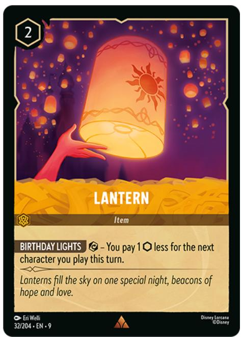

Stitch - Rock Star

Amber character

Floodborn · Hero · Alien

6 cost, inkable

3/5/3

Shift 4 {I} (You may pay 4 {I} to play this on top of one of your characters named Stitch.)

\Adoring Fans\ Whenever you play a character with cost 2 or less, you may exert them to draw a card.

Lantern

Amber item

2 cost, uninkable

\Birthday Lights\ {E} - You pay 1 {I} less for the next character you play this turn.

Q: Say I have Stitch - Rock Star in play and a cost 3 character in my hand. If I use Lantern so I can pay 1  \(\{\mathrm{I}\}\)  less to play that character, can I then exert the character to draw a card?

A: No. It's not the character's cost that's reduced by Lantern but rather the amount of ink you need to pay in order to play it. The character's cost would still be 3, so they wouldn't qualify for the "cost 2 or less" part of the Adoring Fans ability.

#### Pongo – Determined Father

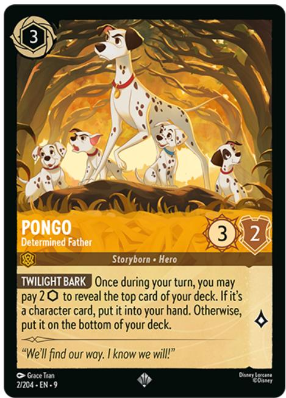

Pongo - Determined Father

Amber character

Storyborn · Hero

3 cost, inkable

3/2/1

Twilight Bark\ Once during your turn, you may pay 2 {I} to reveal the top card of your deck. If it's a character card, put it into your hand. Otherwise, put it on the bottom of your deck.

Q: If I have 3 copies of Pongo – Determined Father in play, how many times can I use his Twilight Bark ability per turn?

A: 3 times. You can use it once for each copy of Pongo – Determined Father you have in play. Note that if you return Pongo to your hand and then play him again, you can use his Twilight Bark ability again because the card resets when it leaves play.

#### The Queen – Wicked and Vain

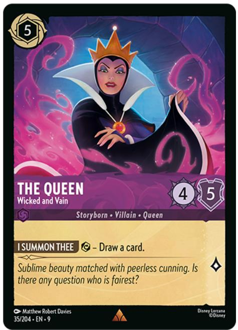

The Queen - Wicked and Vain

Amethyst character

Storyborn • Villain • Queen

5 cost, inkable

4/5/1

\I Summon Thee\{E\} - Draw a card.

Q: If I have The Queen – Wicked and Vain in play and an effect makes me exert her, do I get to draw a card with her I Summon Thee ability?

A: No. When an ability has a cost, the card's player must pay that cost to use the ability. If another effect exerts The Queen, you haven't paid the cost for I Summon Thee, so you don't get to draw the card. Additionally, you won't be able to use I Summon Thee until The Queen is readied.

#### Ursula - Sea Witch

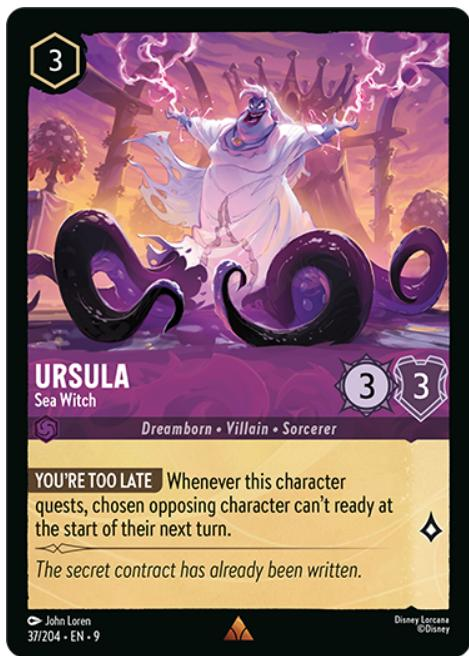

Ursula - Sea Witch

Amethyst character

Dreamborn · Villain · Sorcerer

3 cost, uninkable

3/3/1

\You're Too Late\ Whenever this character quests, chosen opposing character can't ready at the start of their next turn.

Q: When I use Ursula – Sea Witch's ability You're Too Late, can I choose a ready character?

A: Yes. Note, however, that You're Too Late doesn't exert the character you've chosen. It only prevents them from being readied if they're exerted.

#### Jafar – Keeper of Secrets / Flynn Rider – Charming Rogue

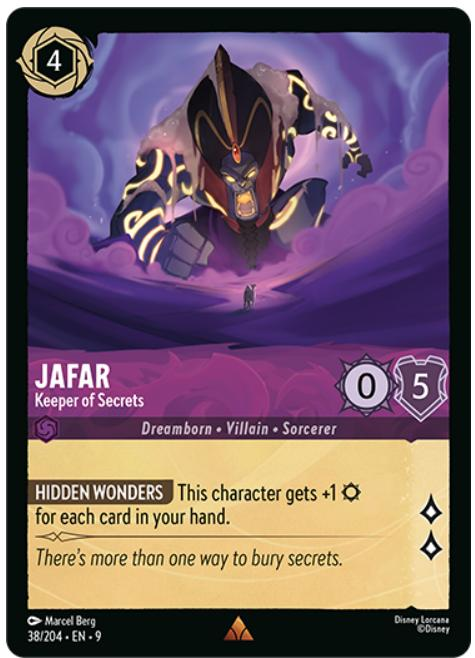

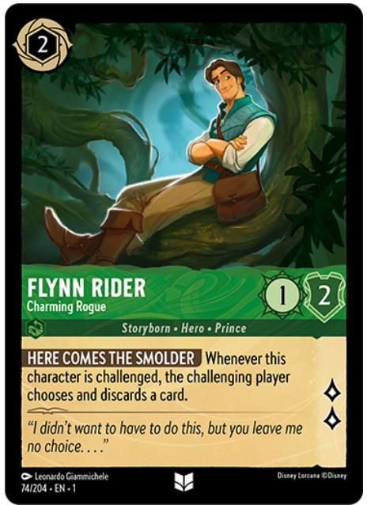

Jafar - Keeper of Secrets

Amethyst character

Dreamborn · Villain · Sorcerer

4 cost, inkable

0/5/2

\Hidden Wonders\ This character gets +1 \{S\} for each card in your hand.

Flynn Rider - Charming Rogue

Emerald character

Storyborn • Hero • Prince

2 cost, inkable

1/2/2

\Here Comes the Smolder\ Whenever this character is challenged, the challenging player chooses and discards a card.

Q: I have 2 cards in my hand plus a Jafar – Keeper of Secrets in play, and my Jafar challenges Flynn Rider – Charming Rogue. When does Flynn Rider's ability Here Comes the Smolder happen? How much damage will he take from the challenge, considering Jafar's Hidden Wonders ability?

A: Here Comes the Smolder happens as soon as Flynn Rider is chosen to be challenged. This

means the challenging player must discard a card before any damage from the challenge is dealt to either character. In this case, you'll have to discard 1 of your 2 cards, so you'll have 1 card left. Hidden Wonders increases Jafar's Strength by an amount equal to the number of cards in your hand, so he'll have  \(+1\)  Strength when he deals damage to Flynn Rider in the challenge.

#### Elsa – Spirit of Winter / Fan the Flames

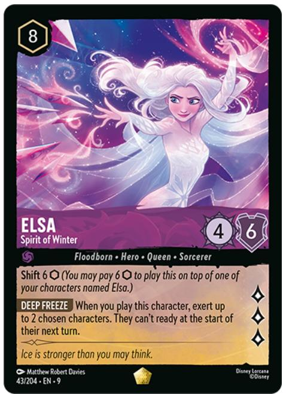

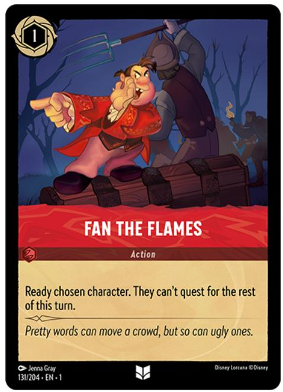

Elsa - Spirit of Winter

Amethyst character

Floodborn • Hero • Queen • Sorcerer

8 cost, uninkable

4/6/3

Shift 6 {I} (You may pay 6 {I} to play this on top of one of your characters named Elsa.)

\Deep Freeze\ When you play this character, exert up to 2 chosen characters. They can't ready at the start of their next turn.

Fan the Flames

Ruby action

1 cost, inkable

Ready chosen character. They can't quest for the rest of this turn.

Q: If I use Elsa – Spirit of Winter's ability Deep Freeze to exert 2 characters, can they be readied with Fan the Flames on their next turn?

A: Yes. Deep Freeze only keeps characters from readying during the Ready step of their next turn. It doesn't keep them from being readied by Fan the Flames and similar abilities.

#### Mickey Mouse – Trumpeter

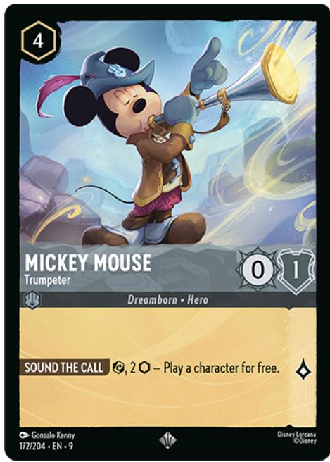

Mickey Mouse - Trumpeter

Steel character

Dreamborn • Hero

4 cost, uninkable

0/1/1

\Sound the Call\ {E}, 2 {I} - Play a character for free.

Q: If I use Mickey Mouse – Trumpeter's Sound the Call ability, can I play a character using their Shift ability for free?

A: It depends. "For free" applies only to the ink cost of playing a card, not to any other costs of playing it. If the Shift cost of the character you want to play is just ink, you can play them using their Shift ability for free. However, if their Shift cost includes other costs, those would still need to be paid.

#### Donald Duck – Perfect Gentleman

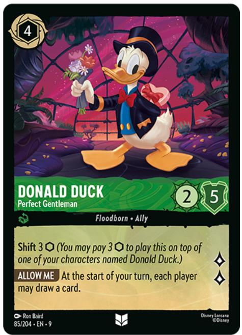

Donald Duck - Perfect Gentleman

Emerald character

Floodborn • Ally

4 cost, inkable

2/5/2

Shift 3 {I} (You may pay 3 {I} to play this on top of one of your characters named Donald Duck.)

\Allow Me\ At the start of your turn, each player may draw a card.

Q: If I choose not to draw a card for Donald Duck – Perfect Gentleman's Allow Me ability, can my opponent still draw a card?

A: Yes. Each player decides individually whether they want to draw a card at the start of your turn.

#### Grand Pabbie – Oldest and Wisest

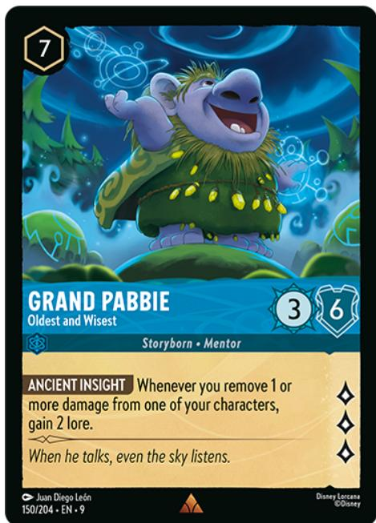

Grand Pabbie - Oldest and Wisest

Sapphire character

Storyborn · Mentor

7 cost, uninkable

3/6/3

\Ancient Insight\ Whenever you remove 1 or more damage from one of your characters, gain 2 lore.

Q: If I have 3 damaged characters in play, including Grand Pabbie – Oldest and Wisest, and I play a card that removes damage from all my characters, how much lore do I gain from his Ancient Insight ability?

A: 6 lore. Ancient Insight triggers for each character that has damage removed, even if those characters have damage removed simultaneously.

#### Pluto - Determined Defender

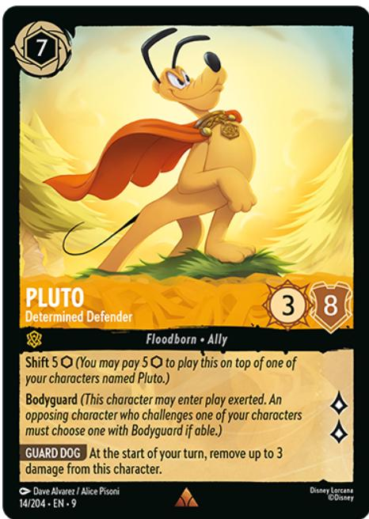

Pluto - Determined Defender

Amber character

Floodborn • Ally

7 cost, inkable

3/8/2

Shift 5 {I} (You may pay 5 {I} to play this on top of one of your characters named Pluto.)

Bodyguard (This character may enter play exerted. An opposing character who challenges one of your characters must choose one with Bodyguard if able.)

\Guard Dog\ At the start of your turn, remove up to 3 damage from this character.

Q: Can I choose not to remove any damage from Pluto – Determined Defender at the start of my turn?

A: Yes. The Guard Dog ability lets you remove up to 3 damage from Pluto, so you can choose any amount from 0 to 3.

Q: If I play Pluto – Determined Defender using his Shift ability, can I also use his Bodyguard ability to have him enter play exerted?

A: Yes, you can do both.

#### Ursula's Shell Necklace

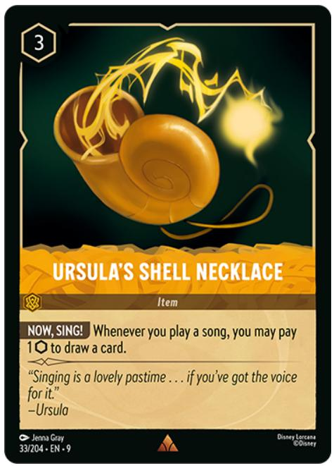

Ursula's Shell Necklace

Amber item

3 cost, uninkable

\Now, Sing! \ Whenever you play a song, you may pay 1 {I} to draw a card.

Q: If I have Ursula's Shell Necklace in play and exert a cost 3 character to sing a cost 2 song, can I use the difference of 1 ink to use its Now, Sing! ability to draw a card?

A: No. Ink costs, including the cost to use an ability like Now, Sing!, must be paid with ink from your inkwell. Using a character with a higher cost than necessary to sing a song doesn't generate ink.

#### Queen of Hearts – Sensing Weakness / Jafar – Keeper of Secrets

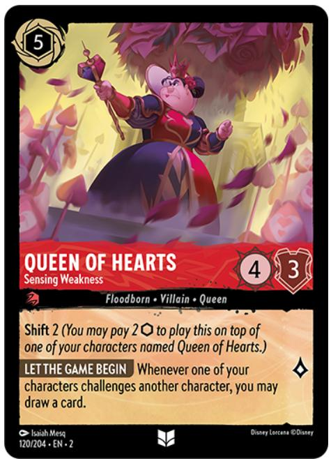

Queen of Hearts - Sensing Weakness

Ruby character

Floodborn • Villain • Queen

5 cost, inkable

4/3/1

Shift 2 {I} (You may pay 2 {I} to play this on top of one of your characters named Queen of Hearts.)

\Let the Game Begin\ Whenever one of your characters challenges another character, you may draw a card.

Jafar - Keeper of Secrets

Amethyst character

Dreamborn · Villain · Sorcerer

4 cost, inkable

0/5/2

\Hidden Wonderss\ This character gets  \(+1\)  {S} for each card in your hand.

Q: I have a Queen of Hearts – Sensing Weakness and a Jafar – Keeper of Secrets in play and 1 card in my hand. If I challenge my opponent's Flounder – Voice of Reason, how much damage does Flounder take?

A: 2 damage. Let the Game Begin applies as soon as a challenge is declared, so you draw a card

before the challenge itself has happened. With his Hidden Wonderss ability, Jafar then gains 2 Strength for the total of 2 cards you now have in your hand.

#### Dinner Bell

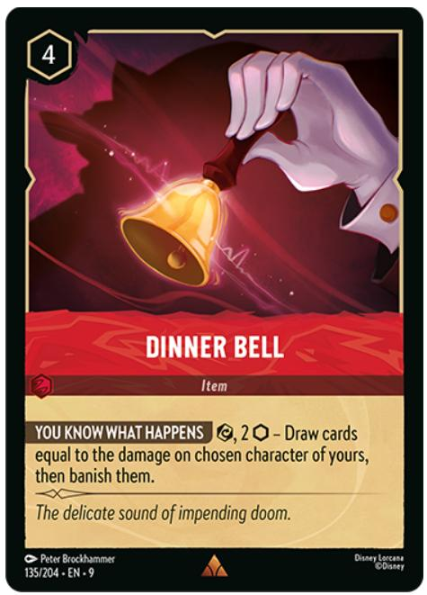

Dinner Bell

Ruby item

4 cost, uninkable

\You Know What Happens\ {E}, 2 {I} - Draw cards equal to the damage on chosen character of yours, then banish them.

Q: If I use Dinner Bell's You Know What Happens ability, can I choose one of my characters that doesn't have any damage?

A: Yes. If you did, you wouldn't draw any cards because there's no damage on the character you chose, but you'd still banish that character. It certainly is a bold choice, but hey, you do you!

#### Last-Ditch Effort

Last-Ditch Effort

Amethyst action

3 cost, uninkable

Exert chosen opposing character. Chosen character of yours gains Challenger +2 this turn. (They get +2  \(\{S\}\)  while challenging.)

Q: The only character my opponent has in play has Ward. Can I still play Last-Ditch Effort and give my character Challenger +2 even though I can't choose an opposing character?

A: Yes. When there aren't any eligible opposing characters to choose for the first part of Last-Ditch Effort, that part of its effect simply finishes without exerting a character. However, the second part of its effect still happens, so you still choose a character of yours to get Challenger +2 until the end of the turn.

#### Moana – Of Motunui (new text)

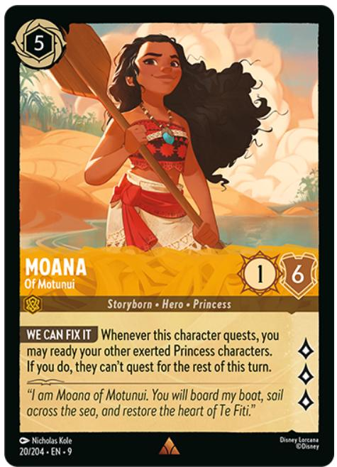

Moana - Of Motunui

Amber character

Storyborn • Hero • Princess

5 cost, inkable

1/6/3

\We Can Fix It\ Whenever this character quests, you may ready your other exerted Princess characters. If you do, they can't quest for the rest of this turn.

Q: If I quest with Moana – Of Motunui and use her We Can Fix It ability, can I choose which Princess characters I ready? If I instead ready them with other effects later in the turn, can they quest that turn?

A: No, you can't choose only some of your Princess characters for We Can Fix It. When you use the ability, you must ready all of your Princess characters. If you don't use We Can Fix It, your other Princess characters can quest as normal and you can ready them with other abilities and effects later in the turn.

#### Pluto - Friendly Pooch

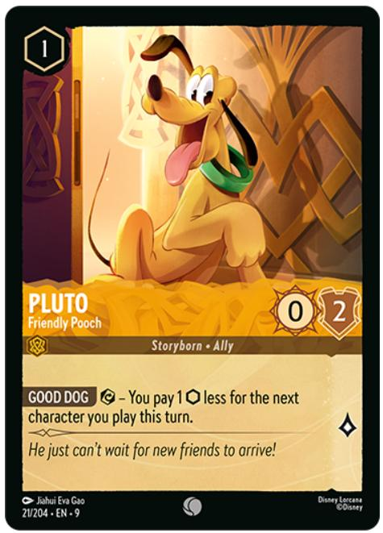

Pluto - Friendly Pooch

Amber character

Storyborn • Ally

1 cost, uninkable

0/2/1

\Good Dog\ {E} - You pay 1 {I} less for the next character you play this turn.

Q: Can I use Pluto – Friendly Pooch’s Good Dog ability to reduce the ink I need to pay for the Shift cost of a character?

A: Yes. The Good Dog ability reduces the amount of ink you have to pay for the character, which includes the ink needed for an alternate cost like Shift.