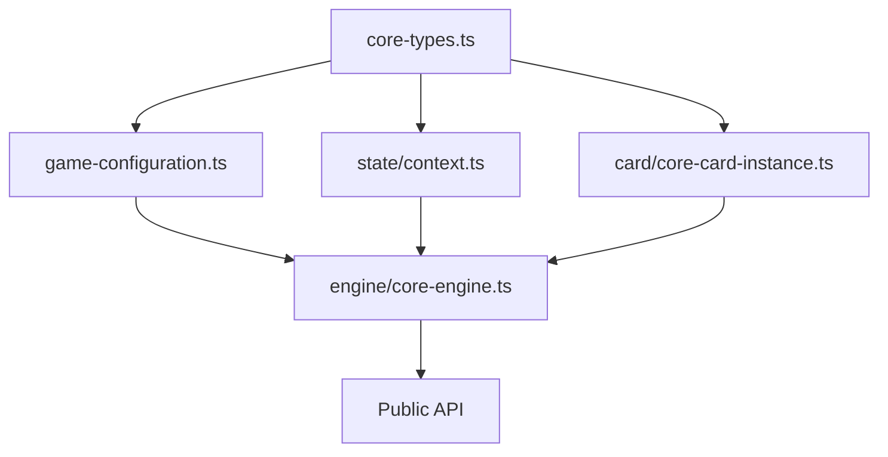

# Design Document

## Overview

This design outlines a systematic approach to cleaning up the core-engine codebase by consolidating duplicate code, removing unused elements, and establishing consistent patterns. The cleanup will be performed in phases to minimize risk and ensure thorough testing at each step.

## Architecture

### Cleanup Strategy

The cleanup follows a **bottom-up approach**, starting with foundational types and utilities, then moving to higher-level abstractions. This ensures that changes propagate cleanly through the dependency graph.

**Phase Order:**
1. **Foundation Layer**: Types, utilities, and basic abstractions
2. **Core Layer**: Engine components, state management, and operations  
3. **Integration Layer**: Card systems, flow management, and error handling
4. **Interface Layer**: Public APIs and exports

### Risk Mitigation

- **Incremental Changes**: Each phase is independently testable
- **Backward Compatibility**: Public APIs remain unchanged
- **Type Safety**: TypeScript compiler catches breaking changes
- **Test Coverage**: Existing tests validate functionality preservation

## Components and Interfaces

### 1. Type System Consolidation

#### Current State Analysis
- **PlayerID/PlayerId**: Defined in 8+ files with inconsistent naming
- **InstanceId**: Defined in 4+ files with varying contexts
- **CardInstanceID**: Overlaps with InstanceId concept
- **Type imports**: Mix of value and type-only imports

#### Target Architecture
```typescript
// packages/engines/core-engine/src/game-engine/core-engine/types/core-types.ts
export type PlayerID = string;
export type InstanceId = string; 
export type PublicId = string;
export type ZoneId = string;

// Deprecated aliases for backward compatibility
/** @deprecated Use PlayerID instead */
export type PlayerId = PlayerID;
/** @deprecated Use InstanceId instead */  
export type CardInstanceID = InstanceId;
```

#### Migration Strategy
1. Create centralized `core-types.ts` file
2. Update all files to import from central location
3. Add deprecated aliases for backward compatibility
4. Remove local type definitions

### 2. Card Abstraction Cleanup

#### Current State Analysis
- **CoreCardInstance**: Uses WeakRef pattern for engine access
- **GameCard**: Uses context injection pattern
- **Dual patterns**: Confusing for developers, unclear when to use which

#### Target Architecture
```typescript
// Recommended pattern: Context injection (GameCard)
// - Better performance (no WeakRef overhead)
// - Clearer dependencies
// - Easier testing

// Legacy pattern: WeakRef (CoreCardInstance) 
// - Maintained for backward compatibility
// - Marked as legacy in documentation
```

#### Design Decision
- **Keep both patterns** but provide clear guidance
- **GameCard** becomes the recommended approach for new code
- **CoreCardInstance** remains for existing implementations
- Add comprehensive documentation explaining trade-offs

### 3. Error System Streamlining

#### Current State Analysis
- **engine-errors.ts**: 15+ error classes with good hierarchy
- **domain-errors.ts**: 15+ domain-specific errors
- **Some overlap**: Between validation and domain errors
- **Unused errors**: Several error types not referenced in codebase

#### Target Architecture
```typescript
// Consolidated error hierarchy
export abstract class EngineError extends Error {
  abstract readonly type: string;
  abstract readonly category: "validation" | "execution" | "state" | "system";
}

// Remove unused error types:
// - NetworkError (not used in current architecture)
// - SerializationError subclasses (handled by external libraries)
// - Some modifier errors (not implemented yet)
```

#### Cleanup Actions
1. Identify unused error classes through static analysis
2. Remove unused errors or mark as `@internal` if planned for future
3. Consolidate overlapping error types
4. Improve error message consistency

### 4. Import/Export Optimization

#### Current State Analysis
- **Circular imports**: Some files have circular dependencies
- **Unused imports**: Many files import types/functions not used
- **Re-export chains**: Complex re-export patterns in index files
- **Mixed import styles**: Value imports mixed with type imports

#### Target Architecture
```typescript
// Consistent import patterns
import type { TypeName } from "./types";
import { functionName } from "./utils";

// Simplified re-exports
export type { PublicType } from "./internal/types";
export { publicFunction } from "./internal/utils";

// Clear barrel exports
export * from "./core-types";
export * from "./public-api";
```

#### Optimization Strategy
1. **Static Analysis**: Use TypeScript compiler API to find unused imports
2. **Dependency Graph**: Map actual usage vs declared dependencies  
3. **Import Cleanup**: Remove unused, consolidate related imports
4. **Export Cleanup**: Remove unused exports, simplify re-export chains

### 5. Utility Function Consolidation

#### Current State Analysis
- **Context creation**: Multiple patterns for creating CoreCtx
- **Validation logic**: Duplicate validation in multiple files
- **ID generation**: Multiple approaches to generating unique IDs
- **Logging patterns**: Inconsistent debug/logging usage

#### Target Architecture
```typescript
// packages/engines/core-engine/src/game-engine/core-engine/utils/
├── core-types.ts          // Centralized type definitions
├── context-factory.ts     // Standardized context creation
├── validation.ts          // Shared validation utilities  
├── id-generation.ts       // Consistent ID generation
├── logger.ts              // Existing logging (keep as-is)
└── index.ts              // Clean barrel exports
```

## Data Models

### Type Dependency Graph


### File Organization
```
core-engine/
├── types/
│   ├── core-types.ts          # Centralized basic types
│   ├── game-specific-types.ts # Game extension types (existing)
│   └── result.ts              # Result type (existing)
├── utils/
│   ├── context-factory.ts     # Context creation utilities
│   ├── validation.ts          # Shared validation logic
│   └── [existing utils]       # Keep existing utilities
├── [existing directories]      # Maintain current structure
└── index.ts                   # Clean public exports
```

## Error Handling

### Error Cleanup Strategy

1. **Unused Error Removal**
   - `NetworkError`: Remove (not used in current architecture)
   - `SerializationError` subclasses: Remove (handled externally)
   - Unused modifier errors: Remove or mark `@internal`

2. **Error Message Consistency**
   - Standardize error message formats
   - Include consistent context information
   - Use template patterns for similar error types

3. **Error Type Consolidation**
   - Merge overlapping validation errors
   - Consolidate similar state errors
   - Maintain clear error hierarchy

## Testing Strategy

### Test Infrastructure Cleanup

1. **Test Utility Consolidation**
   ```typescript
   // packages/engines/core-engine/src/game-engine/core-engine/__tests__/
   ├── test-utils/
   │   ├── engine-factory.ts    # Standardized engine creation
   │   ├── mock-data.ts         # Reusable test data
   │   └── assertions.ts        # Custom test assertions
   └── [existing tests]         # Keep existing test files
   ```

2. **Mock Object Standardization**
   - Create factory functions for common mocks
   - Standardize test engine configuration
   - Consolidate duplicate test setup code

3. **Test Coverage Validation**
   - Ensure all public APIs remain tested
   - Add tests for consolidated utilities
   - Validate error handling paths

### Validation Approach

1. **Automated Testing**
   - Run full test suite after each phase
   - Type checking with `tsc --noEmit`
   - Lint checking with Biome

2. **Manual Validation**
   - Review public API surface area
   - Validate import/export consistency
   - Check documentation accuracy

## Implementation Phases

### Phase 1: Foundation Cleanup (Low Risk)
- Create centralized type definitions
- Remove unused imports/exports
- Consolidate utility functions
- **Risk**: Low - mostly internal changes

### Phase 2: Error System Cleanup (Medium Risk)  
- Remove unused error types
- Consolidate overlapping errors
- Standardize error messages
- **Risk**: Medium - affects error handling

### Phase 3: Card System Optimization (Medium Risk)
- Document card pattern recommendations
- Consolidate card filtering logic
- Clean up card-related utilities
- **Risk**: Medium - affects card implementations

### Phase 4: Final Integration (Low Risk)
- Update documentation
- Clean up test infrastructure  
- Final import/export optimization
- **Risk**: Low - mostly cleanup and documentation

## Success Metrics

### Quantitative Metrics
- **Duplicate Types**: Reduce from 12+ to 4 canonical definitions
- **Unused Imports**: Remove 50+ unused import statements
- **File Size**: Reduce total codebase size by 5-10%
- **Circular Dependencies**: Eliminate all circular imports

### Qualitative Metrics
- **Developer Experience**: Clearer type definitions and imports
- **Maintainability**: Consistent patterns across codebase
- **Documentation**: Clear guidance on recommended patterns
- **Test Coverage**: Maintained or improved test coverage