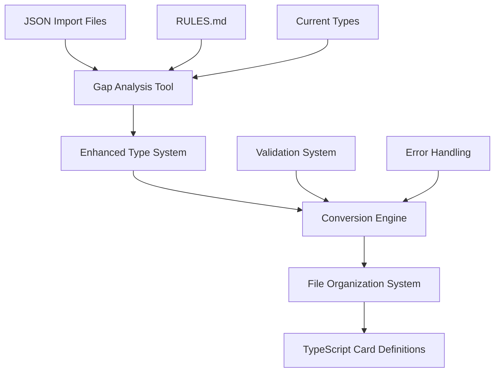

# Design Document

## Overview

The Gundam Card Converter system will transform JSON import data into properly typed TypeScript card definitions using an enhanced type system that accurately models Gundam card game mechanics. The system consists of four main components: a gap analysis tool, enhanced type definitions, a conversion engine, and a file organization system.

## Architecture

The system follows a pipeline architecture with clear separation of concerns:



### Component Interaction

1. **Gap Analysis Tool** reads current types, import data, and rules to identify improvements needed
2. **Enhanced Type System** provides comprehensive type definitions based on gap analysis
3. **Conversion Engine** transforms JSON data using enhanced types with validation
4. **File Organization System** creates structured output with proper naming and directory organization

## Components and Interfaces

### 1. Gap Analysis Tool

**Purpose**: Analyze current system gaps and provide improvement recommendations

**Interface**:
```typescript
interface GapAnalyzer {
  analyzeImportData(importFiles: string[]): ImportDataAnalysis;
  analyzeCurrentTypes(typesFile: string): TypeSystemAnalysis;
  analyzeGameRules(rulesFile: string): GameRulesAnalysis;
  generateGapReport(): GapAnalysisReport;
}

interface GapAnalysisReport {
  missingFields: FieldGap[];
  missingAbilities: AbilityGap[];
  missingEffects: EffectGap[];
  typeImprovements: TypeImprovement[];
  recommendations: string[];
}
```

**Key Features**:
- Scans all JSON import files to catalog used fields and patterns
- Compares against current type definitions to identify gaps
- Parses RULES.md to extract game mechanics not yet modeled
- Generates actionable recommendations for type system improvements

### 2. Enhanced Type System

**Purpose**: Provide comprehensive type definitions that accurately model Gundam card mechanics

**Core Types**:
```typescript
// Enhanced ability timing system
type AbilityTiming = 
  | "main" | "action" | "deploy" | "attack" | "destroyed" 
  | "when-paired" | "during-pair" | "burst" 
  | "activate-main" | "activate-action" | "constant";

// Comprehensive effect system
interface GameEffect {
  type: EffectType;
  targets?: AbilityTarget[];
  conditions?: TargetFilter[];
  value?: number | string;
}

// Enhanced card definitions
interface EnhancedGundamCard {
  // Core properties
  id: string;
  name: string;
  type: CardType;
  cost: number;
  level: number;
  
  // Enhanced properties
  abilities: CardAbility[];
  keywords: KeywordEffect[];
  metadata: CardMetadata;
}
```

**Key Improvements**:
- Structured ability system with proper timing and effect modeling
- Comprehensive keyword effect representation
- Enhanced trait and zone typing with proper validation
- Support for complex card interactions and state management

### 3. Conversion Engine

**Purpose**: Transform JSON import data into typed card definitions with validation

**Architecture**:
```typescript
class ConversionEngine {
  private parsers: Map<string, FieldParser>;
  private validators: CardValidator[];
  private abilityExtractor: AbilityExtractor;
  
  convertCard(importData: ExternalCardData): ConversionResult<EnhancedGundamCard>;
  convertSet(setData: ExternalCardData[]): SetConversionResult;
  validateConversion(card: EnhancedGundamCard): ValidationResult;
}
```

**Core Parsers**:

1. **Basic Field Parser**: Handles standard card properties (name, cost, level, etc.)
2. **Ability Text Parser**: Extracts structured abilities from HTML effect text
3. **Trait Parser**: Processes parenthetical trait notation
4. **Zone Parser**: Handles space/earth zone combinations
5. **Link Requirement Parser**: Extracts pilot names from bracket notation

**Ability Extraction System**:
```typescript
class AbilityExtractor {
  extractAbilities(effectText: string): CardAbility[];
  parseTimingKeywords(text: string): AbilityTiming[];
  parseTargets(text: string): AbilityTarget[];
  parseEffects(text: string): GameEffect[];
}
```

**Key Features**:
- HTML entity decoding and text normalization
- Pattern matching for timing keywords (【Main】, 【Deploy】, etc.)
- Target extraction with condition parsing
- Effect value extraction and typing
- Comprehensive error handling and reporting

### 4. File Organization System

**Purpose**: Create structured output with proper naming and directory organization

**Directory Structure**:
```
packages/engines/core-engine/src/game-engine/engines/gundam/src/cards/definitions/
├── ST01/
│   ├── ST01-001-gundam.ts
│   ├── ST01-002-guncannon.ts
│   └── index.ts
├── ST02/
│   ├── ST02-001-wing-gundam-zero.ts
│   └── index.ts
├── GD01/
│   ├── GD01-001-gundam.ts
│   └── index.ts
└── index.ts (exports all sets)
```

**File Generation**:
```typescript
class FileOrganizer {
  generateCardFile(card: EnhancedGundamCard): GeneratedFile;
  generateSetIndex(setCards: EnhancedGundamCard[]): GeneratedFile;
  generateMasterIndex(allSets: string[]): GeneratedFile;
  validateFileStructure(): ValidationResult;
}
```

**Naming Conventions**:
- Card files: `{SET}-{NUMBER}-{kebab-case-name}.ts`
- Set folders: `{SET}/` (e.g., `ST01/`, `GD01/`)
- Exports: Named exports matching card names in camelCase

## Data Models

### Enhanced Card Type Hierarchy

```typescript
// Base card interface
interface EnhancedCardBase {
  readonly id: string;
  readonly implemented: boolean;
  readonly missingTestCase: boolean;
  readonly name: string;
  readonly cost: number;
  readonly level: number;
  readonly number: number;
  readonly color: CardColor;
  readonly set: GundamitoCardSet;
  readonly rarity: CardRarity;
  readonly metadata: CardMetadata;
}

// Specialized card types
interface EnhancedUnitCard extends EnhancedCardBase {
  readonly type: "unit";
  readonly zones: readonly CardZones[];
  readonly traits: readonly Traits[];
  readonly linkRequirement: readonly string[];
  readonly ap: number;
  readonly hp: number;
  readonly abilities: readonly CardAbility[];
  readonly keywords: readonly KeywordEffect[];
}

interface EnhancedPilotCard extends EnhancedCardBase {
  readonly type: "pilot";
  readonly traits: readonly Traits[];
  readonly apModifier: number;
  readonly hpModifier: number;
  readonly abilities: readonly CardAbility[];
  readonly pilotName?: string;
}

// Similar interfaces for Command, Base, and Resource cards
```

### Ability System Data Model

```typescript
// Comprehensive ability representation
interface CardAbility {
  readonly id?: string;
  readonly timing: AbilityTiming;
  readonly name?: string;
  readonly text: string;
  readonly cost?: ActivationCost[];
  readonly targets?: AbilityTarget[];
  readonly conditions?: AbilityCondition[];
  readonly effects: GameEffect[];
  readonly restrictions?: AbilityRestriction[];
}

// Effect system with proper typing
interface GameEffect {
  readonly type: EffectType;
  readonly description?: string;
  readonly targets?: AbilityTarget[];
  readonly value?: number | string;
  readonly duration?: EffectDuration;
}

// Target specification system
interface AbilityTarget {
  readonly type: TargetType;
  readonly amount?: number | "all";
  readonly filters?: TargetFilter[];
  readonly optional?: boolean;
}
```

## Error Handling

### Conversion Error Types

```typescript
interface ConversionError {
  readonly cardId: string;
  readonly severity: "error" | "warning" | "info";
  readonly category: ErrorCategory;
  readonly field?: string;
  readonly message: string;
  readonly suggestion?: string;
}

type ErrorCategory = 
  | "parsing" | "validation" | "type-conversion" 
  | "ability-extraction" | "file-generation";
```

### Error Recovery Strategies

1. **Field-Level Recovery**: Use default values for missing non-critical fields
2. **Ability-Level Recovery**: Mark complex abilities as "notImplemented" for manual review
3. **Card-Level Recovery**: Skip malformed cards but continue processing others
4. **Set-Level Recovery**: Process other sets even if one set fails

### Validation System

```typescript
interface ValidationRule {
  name: string;
  validate(card: EnhancedGundamCard): ValidationResult;
  severity: "error" | "warning";
}

class CardValidator {
  private rules: ValidationRule[];
  
  validateCard(card: EnhancedGundamCard): ValidationResult;
  validateSet(cards: EnhancedGundamCard[]): SetValidationResult;
}
```

**Validation Rules**:
- Required field presence validation
- Type consistency validation
- Game rule compliance validation
- Cross-reference validation (e.g., link requirements exist)
- TypeScript compilation validation

## Testing Strategy

### Unit Testing

1. **Parser Testing**: Test each field parser with various input formats
2. **Conversion Testing**: Test card conversion with known good/bad inputs
3. **Validation Testing**: Test validation rules with edge cases
4. **File Generation Testing**: Test output file structure and content

### Integration Testing

1. **End-to-End Conversion**: Test complete conversion pipeline
2. **Set Processing**: Test processing of complete card sets
3. **Error Handling**: Test error recovery and reporting
4. **File System Integration**: Test actual file creation and organization

### Test Data Strategy

```typescript
// Test fixtures for various card types and edge cases
const testCards = {
  simpleUnit: { /* basic unit card */ },
  complexUnit: { /* unit with multiple abilities */ },
  pilotCommand: { /* command card with pilot effect */ },
  malformedCard: { /* card with missing/invalid data */ },
  edgeCases: { /* promotional variants, tokens, etc. */ }
};
```

### Performance Testing

- Measure conversion speed for large card sets
- Test memory usage during batch processing
- Validate file I/O performance
- Test concurrent processing capabilities

## Implementation Phases

### Phase 1: Gap Analysis and Type Enhancement
- Implement gap analysis tool
- Enhance type system based on findings
- Create comprehensive test suite for new types

### Phase 2: Core Conversion Engine
- Implement basic field parsers
- Create ability extraction system
- Add validation framework
- Test with sample cards

### Phase 3: File Organization System
- Implement file generation
- Create directory structure management
- Add naming convention enforcement
- Test output structure

### Phase 4: Integration and Optimization
- Integrate all components
- Add batch processing capabilities
- Implement error recovery
- Performance optimization

### Phase 5: Production Deployment
- Process all existing card sets
- Validate generated definitions
- Update build system integration
- Documentation and maintenance guides