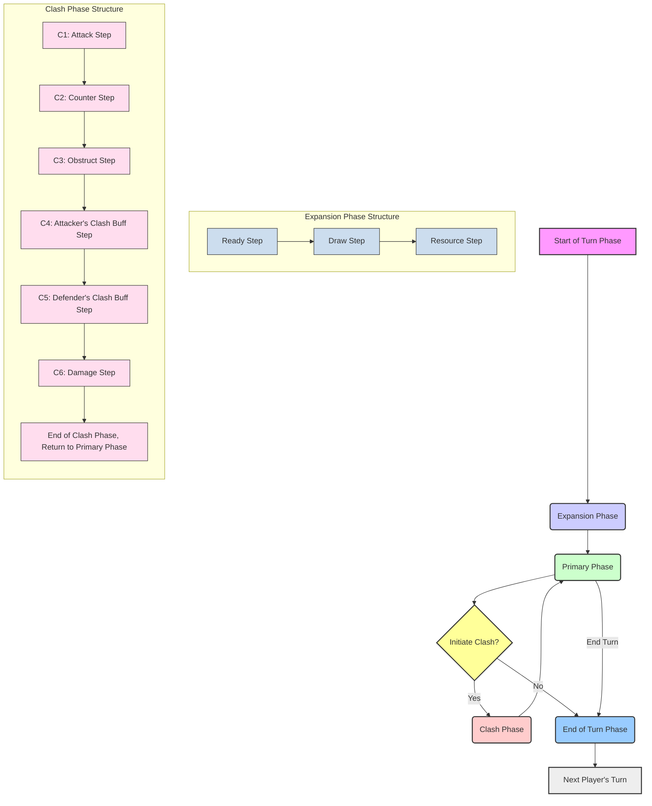

# Alpha Clash TCG Flowcharts

## Overall Turn Structure



## Activating an Effect (Rule 602.2)

```mermaid
graph TD
    AE1[Declare Activation: Reveal card if from hidden zone. Effect to Standby.] --> AE2{Effect has Modal Effect, Variable Cost, or Alternative/Additional Costs?};
    AE2 -- Yes --> AE3[Declare Mode(s), Value of X, Intent to Pay Alt/Add Costs];
    AE2 -- No --> AE4;
    AE3 --> AE4[Declare Targets];
    AE4 --> AE5{Effect requires Division/Distribution?};
    AE5 -- Yes --> AE6[Declare Division/Distribution];
    AE5 -- No --> AE7;
    AE6 --> AE7[Game Checks if Activation is Legal];
    AE7 -- Illegal --> AE_Reverse[Reverse Action];
    AE7 -- Legal --> AE8[Determine Total Cost: Activation Cost + Add. Costs + Increases - Reductions];
    AE8 --> AE9[Effect Becomes "Activated": "When Activated" Triggers Occur];
    AE9 --> AE10[Controller Passes Priority];

    style AE1 fill:#f9f,stroke:#333,stroke-width:2px
    style AE2 fill:#ccf,stroke:#333,stroke-width:2px
    style AE3 fill:#cfc,stroke:#333,stroke-width:2px
    style AE4 fill:#ff9,stroke:#333,stroke-width:2px
    style AE5 fill:#fcc,stroke:#333,stroke-width:2px
    style AE6 fill:#9cf,stroke:#333,stroke-width:2px
    style AE7 fill:#f9c,stroke:#333,stroke-width:2px
    style AE8 fill:#c9f,stroke:#333,stroke-width:2px
    style AE9 fill:#9fc,stroke:#333,stroke-width:2px
    style AE10 fill:#9cf,stroke:#333,stroke-width:2px
    style AE_Reverse fill:#f00,stroke:#333,stroke-width:2px
```

## Playing a Card (Rule 601.1)

```mermaid
graph TD
    P1[Propose Playing Card: Move card to Standby] --> P2{Card has Modal Effect, Variable Cost, or Alternative/Additional Costs?};
    P2 -- Yes --> P3[Declare Mode(s), Value of X, Intent to Pay Alt/Add Costs];
    P2 -- No --> P4;
    P3 --> P4[Declare Targets];
    P4 --> P5{Card requires Division/Distribution of Effect?};
    P5 -- Yes --> P6[Declare Division/Distribution];
    P5 -- No --> P7;
    P6 --> P7[Game Checks if Play is Legal];
    P7 -- Illegal --> P_Reverse[Reverse Action];
    P7 -- Legal --> P8[Determine Total Cost: Resource/Alt Cost + Add. Costs + Increases - Reductions];
    P8 --> P9[Card Becomes "Played": Apply Modifying Effects, "When Played" Triggers Occur];
    P9 --> P10[Controller Passes Priority];

    style P1 fill:#f9f,stroke:#333,stroke-width:2px
    style P2 fill:#ccf,stroke:#333,stroke-width:2px
    style P3 fill:#cfc,stroke:#333,stroke-width:2px
    style P4 fill:#ff9,stroke:#333,stroke-width:2px
    style P5 fill:#fcc,stroke:#333,stroke-width:2px
    style P6 fill:#9cf,stroke:#333,stroke-width:2px
    style P7 fill:#f9c,stroke:#333,stroke-width:2px
    style P8 fill:#c9f,stroke:#333,stroke-width:2px
    style P9 fill:#9fc,stroke:#333,stroke-width:2px
    style P10 fill:#9cf,stroke:#333,stroke-width:2px
    style P_Reverse fill:#f00,stroke:#333,stroke-width:2px

```
