# Grand Archive Game Flow Diagrams

This document visualizes the flow structures of Grand Archive's core game mechanics using MermaidJS diagrams. These diagrams can be used to implement state machines for controlling game execution flow.

## Table of Contents
1. [Turn Structure](#turn-structure)
2. [Priority System and Effects Stack](#priority-system-and-effects-stack)
3. [Card Activation Process](#card-activation-process)
4. [Card Materialization Process](#card-materialization-process)
5. [Combat Process](#combat-process)

## Turn Structure

## Priority System and Effects Stack

## Card Activation Process

## Card Materialization Process

## Combat Process

## Effects Resolution System

## Continuous Effects and Layers

## State-Based Effects Check

```mermaid
flowchart TD
    A[Game State Check] --> B{Unit Damage ≥ Life?}
    B -- Yes --> C[Unit Dies]
    B -- No --> D{Weapon at 0 Durability?}
    
    C --> H
    
    D -- Yes --> E[Weapon Destroyed]
    D -- No --> F{Unique Rule Violated?}
    
    E --> H
    
    F -- Yes --> G[Force Sacrifice]
    F -- No --> H{Champion Dead or\nDeck Empty?}
    
    G --> H
    
    H -- Yes --> I[Game Ends]
    H -- No --> J[Continue Game]
```

