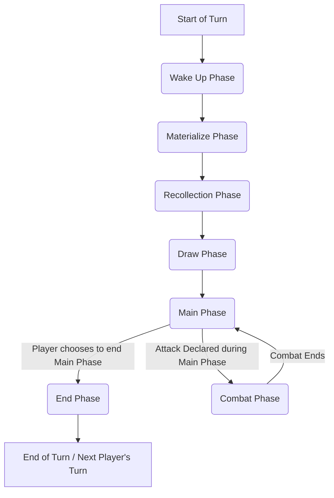

# Grand Archive Card Game Flowcharts

These flowcharts illustrate key game processes in the Grand Archive Card Game.

## 1. Starting the Game

```mermaid
graph TD
A[Start Game Setup] --> B{Each player places material & main decks in appropriate zones};
B --> C{Each player shuffles their main deck};
C --> D{Players present main decks to opponents to shuffle and/or cut};
D --> E{Players determine the first turn player (random method)};
E --> F{First player takes their first turn (see Turn One rules)};
F --> G[Game Begins]; 
```

## 2. Turn One (Modified Turn Order)
```

```mermaid
graph TD
subgraph TurnOne [Player's First Turn]
A[Player's First Turn Begins] --> B{Is it a 2-player game?};
B -- Yes --> C{Is this the First Player's turn?};
C -- Yes (First Player, 2-Player Game) --> D[Skip Wake Up, Materialize, Recollection Phases];
D --> E[Place Level 0 Champion from Material Deck onto the field];
E --> F[Skip Draw Phase];
F --> G[Proceed to Main Phase];
C -- No (Second Player, 2-Player Game) --> H[Skip Wake Up, Materialize, Recollection Phases];
H --> I[Place Level 0 Champion from Material Deck onto the field];
I --> J[Proceed to Draw Phase];
J --> K[Proceed to Main Phase];
B -- No (Multiplayer Game) --> L{Is this the First Player's turn? (Multiplayer)};
L -- Yes (First Player, Multiplayer) --> M[Skip Wake Up, Materialize, Recollection Phases];
M --> N[Place Level 0 Champion from Material Deck onto the field];
N --> O[Proceed to Draw Phase];
O --> P[Proceed to Main Phase];
L -- No (Other Players, Multiplayer - First Turn) --> Q[Skip Wake Up, Materialize, Recollection Phases];
Q --> R[Place Level 0 Champion from Material Deck onto the field];
R --> S[Proceed to Draw Phase];
S --> T[Proceed to Main Phase];
end
```

## 3. Standard Turn Order
```



## 4. Wake Up Phase
```

```mermaid
graph TD
A[Start of Wake Up Phase] --> B[Simultaneously wake each rested object controlled by turn player (Turn-based action)];
B --> C{Any 'Wake Up' or 'At the beginning of Wake Up Phase' triggers?};
C -- Yes --> D[Place triggers on Effects Stack];
D --> E[Turn player gains Opportunity];
E --> F{Effects Stack empty & All players pass Opportunity in succession?};
F -- Yes --> G[Proceed to Materialize Phase];
C -- No --> G; 
```

## 5. Materialize Phase
(Skipped on each player's first turn)

```mermaid

graph TD
A[Start of Materialize Phase] --> B{Any 'beginning of materialize phase' triggers?};
B -- Yes --> C[Place triggers on Effects Stack];
C --> D[Turn player gains Opportunity];
D --> E{Stack empty & Opportunity passed by all?};
E -- Yes --> F{Turn player chooses to materialize a card from material deck? (Turn-based action for materialization choice)};
F -- Yes --> G[Materialize card (Regalia/Champion), place on Effects Stack, pay costs];
G --> H[Opportunity generated, players may respond];
H --> I{Stack empty & Opportunity passed by all?};
I -- Yes --> J[Proceed to Recollection Phase];
F -- No --> K[No Materialization Opportunity given (unless triggers from B created one)];
K --> J;
B -- No --> F;
```

## 6. Recollection Phase
```

```mermaid
graph TD
A[Start of Recollection Phase] --> B{Any 'beginning of recollection' abilities trigger?};
B -- Yes --> C[Place abilities on Effects Stack];
C --> D{Effects Stack empty? (Resolve stack if not)};
D -- Yes --> E[Turn player gains Opportunity];
E --> F{Effects Stack empty & all players pass Opportunity in succession?};
F -- Yes --> G[Turn player returns all cards from their Memory zone to their Hand (Turn-based action)];
G --> H[Proceed to Draw Phase];
B -- No --> E;
```

## 7. Draw Phase
(First turn player in a 2-player game skips their first Draw Phase)

```

```mermaid
graph TD
A[Start of Draw Phase] --> B[Turn player draws a card (Turn-based game action)];
B --> C{Any abilities trigger from drawing?};
C -- Yes --> D[Place triggers on Stack, Opportunity arises];
D --> E{Effects Stack empty & all players pass Opportunity?};
E -- Yes --> F[Proceed to Main Phase];
C -- No --> F;
```

## 8. Main Phase
```

```mermaid
graph TD
A[Start of Main Phase] --> B[Turn player receives Opportunity];
B --> C{Turn player performs a Slow Player Action? (e.g., Play Ally/Item, Attack, Activate Slow Action)};
C -- Yes (Attack Declared) --> D(Combat Phase Begins);
D -- Combat Ends --> B;
C -- Yes (Other Slow/Fast Action or Ability Activation) --> E[Action/Ability on Effects Stack];
E --> F[Players gain Opportunity, resolve stack];
F --> B;
C -- No (Turn player passes) --> G{Non-turn players wish to act? (Fast Actions/Abilities only)};
G -- Yes --> E;
G -- No (All players pass Opportunity in succession) --> H{Effects Stack is empty?};
H -- Yes --> I[Player chooses to proceed to End Phase];
I --> J(End Phase Begins);
```

## 9. End Phase
```

```mermaid
graph TD
A[Start of End Phase] --> B[Any 'beginning of the end phase' effects are placed onto the Effects Stack];
B --> C[Turn player receives Opportunity ("before end of turn" window)];
C --> D{Effects Stack empty & all players pass Opportunity in succession?};
D -- Yes --> E[Special Game Action: Temporary damage marked on allies is removed];
E --> F['Until the end of the turn' / 'this turn' effects end. 'As turns end' effects occur];
F --> G[If hand-size/memory-size limits imposed, turn player discards if necessary];
G --> H[State-based actions are checked];
H --> I[Turn Ends];
```

## 10. Combat Phase Detailed Flow
```

```mermaid
graph TD
subgraph OverallCombat [Combat Phase]
direction LR
AA[Attack Declaration in Main Phase] --> AB(1. Attack Declarations Step);
AB --> AC(2. Retaliation Step);
AC --> AD(3. Damage Step);
AD --> AE(4. End of Combat Step);
AE --> AF[Return to Main Phase];
end

    subgraph AttackDeclarationsStep [1. Attack Declarations Step]
        direction TD
        B1[Player declares attack (target(s) chosen)] --> B2[Turn immediately enters Combat Phase];
        B2 --> B3[Attack declarations cannot be responded to directly; No Opportunity given here];
        B3 --> B4[Any 'On Attack' triggers are placed onto the Effects Stack];
        B4 --> B5[Proceed to Retaliation Step];
    end

    subgraph RetaliationStep [2. Retaliation Step]
        direction TD
        C1[Start Retaliation Step] --> C2{Effects on Stack (from 'On Attack' triggers)?};
        C2 -- Yes --> C3[Players receive Opportunity (turn order) to respond to these effects];
        C3 --> C4{Effects Stack empty?};
        C4 -- Yes --> C5[Turn player receives Opportunity ("before retaliation" window)];
        C2 -- No --> C5;
        C5 --> C6{Stack empty & each player passes Opportunity?};
        C6 -- Yes --> C7{Any awake defending units?};
        C7 -- Yes --> C8[For each, its controller may choose to rest it to retaliate against an attacker];
        C8 --> C9[Proceed to Damage Step];
        C7 -- No --> C9;
    end

    subgraph DamageStep [3. Damage Step]
        direction TD
        D1[Start Damage Step] --> D2[Turn player receives Opportunity ("before damage" window)];
        D2 --> D3{Stack empty & each player passes Opportunity?};
        D3 -- Yes --> D4{Multiple units retaliating against one attacker?};
        D4 -- Yes --> D5[Attacking player chooses order retaliating units deal damage];
        D5 --> D6[Damage dealt simultaneously: Attacker(s) vs. Target(s), Retaliator(s) vs. Retaliation Target(s)];
        D4 -- No --> D6;
        D6 --> D7[Calculate damage (sum power, apply modifiers, replacement effects)];
        D7 --> D8[Combat damage dealt & weapon durability counters removed simultaneously];
        D8 --> D9[No Opportunity given during the instance of damage dealing];
        D9 --> D10[Any 'On Hit' / 'On Kill' (from lethal combat damage) triggers occur];
        D10 --> D11[Proceed to End of Combat Step];
    end

    subgraph EndOfCombatStep [4. End of Combat Step]
        direction TD
        E1[Start End of Combat Step (always happens if combat initiated)] --> E2[Any cards in the Intent zone are placed into the graveyard];
        E2 --> E3[Attacking and defending objects are removed from combat (lose 'attacking'/'defending' properties)];
        E3 --> E4[State-based effects are checked];
        E4 --> E5{Abilities triggered during Damage Step (e.g., On Hit, On Kill)?};
        E5 -- Yes --> E6[Place these triggers onto Effects Stack; players gain Opportunity to respond];
        E6 --> E7{Stack empty & all pass Opportunity?};
        E7 -- Yes --> E8[Return to Main Phase];
        E5 -- No (or after stack resolves) --> E8;
    end
```

11. Card Activation Process

```mermaid
graph TD
A[Player Intends to Activate Card] --> B(1. Announce Activation: Place card on Effects Stack);
B --> C(2. Check Elements: Player has required elements enabled?);
C -- No --> Z[Activation Illegal: Revert game state];
C -- Yes --> D(3. Declare Costs: Specify X value, optional costs, alternative costs);
D --> E(4. Select Modes: If card has multiple modes);
E --> F(5. Declare Targets: Choose all necessary targets);
F --> G(6. Check Legality: Game checks if activation is legal with chosen modes/targets);
G -- No --> Z;
G -- Yes --> H(7. Calculate Reserve Cost: Apply cost modifications);
H --> I(8. Pay Costs: Pay calculated reserve cost and any additional/alternative costs);
I -- Cannot Pay --> Z;
I -- Costs Paid --> J{Did cost payment modify/add modes or targets (e.g. Imbue)?};
J -- Yes --> K[Repeat Mode/Target Selection (Steps 4-5) for new/modified parts only];
K --> G;
J -- No --> L(9. Activation Complete: Card is activated);
L --> M[Player who activated gains Opportunity];
```

## 12. Card Materialization Process

```mermaid

graph TD
A[Player Intends to Materialize Card (once per materialize phase or by effect)] --> B(1. Announce Materialization: Place card on Effects Stack);
B --> C(2. Check Elements: Player has required elements enabled? (Champions ignore this for materializing));
C -- No (and not Champion)--> Z[Materialization Illegal: Revert game state];
C -- Yes (or Champion) --> D(3. Declare Costs: Specify X value, optional costs, alternative costs);
D --> E(4. Select Modes: If card has multiple modes);
E --> F(5. Declare Targets: Choose all necessary targets);
F --> G(6. Check Legality: Game checks if materialization is legal - for Champions, includes Lineage/Leveling reqs);
G -- No --> Z;
G -- Yes --> H(7. Calculate Memory Cost: Apply cost modifications);
H --> I(8. Pay Costs: Pay calculated memory cost and any additional/alternative costs);
I -- Cannot Pay --> Z;
I -- Costs Paid --> L(9. Materialization Complete: Card is materialized);
L --> M[Player who materialized gains Opportunity];
```
