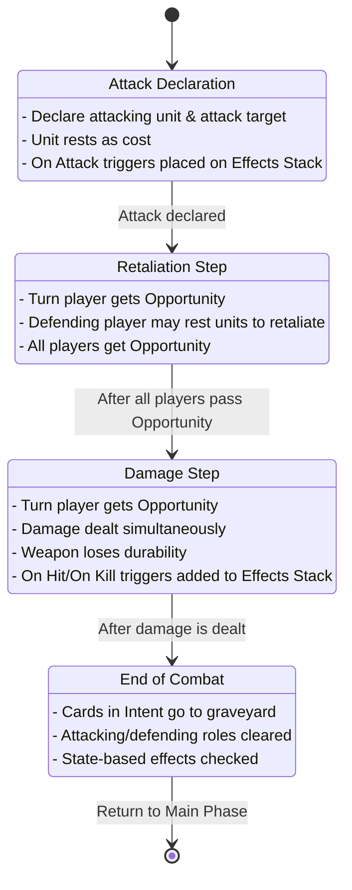
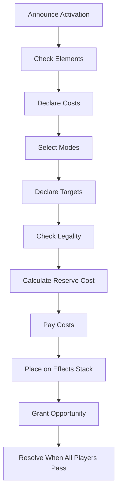
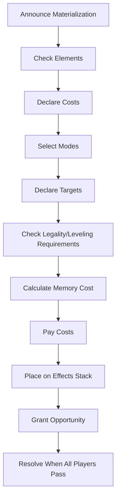

# Grand Archive Comprehensive Rules

For full context, refer to the RULES.md file.

Last Updated: 2025-06-18

## Objectives
- Players aim to win by defeating opponent champions
- A draw occurs if all players lose simultaneously

## Game Zones
- **Public Zones**: Field, Graveyard, Banishment, Effects Stack, Intent
- **Private Zones**: Hand, Memory, Main Deck, Material Deck

## Card Types
- **Champion**: Main character, starts at level 0, can be leveled up
- **Ally**: Units that can attack and retaliate
- **Action**: Cards with effects that resolve then go to graveyard
- **Attack**: Creates combat phase when resolved
- **Item**: Permanent with various effects
- **Weapon**: Equipment with power/durability used for attacks
- **Domain**: Field object with continuous effects
- **Phantasia**: Field object with special effects
- **Regalia**: Supertyped cards that start in Material Deck

## Turn Structure
1. **Wake Up Phase**: Awaken all rested objects
2. **Materialize Phase**: Materialize one card from Material Deck
3. **Recollection Phase**: Return cards from Memory to Hand
4. **Draw Phase**: Draw one card
5. **Main Phase**: Perform slow actions, play cards, attack
6. **End Phase**: End-of-turn effects, clear temporary damage

### Turn Priority Structure
- Only the turn player can take actions during their turn
- Actions must fully resolve before another action can be taken
- When effects enter the Effects Stack, they resolve in first-in-last-out order
- The turn player receives Opportunity at the beginning of Recollection, Main, and End phases
- When Opportunity arises:
  1. Turn player gets first chance to act
  2. After turn player passes, non-turn players may act in turn order
  3. Players may only activate fast-speed cards/abilities during Opportunity
  4. If all players pass Opportunity in succession, the top effect on the Effects Stack resolves
- No player may interrupt the resolution of effects or abilities

## Combat
1. **Attack Declaration**: Declare attack target
2. **Retaliation Step**: Defending player may rest units to retaliate
3. **Damage Step**: Both sides deal damage simultaneously
4. **End of Combat**: Remove cards from Intent, clear combat roles

### Combat Process Diagram

## Playing Cards
- **Activation**: Pay reserve cost, target selection, play from hand
- **Materialization**: Pay memory cost, used for Material Deck cards
- **Resolution**: Cards resolve from top of Effects Stack
- **Speed**: Fast cards can be played anytime with Opportunity, Slow cards only during Main Phase

### Card Activation Process

### Card Materialization Process

## Element System
- **Norm**: Available to all players
- **Basic Elements**: Fire, Water, Wind (unlocked by Level 0 champion)
- **Advanced Elements**: Arcane, Crux, etc. (unlocked at higher levels)

## Key Mechanics
- **Damage**: Marked on champions permanently, on allies temporarily
- **Obedience**: Units must obey controller to attack or use abilities
- **Lineage**: Stack of champion cards showing progression
- **Opportunity**: Chance to act during specific windows
- **Triggers**: Abilities that activate under specific conditions (On Enter, On Death, etc.)
- **Counters**: Track stats and special effects (Buff, Enlighten, Wither, etc.)
- **Keywords**: Specific abilities like Taunt, Cleave, Stealth, True Sight

## Effects Resolution
- Effects resolve in first-in-last-out (FILO) order from the Effects Stack
- When multiple triggered abilities enter the Effects Stack simultaneously:
  1. Turn player's triggers are placed first (in order chosen by turn player)
  2. Non-turn players' triggers are placed next (in turn order)
  3. Resolution begins after all triggers are placed on the stack
- Replacement effects are applied in order chosen by affected player
- Continuous effects use the layer system for overlapping modifications

## State-Based Effects
- Units die when damage equals/exceeds life
- Weapons are destroyed at 0 durability
- Unique rule forces sacrifice of duplicates
- Game ends when champion dies or deck is empty