# Lorcana Engine — Components Diagram

A high-level map of the `lorcana-engine` package for new contributors. It shows major components and how they interact. Use it to find the right home for new code (moves, abilities, operations, etc.).

```mermaid
flowchart LR
  %% Left to right: base dependencies → high-level components
  
  %% Base layer (leftmost)
  CORE_RULE["<b>@tcg/core - Core Engine</b><br/>(core-engine package)<br/><br/><b>Provides to Lorcana:</b><br/>• GameEngine base class<br/>• Zone operations (move cards, draw, shuffle)<br/>• Card operations (metadata, ownership)<br/>• Flow manager (segments, turns, phases, steps)<br/>• Card registry (lookup definitions)<br/>• CoreOperation base class<br/>• Immer-based immutable updates"]

  TYPES["<b>Types</b><br/>📁 src/lorcana-engine-types.ts<br/>📁 src/cards/lorcana-card-types.ts<br/><br/>LorcanaGameState, LorcanaPlayerState,<br/>LorcanaCardMeta, LorcanaZone"]

  %% Card system layer
  CARDS["<b>Card System</b><br/>📁 src/cards/**<br/><br/>• LorcanaCardInstance (extends CoreCardInstance)<br/>• LorcanaCardRepository<br/>• LorcanaCardFilterBuilder<br/>• Card definitions"]

  ABILITIES["<b>Abilities System</b><br/>📁 src/abilities/**<br/><br/>• Activated abilities<br/>• Triggered abilities (when/whenever/at)<br/>• Static abilities (while)<br/>• Keyword abilities<br/>• Replacement effects<br/>• Ability targets & conditions<br/>• Effects & durations"]

  %% Operations layer
  OPS["<b>Operations</b><br/>📁 src/operations/**<br/>📄 lorcana-core-operations.ts<br/><br/>LorcanaCoreOperations (extends CoreOperation)<br/>Lorcana-specific game logic:<br/>• Quest/challenge helpers<br/>• Ink management<br/>• Ready/exert operations<br/>• Location operations<br/>• Ability resolution (the Bag)<br/>• Game state checks"]

  OPS_MODULES["<b>Operation Modules</b><br/>📁 src/operations/modules/**<br/><br/>Complex operations (>5 lines):<br/>• challenge-character.ts<br/>• quest-with-character.ts<br/>• add-abilities-to-resolve.ts<br/>• resolve-layer-item.ts<br/>• ready-all-characters.ts<br/>• exert-ink-for-cost.ts"]

  %% Game logic layer
  MOVES["<b>Moves</b><br/>📁 src/moves/**<br/><br/>Player actions:<br/>• Core: playCard, quest, challenge<br/>• Resources: putACardIntoTheInkwell<br/>• Songs: sing, singTogether<br/>• Locations: moveCharacterToLocation<br/>• Abilities: useActivatedAbility<br/>• Setup: chooseFirstPlayer, alterHand<br/>• Flow: passTurn, resolveBag<br/>• Debug: concede, manualMoves"]

  SEGMENTS["<b>Segments & Flow</b><br/>📁 src/game-definition/segments/**<br/><br/>• startingAGame: setup sequence<br/>• duringGame: turn/phase/step structure<br/>&nbsp;&nbsp;- beginningPhase (ready/set/draw)<br/>&nbsp;&nbsp;- mainPhase<br/>• endGame: win condition check"]

  GAMEDEF["<b>Game Definition</b><br/>📄 src/game-definition/<br/>&nbsp;&nbsp;&nbsp;&nbsp;lorcana-game-definition.ts<br/><br/>Bundles rules config:<br/>• Segments (game flow)<br/>• Moves (player actions)<br/>• Setup function"]

  %% Top layer (rightmost)
  ENGINE["<b>LorcanaEngine</b><br/>📄 src/lorcana-engine.ts<br/><br/>Extends GameEngine with:<br/>• Lorcana-specific API<br/>• Card model initialization<br/>• Move availability<br/>• Parameter enumeration<br/>• Uses LorcanaCoreOperations"]

  TESTING["<b>Testing Utils</b><br/>📁 src/testing/**<br/><br/>• lorcana-test-engine.ts<br/>• mockCards.ts<br/>Helper for test setup"]

  %% Dependencies flow left → right
  CORE_RULE --> TYPES
  CORE_RULE --> CARDS
  CORE_RULE --> OPS
  TYPES --> CARDS
  TYPES --> ABILITIES
  TYPES --> OPS
  TYPES --> MOVES
  TYPES --> SEGMENTS
  CARDS --> ABILITIES
  CARDS --> ENGINE
  ABILITIES --> OPS
  ABILITIES --> MOVES
  OPS --> OPS_MODULES
  OPS_MODULES --> OPS
  OPS --> MOVES
  OPS --> SEGMENTS
  MOVES --> SEGMENTS
  SEGMENTS --> GAMEDEF
  MOVES --> GAMEDEF
  GAMEDEF --> ENGINE
  CORE_RULE --> ENGINE
  ENGINE --> TESTING

  %% Styling: left-align text and top-align box content
  classDef leftAlign text-align:left
  classDef topAlign vertical-align:top
  class CORE_RULE,ENGINE,GAMEDEF,MOVES,OPS,OPS_MODULES,TYPES,CARDS,ABILITIES,SEGMENTS,TESTING leftAlign,topAlign
```

## Glossary

### LorcanaEngine
**What:** The main engine class that extends `GameEngine` from core-engine. Provides Lorcana-specific functionality.  
**Where:** `src/lorcana-engine.ts`  
**Key Features:**
- Initializes `LorcanaCardInstance` models for all cards
- Uses `LorcanaCoreOperations` for game logic
- Provides game-specific API for querying moves and state

### LorcanaCoreOperations
**What:** Extension of `CoreOperation` from core-engine. Encapsulates all Lorcana-specific game logic and rules.  
**Where:** `src/operations/lorcana-core-operations.ts`  
**Key Responsibilities:**
- Character questing and challenging logic
- Ink management (ready, exert, calculate available)
- Ability resolution via "the Bag" (triggered effects queue)
- Location operations (enter/leave)
- Game state checks and win conditions
- Delegates complex operations to modules in `operations/modules/`

### Operations Modules
**What:** Complex operations (>5 lines) extracted to separate files for maintainability and testability.  
**Where:** `src/operations/modules/`  
**Examples:**
- `challenge-character.ts` — handles challenge resolution, damage, banishing
- `quest-with-character.ts` — validates and resolves questing
- `add-abilities-to-resolve.ts` — adds triggered abilities to the Bag
- `resolve-layer-item.ts` — resolves a single triggered ability from the Bag
- `ready-all-characters.ts` — readies all characters for a player
- `exert-ink-for-cost.ts` — exerts ink cards to pay costs

### Moves
**What:** Player actions that can be taken during the game. Each move is a function that validates conditions and modifies state.  
**Where:** `src/moves/` (organized by category)  
**Categories:**
- **Core gameplay:** `playCard`, `quest`, `challenge`
- **Resources:** `putACardIntoTheInkwell`
- **Songs:** `sing`, `singTogether`
- **Locations:** `moveCharacterToLocation`
- **Abilities:** `useActivatedAbility`
- **Setup:** `chooseFirstPlayer`, `alterHand`
- **Flow:** `passTurn`, `resolveBag`
- **Debug/Admin:** `concede`, `manualMoves`

All moves are exported from `moves.ts` as `lorcanaMoves`.

### Segments
**What:** Top-level game flow structure from core-engine. Segments contain turns, phases, and steps.  
**Where:** `src/game-definition/segments/`  
**Three Main Segments:**
- `startingAGame` — handles game setup (choose first player, draw, mulligan)
- `duringGame` — main gameplay loop with turn structure:
  - `beginningPhase` → `readyStep`, `setStep`, `drawStep`
  - `mainPhase` → where most moves happen
- `endGame` — win condition check

### Abilities System
**What:** Comprehensive ability framework for card effects.  
**Where:** `src/abilities/`  
**Ability Types:**
- **Activated:** Abilities with costs that can be manually triggered (`activated/`)
- **Triggered:** When/Whenever/At abilities that automatically trigger (`triggered/`, `whenAbilities.ts`, `wheneverAbilities.ts`, `atTheAbilities.ts`)
- **Static:** Continuous effects that apply while a card is in play (`static/`, `whileAbilities.ts`)
- **Keyword:** Simplified abilities like Rush, Evasive, Challenger (`keyword/`)
- **Replacement:** Effects that replace game events (`replacement/`)

Each ability has:
- **Conditions:** When it can trigger/activate
- **Targets:** What it affects
- **Effects:** What it does
- **Duration:** How long effects last

### The Bag (Layer Resolution)
**What:** A conceptual queue for triggered abilities waiting to resolve. When multiple effects trigger simultaneously, they're added to "the Bag" and resolved one at a time.  
**Where:** Managed by `LorcanaCoreOperations`  
**Key Operations:**
- `addAbilitiesToResolve()` — adds triggered abilities to the Bag
- `resolveLayerItem()` — resolves one ability from the Bag
- `resolveBag` move — player action to resolve pending abilities

### Card System
**What:** Lorcana-specific card implementation.  
**Where:** `src/cards/`  
**Key Classes:**
- `LorcanaCardInstance` — extends `CoreCardInstance` with Lorcana-specific functionality
- `LorcanaCardRepository` — manages card definitions and lookups
- `LorcanaCardFilterBuilder` — builds queries to find specific cards

### Game Definition
**What:** The complete rules configuration object passed to GameEngine. Defines the game structure.  
**Where:** `src/game-definition/lorcana-game-definition.ts` (exports `lorcanaGameDefinition` and `LorcanaGame`)  
**Contains:**
- Segments (game flow structure)
- Base moves (minimal set, most are in segments)
- Setup function
- Game metadata (name, player count)

---

## Where to add new code

- **New move:** Add to appropriate file in `src/moves/` (or create new file) and export from `src/moves/moves.ts`. Then reference in the appropriate segment phase/step in `src/game-definition/segments/`.

- **New ability type/logic:** Add to `src/abilities/` in the appropriate subdirectory:
  - `activated/` for activated abilities
  - `triggered/` for triggered abilities
  - `static/` for static/continuous effects
  - `keyword/` for keyword abilities
  - `replacement/` for replacement effects
  - Update ability types in `ability-types.ts`

- **New operation (game logic):** 
  - If simple (<5 lines): Add directly to `src/operations/lorcana-core-operations.ts`
  - If complex (>5 lines): Create a new module in `src/operations/modules/` and import/use it from `lorcana-core-operations.ts`

- **New segment/phase/step:** Modify the appropriate segment config in `src/game-definition/segments/`:
  - `starting-a-game/` for setup flow
  - `during-game/` for main game turn structure
  - `end-game/` for win condition logic

- **New card type or card logic:** Update `src/cards/`:
  - Card types in `lorcana-card-types.ts`
  - Card instance behavior in `lorcana-card-instance.ts`
  - Card definitions in `cards/definitions/`

- **Game setup/initialization:** Update `src/game-definition/segments/starting-a-game/starting-a-game-segment.ts`

- **Engine UX (AI/UI helpers):** Extend `src/lorcana-engine.ts` with new public methods for querying state or available actions

- **Tests:** 
  - Use `src/testing/lorcana-test-engine.ts` to arrange board state and execute moves
  - Add test files alongside the code being tested (e.g., `quest.test.ts` next to `quest.ts`)

- **Type definitions:** Add to:
  - `src/lorcana-engine-types.ts` for game state and player state types
  - `src/cards/lorcana-card-types.ts` for card-specific types
  - `src/moves/types.ts` for move parameter types

## Notes

- The engine extends `GameEngine` from `@tcg/core` core-engine package
- `LorcanaCoreOperations` extends `CoreOperation` and contains all Lorcana-specific game logic
- Game flow is defined using segments/turns/phases/steps from core-engine
- Complex operations (>5 lines) must be extracted to modules for maintainability
- The "Bag" (triggered abilities queue) is managed by `LorcanaCoreOperations`
- Card abilities are defined using the comprehensive abilities system in `src/abilities/`
- Keep TypeScript strict and avoid `any`. Prefer explicit Lorcana types
- **No validators directory exists** — validation logic is embedded in moves or operations
