# Disney Lorcana Flowcharts

These flowcharts illustrate the key game processes based on the Disney Lorcana Trading Card Game rules.

# Game Flow Diagrams

This document contains flowcharts that visualize the structure and flow of the Lorcanito game engine. These diagrams can be used to understand the game flow and create state machines to control game execution.

## Game State Machine

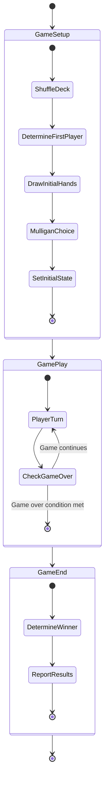

## Game Turn Structure

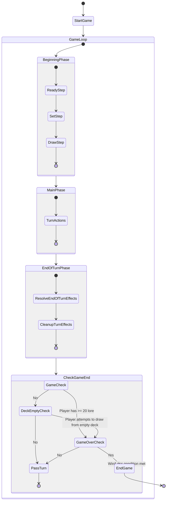

## Player Turn Actions

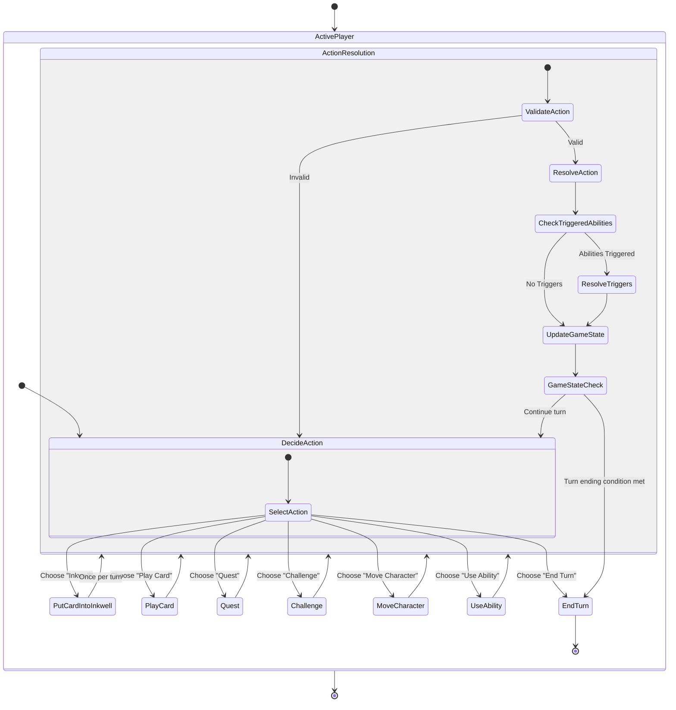

## Card Playing Process

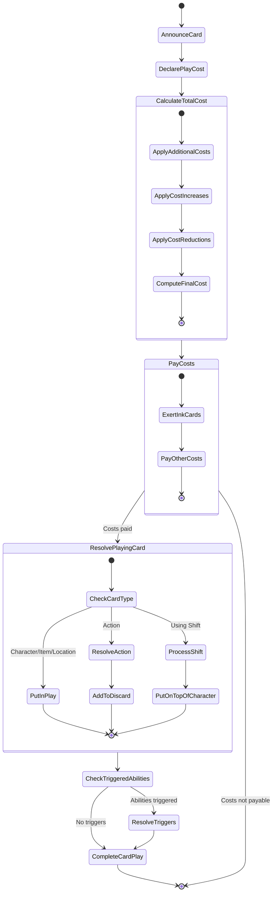

## Game State Check Flow

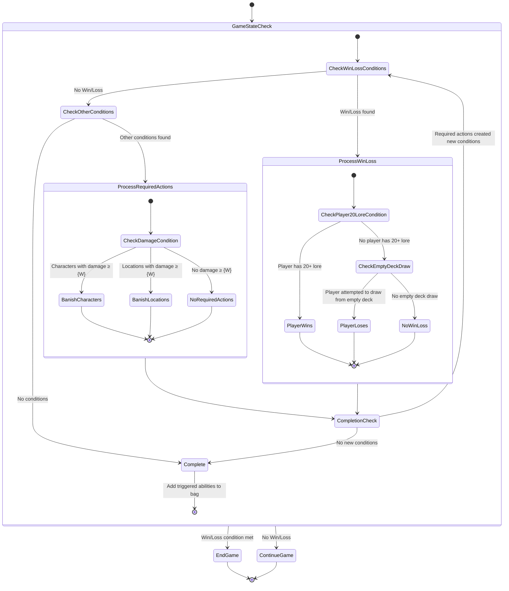

## Challenge Resolution

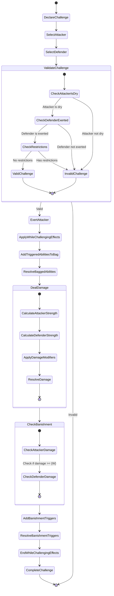

## State Transitions

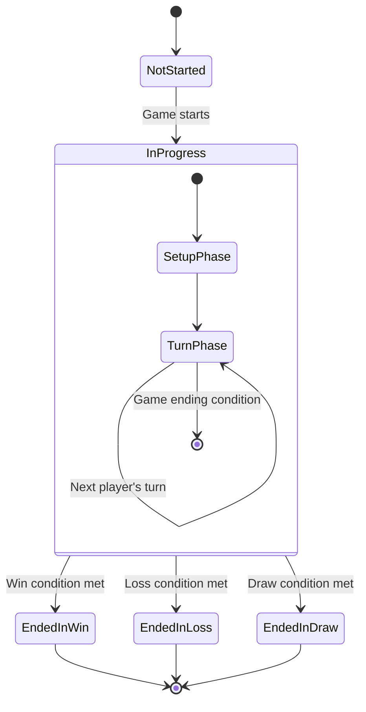

## Action Resolution State Machine

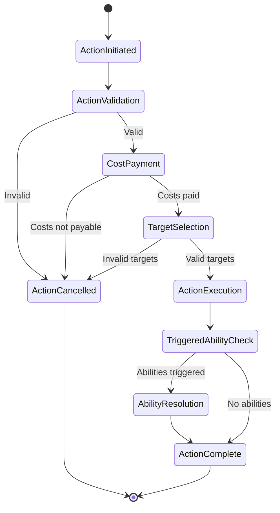

## Ability Resolution Flow

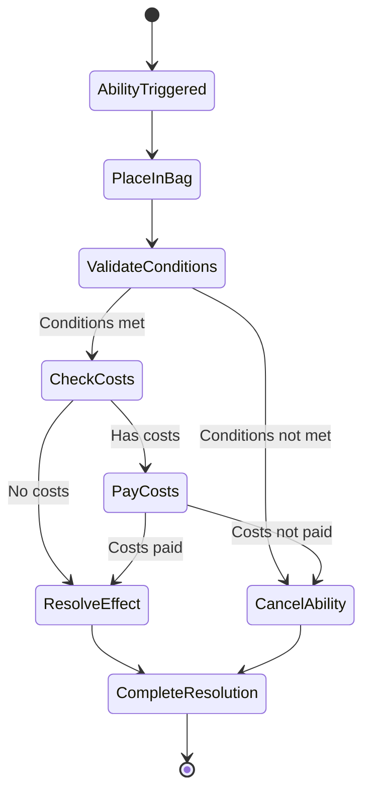

## Quest Action

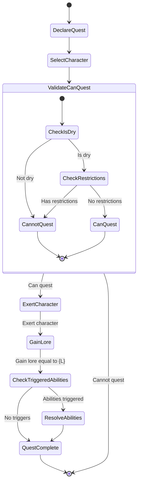

## Core Engine Integration

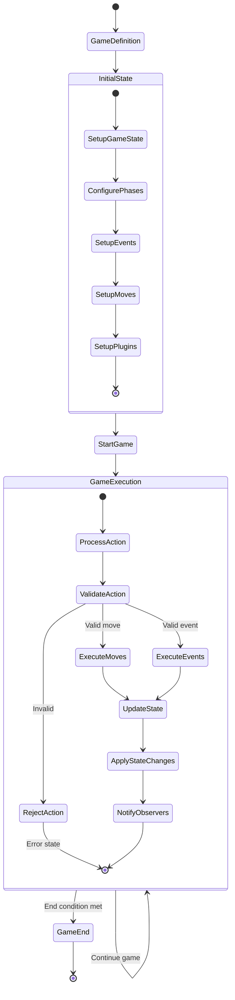

## Client-Server State Synchronization

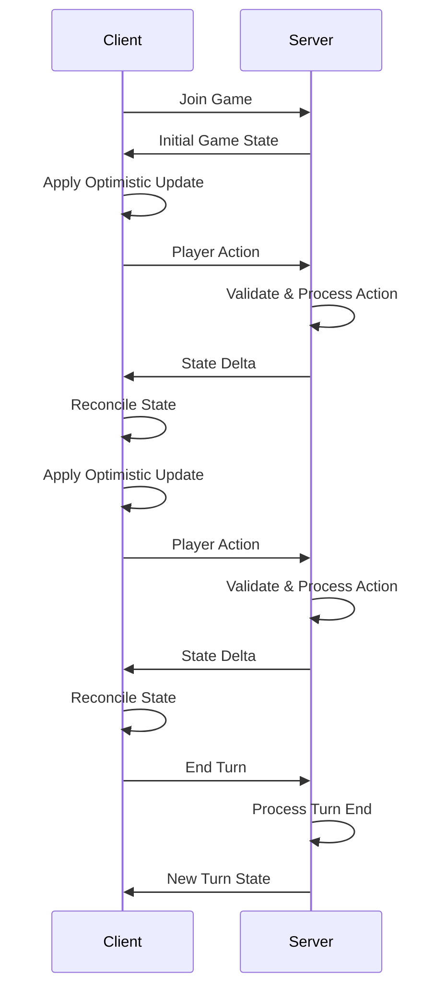

## Turn Priority Structure

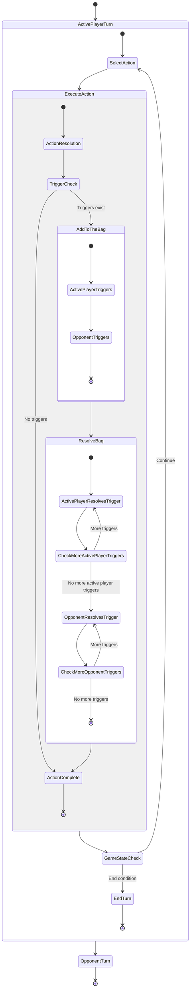

## Game Setup and Turn Flow

```mermaid
graph TD
    A[Game Setup] --> B{Determine Starting Player};
    B --> C[Each Player Shuffles Deck];
    C --> D[Offer Cut to Opponent];
    D --> E[Set Lore to 0];
    E --> F[Each Player Draws 7 Cards];
    F --> G{Alter Starting Hand? (Starting Player First)};
    G -- Yes --> H[Select Cards to Bottom-Deck];
    H --> I[Draw to 7 Cards];
    I --> J[Other Players Alter Hand];
    J --> K[Shuffle Deck (if altered)];
    K --> L[Offer Cut (if altered)];
    L --> M[Game Begins: Starting Player's Turn];
    G -- No --> M;
    M --> N(Player Turns);
    N --> O{Game End Condition Met?};
    O -- Yes --> P[Game Ends];
    O -- No --> N;

    subgraph GameEndConditions
        direction LR
        P1[Player reaches 20+ Lore] --> P;
        P2[Player attempts to draw from empty deck] --> P;
        P3[Last player remaining in multiplayer] --> P;
    end

    style A fill:#f9f,stroke:#333,stroke-width:2px
    style P fill:#f9f,stroke:#333,stroke-width:2px
    style M fill:#ccf,stroke:#333,stroke-width:2px
    style N fill:#ccf,stroke:#333,stroke-width:2px
```

## Turn Structure

```mermaid
graph TD
    TurnStart[Player's Turn Begins] --> BP[Beginning Phase];

    subgraph BeginningPhase
        direction TB
        BP_Ready[1. Ready Step] --> BP_Set[2. Set Step];
        BP_Set --> BP_Draw[3. Draw Step];
        BP_Ready_A[Active player readies all their cards in play & inkwell] --> BP_Ready_B["'During your turn' effects start"];
        BP_Ready_B --> BP_Ready_C["'Start of turn' effects end"];
        BP_Ready_C --> BP_Ready_D["'Start of turn' abilities trigger (don't resolve yet)"];
        BP_Ready_D --> BP_Set;

        BP_Set_A[Characters in play are no longer 'drying'] --> BP_Set_B[Active player gains lore from Locations];
        BP_Set_B --> BP_Set_C["'Start of turn' abilities & Ready step triggers added to Bag"];
        BP_Set_C --> BP_Set_D[Resolve all triggers in Bag];
        BP_Set_D --> BP_Draw;

        BP_Draw_A[Active player draws a card (skip if first turn of game)] --> BP_Draw_B[Resolve any triggered abilities];
        BP_Draw_B --> MP[Main Phase];
    end

    MP --> EOTP[End of Turn Phase];

    subgraph MainPhase
        direction TB
        MP_Desc[Player takes Turn Actions in any order, any number of times (unless limited)] --> MP_Actions;
        MP_Actions(Turn Actions Available) --> MP_Ink[Put 1 card into Inkwell (once per turn)];
        MP_Actions --> MP_Play[Play a Card];
        MP_Actions --> MP_Quest[Quest with a Character];
        MP_Actions --> MP_Challenge[Challenge with a Character];
        MP_Actions --> MP_Move[Move a Character to a Location];
        MP_Actions --> MP_Activate[Use Activated Abilities];
        MP_Ink --> MP_CheckBag{Any Triggers in Bag?};
        MP_Play --> MP_CheckBag;
        MP_Quest --> MP_CheckBag;
        MP_Challenge --> MP_CheckBag;
        MP_Move --> MP_CheckBag;
        MP_Activate --> MP_CheckBag;
        MP_CheckBag -- Yes --> Resolve_Bag_MP[Resolve Bag];
        Resolve_Bag_MP --> MP_Actions;
        MP_CheckBag -- No --> MP_Continue[Continue Main Phase or Proceed to End Phase];
        MP_Continue --> EOTP;
    end

    subgraph EndOfTurnPhase
        direction TB
        EOTP_Declare[Active player declares end of turn (Bag must be empty)] --> EOTP_Triggers["'End of turn' abilities added to Bag"];
        EOTP_Triggers --> EOTP_ResolveBag[Resolve all triggers in Bag];
        EOTP_ResolveBag --> EOTP_EffectsEnd["'This turn' effects end"];
        EOTP_EffectsEnd --> EOTP_NewTriggers{New Triggers from Effects Ending?};
        EOTP_NewTriggers -- Yes --> EOTP_ResolveBag;
        EOTP_NewTriggers -- No --> EOTP_End[Turn Ends, Next Player's Turn];
    end

    TurnStart --> GameStateCheck1[Perform Game State Check];
    BP_Ready --> GameStateCheck2[Perform Game State Check];
    BP_Set_D --> GameStateCheck3[Perform Game State Check];
    BP_Draw_B --> GameStateCheck4[Perform Game State Check];
    Resolve_Bag_MP --> GameStateCheck5[Perform Game State Check after each resolved ability];
    EOTP_ResolveBag --> GameStateCheck6[Perform Game State Check after each resolved ability];
    EOTP_EffectsEnd --> GameStateCheck7[Perform Game State Check];

    style GameStateCheck1 fill:#lightgrey,stroke:#333,stroke-width:1px,color:black
    style GameStateCheck2 fill:#lightgrey,stroke:#333,stroke-width:1px,color:black
    style GameStateCheck3 fill:#lightgrey,stroke:#333,stroke-width:1px,color:black
    style GameStateCheck4 fill:#lightgrey,stroke:#333,stroke-width:1px,color:black
    style GameStateCheck5 fill:#lightgrey,stroke:#333,stroke-width:1px,color:black
    style GameStateCheck6 fill:#lightgrey,stroke:#333,stroke-width:1px,color:black
    style GameStateCheck7 fill:#lightgrey,stroke:#333,stroke-width:1px,color:black
```

## Playing Cards

```mermaid
graph TD
    Start[Play a Card Action] --> Announce[1. Announce card from hand, reveal it];
    Announce --> HowToPlay[2. Announce how to play (ink cost or alternate cost)];
    HowToPlay --> DetermineCost[3. Determine Total Cost (Base + Modifiers)];
    DetermineCost --> PayCost[4. Pay Total Cost (Exert Ink, other costs)];
    PayCost --> CardPlayed[5. Card is "Played"];
    CardPlayed --> EntersPlay{Type of Card?};
    EntersPlay -- Character, Item, Location --> CIP[Card enters Play zone];
    CIP --> ShiftCheck{Shifted Character?};
    ShiftCheck -- Yes --> PlaceOnTop[Place on top of specified character];
    ShiftCheck -- No --> EndPlayCard;
    PlaceOnTop --> EndPlayCard;
    EntersPlay -- Action --> ResolveAction[Effect immediately resolves];
    ResolveAction --> ActionToDiscard[Action card goes to discard pile];
    ActionToDiscard --> EndPlayCard;
    EndPlayCard --> TriggerCheck{Any abilities triggered by playing card/its effects?};
    TriggerCheck -- Yes --> AddToBag[Add triggered abilities to Bag (resolve after card play is complete)];
    TriggerCheck -- No --> FinishPlay;
    AddToBag --> FinishPlay[Card Play Action Complete];

    style Start fill:#cff,stroke:#333,stroke-width:2px
    style FinishPlay fill:#cff,stroke:#333,stroke-width:2px
## Questing

```mermaid
graph TD
    Start[Quest Action] --> DeclareQuest[1. Declare Character is Questing];
    DeclareQuest --> IdentifyChar[2. Identify Questing Character];
    IdentifyChar --> CheckRestrictions{Restrictions prevent questing? (e.g., not dry, Reckless)};
    CheckRestrictions -- Yes --> IllegalQuest[Quest is Illegal, End Action];
    CheckRestrictions -- No --> ExertChar[3. Exert Questing Character];
    ExertChar --> GainLore[4. Questing Player gains Lore = Character's Lore Value];
    GainLore --> TriggerCheck{Any abilities triggered by questing?};
    TriggerCheck -- Yes --> AddToBag[Add triggered abilities to Bag];
    TriggerCheck -- No --> QuestOver;
    AddToBag --> ResolveBag[Resolve Bag];
    ResolveBag --> QuestOver[Quest is Over];

    style Start fill:#cfc,stroke:#333,stroke-width:2px
    style QuestOver fill:#cfc,stroke:#333,stroke-width:2px
```

## Challenging

```mermaid
graph TD
    Start[Challenge Action] --> DeclareChallenge[1. Declare own Character is Challenging];
    DeclareChallenge --> CheckChallenger[Challenger must be dry, ready, able to challenge];
    CheckChallenger --> ChooseTarget[2. Choose an Exerted Opposing Character OR Opposing Location];
    ChooseTarget --> TargetType{Target is Character or Location?};

    TargetType -- Character --> ChallengeCharSteps;
    TargetType -- Location --> ChallengeLocSteps;

    subgraph ChallengeCharSteps [Challenge Opposing Character]
        direction TB
        CC1[3. Check Challenge Restrictions] --> CC2{Any effect prevents challenge?};
        CC2 -- Yes --> IllegalChallenge[Challenge is Illegal, End Action];
        CC2 -- No --> CC3[4. Exert Challenging Character];
        CC3 --> CC4[5. Challenge Occurs];
        CC4 --> CC5[6. "While challenging" effects apply];
        CC5 --> CC6[7. Add "when challenged/banished in challenge" triggers to Bag];
        CC6 --> CC7[Resolve Bag (if any triggers)];
        CC7 --> CC8[8. Challenge Damage Step: Each character deals damage (Strength) to the other];
        CC8 --> CC9[Calculate Strength (min 0), Apply Resist];
        CC9 --> CC10[Place Damage Counters];
        CC10 --> CC11[Perform Game State Check (banish if damage >= Willpower)];
        CC11 --> CC12{Any "banished in/during challenge" triggers?};
        CC12 -- Yes --> AddToBagDamage[Add to Bag];
        AddToBagDamage --> ResolveBagDamage[Resolve Bag];
        ResolveBagDamage --> CC13;
        CC12 -- No --> CC13;
        CC13["'While challenging/being challenged' effects end"] --> ChallengeOver[Challenge is Over];
    end

    subgraph ChallengeLocSteps [Challenge Opposing Location]
        direction TB
        CL1[3. Check Challenge Restrictions (Locations are always targetable if in play)] --> CL2{Any effect prevents challenge?};
        CL2 -- Yes --> IllegalChallengeL[Challenge is Illegal, End Action];
        CL2 -- No --> CL3[4. Exert Challenging Character];
        CL3 --> CL4[5. Challenge Occurs];
        CL4 --> CL5[6. "While challenging" effects apply (for challenger)];
        CL5 --> CL6[7. Add relevant triggers to Bag (e.g., character challenging a location)];
        CL6 --> CL7[Resolve Bag (if any triggers)];
        CL7 --> CL8[8. Challenge Damage Step: Challenging character deals damage (Strength) to Location];
        CL8 --> CL9[Calculate Strength (min 0), Apply Resist on Location];
        CL9 --> CL10[Place Damage Counters on Location];
        CL10 --> CL11[Perform Game State Check (banish Location if damage >= Willpower)];
        CL11 --> CL12{Any "Location banished in challenge" triggers?};
        CL12 -- Yes --> AddToBagDamageL[Add to Bag];
        AddToBagDamageL --> ResolveBagDamageL[Resolve Bag];
        ResolveBagDamageL --> CL13;
        CL12 -- No --> CL13;
        CL13["'While challenging' effects end"] --> ChallengeOverL[Challenge is Over];
    end

    ChallengeCharSteps --> EndChallenge;
    ChallengeLocSteps --> EndChallenge;

    RemovedCheck{Character removed from challenge? (e.g., banished by pre-damage effect)}
    CC6 -. If character removed .-> RemovedCheck;
    CL6 -. If character removed .-> RemovedCheck;
    RemovedCheck -- Yes --> ResolveRemainingBag[Resolve any remaining Bag triggers] --> EndChallengeEarly["While challenging" effects end, Challenge Ends];


    style Start fill:#fcc,stroke:#333,stroke-width:2px
    style EndChallenge fill:#fcc,stroke:#333,stroke-width:2px
    style ChallengeOver fill:#fcc,stroke:#333,stroke-width:2px
    style ChallengeOverL fill:#fcc,stroke:#333,stroke-width:2px
```

## Trigger Resolution and the Bag

```mermaid
graph TD
    TriggerOccurs[Trigger Condition Met] --> AddToBag[Ability added to Bag by its player];
    AddToBag --> SimultaneousTriggers{Multiple abilities triggered simultaneously?};
    SimultaneousTriggers -- Yes --> AddAllToBag[All added to Bag simultaneously];
    SimultaneousTriggers -- No --> CheckActivePlayerBag;
    AddAllToBag --> CheckActivePlayerBag;

    CheckActivePlayerBag{Active Player has abilities in Bag?};
    CheckActivePlayerBag -- Yes --> AP_Choose[Active Player chooses one of their abilities];
    AP_Choose --> AP_Resolve[Active Player fully resolves it];
    AP_Resolve --> NewTriggerCheckAP{Resolution caused new triggers?};
    NewTriggerCheckAP -- Yes --> AddNewToBagAP[New trigger added to Bag];
    AddNewToBagAP --> CheckActivePlayerBag;
    NewTriggerCheckAP -- No --> CheckActivePlayerBag;

    CheckActivePlayerBag -- No --> CheckNextPlayerBag{Next Player (in turn order) has abilities in Bag?};
    CheckNextPlayerBag -- Yes --> NP_Choose[Next Player chooses one of their abilities];
    NP_Choose --> NP_Resolve[Next Player fully resolves it];
    NP_Resolve --> NewTriggerCheckNP{Resolution caused new triggers (for ANY player)?};
    NewTriggerCheckNP -- Yes --> AddNewToBagNP[New trigger added to Bag];
    AddNewToBagNP --> NP_KeepResolving[Current resolving player continues resolving THEIR triggers first, then pass if none];
    NP_KeepResolving --> CheckNextPlayerBag; %% Simplified: current player resolves all theirs before moving on
    NewTriggerCheckNP -- No --> CheckNextPlayerBag;

    CheckNextPlayerBag -- No --> AllPlayersChecked{All players checked in turn order?};
    AllPlayersChecked -- No --> CheckNextPlayerBag; %% This implies looping through players
    AllPlayersChecked -- Yes --> BagEmptyCheck{Bag is Empty?};
    BagEmptyCheck -- Yes --> ProceedGame[Proceed to next step/phase/action];
    BagEmptyCheck -- No --> CheckActivePlayerBag; %% Restart with Active Player if Bag not empty

    PlayerLeaves{Player leaves game with abilities in Bag?};
    PlayerLeaves -- Yes --> RemoveAbilities[Those abilities cease to exist];

    style TriggerOccurs fill:#ffc,stroke:#333,stroke-width:2px
    style ProceedGame fill:#ffc,stroke:#333,stroke-width:2px
```

```mermaid
graph TD
    StartCheck[Game State Check Triggered] --> CheckWinLoss[1. Check & Complete Win/Loss Conditions First (Turn Order)];
    CheckWinLoss --> WinLossMet{Win/Loss Condition Met?};
    WinLossMet -- Yes --> PlayerWinsOrLoses[Player Wins/Loses Game];
    PlayerWinsOrLoses --> IfWinSimulLoss{Player Wins & Loses Simultaneously?};
    IfWinSimulLoss -- Yes --> PlayerWins[Player Wins];
    IfWinSimulLoss -- No --> EndCheckIfGameEnds[If game ends, check stops here for that player];
    PlayerWins --> EndCheckIfGameEnds;

    WinLossMet -- No --> CheckOtherConditions[2. Check & Complete Other Conditions (Turn Order)];
    CheckOtherConditions --> OtherConditionMet{Other Condition Met? (e.g., Banish Character/Location)};
    OtherConditionMet -- Yes --> PerformRequiredAction[Perform Required Action(s) Simultaneously if multiple];
    PerformRequiredAction --> RepeatCheck{Repeat Game State Check};
    RepeatCheck --> StartCheck;
    OtherConditionMet -- No --> NoMoreActions{No Further Required Actions};
    NoMoreActions --> AddTriggersToBag[3. Add abilities triggered during this process to Bag];
    AddTriggersToBag --> EndCheck[Game State Check Complete];

    subgraph Conditions
        direction LR
        W1[Player has 20+ Lore (WIN)]
        L1[Player tried to draw from empty deck (LOSS)]
        B1[Character/Location damage >= Willpower (BANISH)]
    end

    style StartCheck fill:#eee,stroke:#333,stroke-width:2px
    style EndCheck fill:#eee,stroke:#333,stroke-width:2px
````
