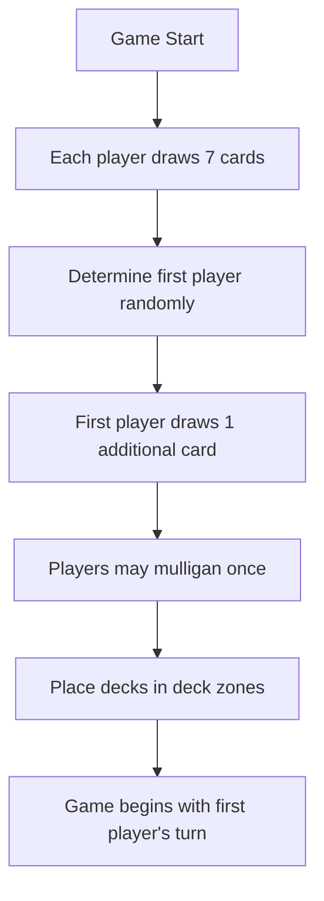
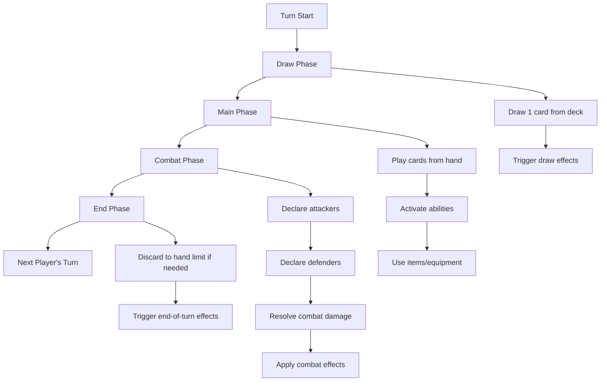
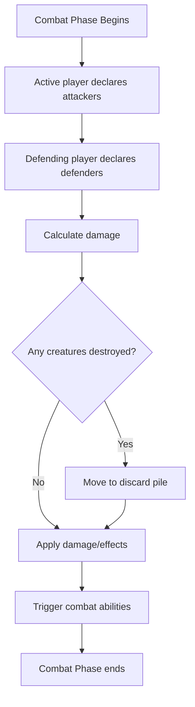
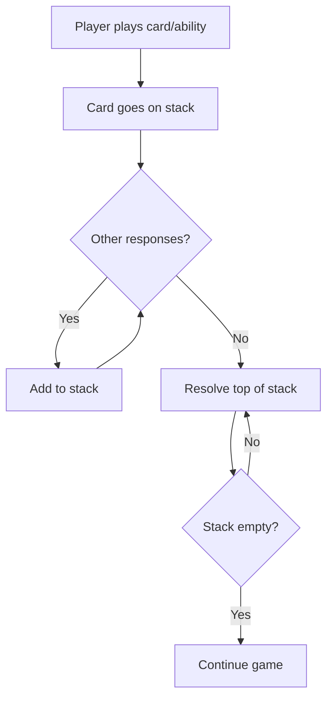
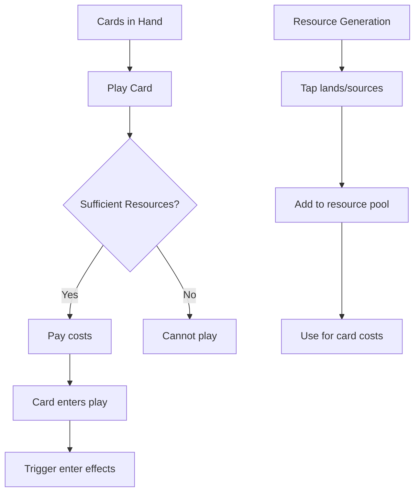
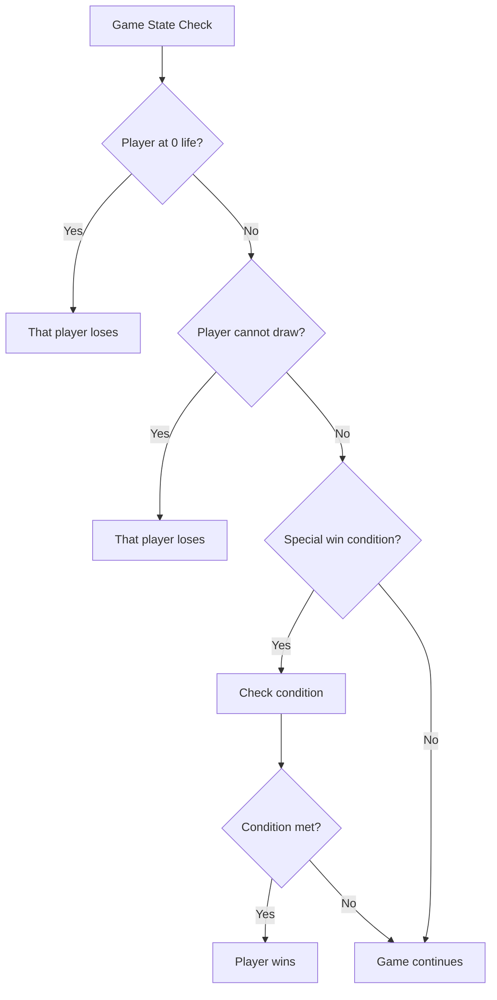
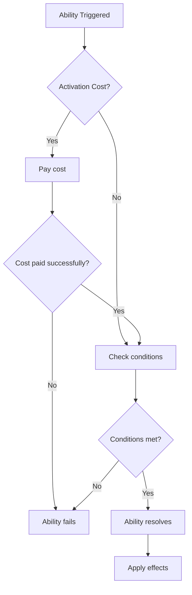

# Riftbound Game Flow Charts

## Game Setup Flow



## Turn Structure



## Combat Resolution



## Card Resolution Stack



## Resource Management



## Win Conditions



## Ability Activation


```