# Lorcana Engine — Components Diagram

A high-level map of the `packages/lorcana-engine` package for new contributors. It shows major components and how they interact. Use it to find the right home for new code (moves, validators, operations, etc.).

```mermaid
flowchart LR
  %% Left to right: base dependencies → high-level components
  
  %% Base layer (leftmost)
  CORE_RULE["<b>@tcg/core - Core Engine</b><br/>(external package)<br/><br/><b>Provides to Lorcana:</b><br/>• RuleEngine (move execution, state management)<br/>• Zone operations (move cards, draw, shuffle)<br/>• Card operations (metadata, ownership)<br/>• Tracker system (per-turn action flags)<br/>• Flow manager (turns, phases, segments)<br/>• Card registry (lookup definitions)<br/>• Immer-based immutable updates"]

  TYPES["<b>Shared Types</b><br/>📁 src/types/**<br/><br/>Game state, move params, card meta"]

  %% Rule helpers layer
  VALS["<b>Validators</b><br/>📁 src/validators/**<br/><br/>Small, pure predicates used in move <a href='#conditions'>conditions</a><br/>Examples: phase, zone, ownership, exerted/dry"]

  OPS["<b>Operations</b><br/>📁 src/operations/**<br/><br/>Lorcana semantics helpers for <a href='#reducers'>reducers</a><br/>Examples: exert, add lore, move to location, damage"]

  %% Game logic layer
  MOVES["<b>Moves</b><br/>📁 src/game-definition/moves/**<br/><br/>Game actions defined with createMove:<br/>• <a href='#conditions'>Conditions</a> (validators)<br/>• <a href='#reducers'>Reducers</a> (use operations)<br/>• Use <a href='#context'>context APIs</a> (zones/cards/trackers)"]

  GAMEDEF["<b>Game Definition</b><br/>📄 src/game-definition/definition.ts<br/><br/>Bundles rules config:<br/>• Flow (turn/phase)<br/>• Zones<br/>• Moves<br/>• Trackers<br/>• Setup & Win conditions"]

  %% Top layer (rightmost)
  ENGINE["<b>LorcanaEngine</b><br/>📄 src/engine/lorcana-engine.ts<br/><br/>Engine wrapper on RuleEngine<br/>• Lists available moves<br/>• Enumerates parameters<br/>• Explains invalid moves"]

  %% Dependencies flow left → right
  CORE_RULE --> TYPES
  CORE_RULE --> VALS
  CORE_RULE --> OPS
  TYPES --> VALS
  TYPES --> OPS
  TYPES --> MOVES
  VALS --> MOVES
  OPS --> MOVES
  CORE_RULE --> MOVES
  MOVES --> GAMEDEF
  TYPES --> GAMEDEF
  CORE_RULE --> ENGINE
  GAMEDEF --> ENGINE
  TYPES --> ENGINE

  %% Styling: left-align text and top-align box content
  classDef leftAlign text-align:left
  classDef topAlign vertical-align:top
  class CORE_RULE,ENGINE,GAMEDEF,MOVES,VALS,OPS,TYPES leftAlign,topAlign
```

## Glossary

### Conditions
**What:** Pure boolean functions that determine if a move is legal at the current game state.  
**Where:** Defined in move definitions via the `condition` property. Composed from validators in `src/validators/`.  
**Example:** A quest move's condition checks: is it main phase? is the card in play? is it ready (not exerted)? is it dry (not played this turn)?

### Reducers
**What:** Functions that modify game state when a move executes. They receive a draft state (via Immer) and a context with APIs.  
**Where:** Defined in move definitions via the `reducer` property. Typically use operations from `src/operations/`.  
**Example:** A quest move's reducer exerts the card, adds lore to the player, and marks the card as "quested this turn."

### Context APIs
**What:** The `MoveContext` object passed to conditions and reducers. Provides access to zones, cards, trackers, flow, and the card registry.  
**Where:** Provided by `@tcg/core` RuleEngine. Used throughout `src/game-definition/moves/`.  
**Key APIs:**
- `context.zones` — move cards between zones, draw, shuffle
- `context.cards` — get/update card metadata (damage, exerted, etc.)
- `context.trackers` — check/mark turn-based actions (hasInked, quested:cardId)
- `context.flow` — read current phase/turn, end phase/turn
- `context.registry` — look up card definitions by ID

### Validators
**What:** Small, reusable, composable predicates used in move conditions.  
**Where:** `src/validators/move-validators.ts`  
**Examples:**
- `isMainPhase()` — checks current phase is "main"
- `cardInHand(cardId)` — checks card is in hand zone
- `cardIsReady(cardId)` — checks card is not exerted
- `canQuest(cardId)` — composite validator (in play + owned + ready + dry + hasn't quested)

### Operations
**What:** High-level Lorcana-specific helpers that encapsulate game semantics for use in reducers.  
**Where:** `src/operations/lorcana-operations.ts`  
**Examples:**
- `exertCard(cardId)` — mark card as exerted
- `addLore(draft, playerId, amount)` — add lore and check win condition
- `addDamage(cardId, amount)` — add damage counters
- `markAsDrying(cardId)` — mark character as "played this turn"

### Game Definition
**What:** The complete rules configuration object passed to RuleEngine. Bundles zones, flow, moves, trackers, setup, and win conditions.  
**Where:** `src/game-definition/definition.ts` (exports `lorcanaGameDefinition`)

### Moves
**What:** Game actions players can take. Each move has a condition (when legal) and a reducer (what it does).  
**Where:** Organized by category in `src/game-definition/moves/`:
- `setup/` — choose first player, mulligan, draw cards
- `resources/` — put card into inkwell
- `core/` — play card, quest, challenge
- `songs/` — sing, sing together
- `locations/` — move character to location
- `abilities/` — activate ability
- `standard/` — pass turn, concede

### Trackers
**What:** Boolean flags that track per-turn or per-game actions (e.g., "has player inked this turn?").  
**Where:** Configuration in `src/game-definition/trackers/tracker-config.ts`. Used via `context.trackers.check()` and `context.trackers.mark()`.

---

## Where to add new code

- New move: add a reducer/condition in `src/game-definition/moves/<category>/` and export it from `src/game-definition/moves/index.ts`. Use validators and operations instead of inlining logic.
- New validator: add to `src/validators/move-validators.ts` (keep small, composable, and pure).
- New operation: add to `src/operations/lorcana-operations.ts` (encapsulate Lorcana semantics on top of core context APIs).
- New zone behavior/config: update `src/game-definition/zones/zone-configs.ts`.
- Turn/phase flow change: edit `src/game-definition/flow/turn-flow.ts`.
- Setup logic: `src/game-definition/setup/game-setup.ts`.
- Win condition: `src/game-definition/win-conditions/`.
- Engine UX (AI/UI helpers): extend `src/engine/lorcana-engine.ts` (e.g., add a new `enumerate<Move>Params` branch and update `getMoveInfo`).
- Tests: use `src/testing/lorcana-test-engine.ts` to arrange board state and execute moves.

## Notes

- The engine runs on the @tcg/core RuleEngine. Moves are defined with `createMove`, get their `context` from the engine, and should rely on validators (conditions) and operations (reducers) for clarity and reuse.
- Keep TypeScript strict and avoid `any`. Prefer explicit Lorcana types from `src/types/**`.
- Legacy zone helpers exist for compatibility; prefer the core zone APIs for new code.
